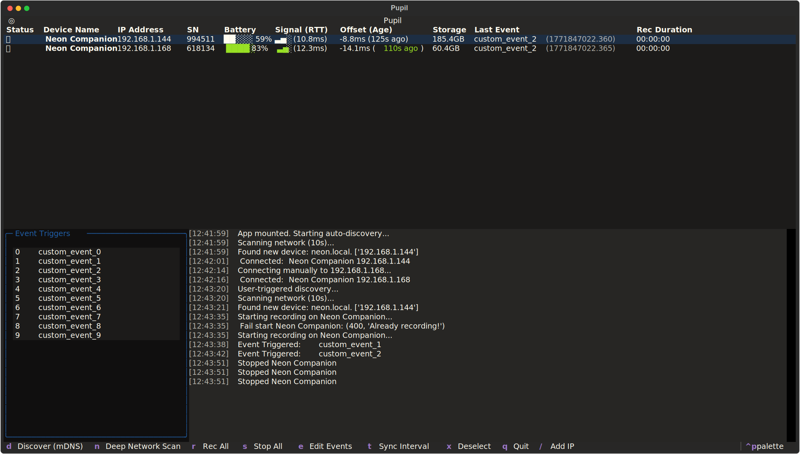

<Youtube src=""/>

::: tip
🎬 3, 2, 1… Action! Learn how to control multiple devices simultaneously and send synchronized event markers to align data for multiperson studies.
:::

## Multiperson Eye Tracking

Social connection happens in the blink of an eye, often literally. To capture the lightning-fast dynamics of mutual gaze and shared attention, researchers have moved from one-person neuroscience to a rich "multi-person" perspective, we have seen it at [Neurolive](https://pupil-labs.com/blog/neurolive-project) or more recently at MacMaster University project [SocialEyes](https://pupil-labs.com/blog/socialeyes).

However, capturing these interactions introduces a new challenge: Temporal alignment. Whether you’re analyzing mutual gaze during a conversation, team coordination in sports, or collaborative problem-solving, you need to align datasets from multiple participants. A saccade, for example, usually takes between 30 to 100 milliseconds, and if your streams are off by even half a second, you might not just miss the moment, but rewrite the cause-effect of an interaction.

Historically, independent cameras were aligned using shared sound or visual cues, like a cinema clapperboard. This guide shows how to generate that "clap" digitally, introducing a tool called pl-realtime-tui, designed to orchestrate, monitor, and synchronize all your eye trackers simultaneously.

## The Challenge

To understand the challenge, one must look at the hardware architecture. Neon and Pupil Invisible devices are standalone platforms. They don't require an external computer, and each operates on its own internal clock.

It’s possible to sync independent Neon clocks via Network Time Protocol (NTP) - see [Achieve Super-Precise Time Sync](https://docs.pupil-labs.com/neon/data-collection/time-synchronization/), and this is sufficient for many use cases. However, analyzing high-speed interactions may require a precision of <10 ms. Moreover, even perfectly synced clocks experience drift over time (e.g., up to 1 second over 24 hours).

To obtain millisecond precision and eliminate drift, we need to generate shared "Anchor" points, or digital equivalents of a cinema clapperboard, that exist in the data streams of all participants simultaneously.

Pupil Labs’ Realtime API offers a mechanism for this called [Time Echo](https://pupil-labs.github.io/pl-realtime-api/dev/api/async/?h=echo#time-echo-protocol). Conceptually similar to the Precision Time Protocol (PTP), it allows an external computer to [estimate the time difference](https://pupil-labs.github.io/pl-realtime-api/dev/methods/simple/others/#time-offset-estimation) (offset) between its own clock and the clock of every Neon device on the network.

By calculating this offset (θ) and removing any network latency, the API can trigger a signal to a connected device, instructing it to write an [event timestamped relative to the client's (computer) clock](https://pupil-labs.github.io/pl-realtime-api/dev/methods/simple/remote-control/#with-manual-clock-offset-correction). When you import your data into your analysis pipeline, these events serve as the perfect alignment keys.

::: tip
Neon and Pupil Invisible use timestamps in nanoseconds from the [UNIX epoch](/28e9d188973c80029c2fecc673c6c74a?pvs=25). In other words, it reports the time in nanoseconds elapsed from 00:00:00 UTC on 1 January 1970. A common standard to report date and times.
:::

## The Solution: pl-realtime-tui

The Realtime API has always allowed users to [obtain clock offsets](https://pupil-labs.github.io/pl-realtime-api/dev/methods/simple/others/#time-offset-estimation) and [send event annotations](https://pupil-labs.github.io/pl-realtime-api/dev/methods/simple/remote-control/#with-manual-clock-offset-correction) manually. However, doing this for multiple devices simultaneously used to require custom scripts or developing a custom application.

::: details See How To Do So Programmatically

```py{4-16,18-31,20,40-43,65,68-73} [example_send_sync_events.py]
import time
from pupil_labs.realtime_api.simple import discover_devices

def send_event_to_all_devices(
    devices, local_timestamp_ns: int, event_name: str = "my_event"
):
    for device, _, clock_offset_ns in devices:
        print(
            f"Sending event '{event_name}' to {device.adress}..."
        )
        print(
            device.send_event(
                event_name,
                event_timestamp_unix_ns=local_timestamp_ns - clock_offset_ns,
            )
        )

def update_device_time_offsets(devices):
    updated_devices = []
    for device, _, _ in devices[:]:
        new_estimate = device.estimate_time_offset()
        new_clock_offset_ns = round(new_estimate.time_offset_ms.mean * 1_000_000)

        updated_devices.append((device, new_estimate, new_clock_offset_ns))

        print(
            f"Updated time offset for device {device.address}: "
            f"{new_estimate.time_offset_ms.mean:.1f} ms"
        )
    devices.clear()
    devices.extend(updated_devices)

def main():
    print("Discovering devices...")
    discovered_devices = discover_devices(search_duration_seconds=10.0)

    devices_info_list = []

    print("Estimating initial time offsets...")
    for device in discovered_devices:
        estimate = device.estimate_time_offset()
        clock_offset_ns = round(estimate.time_offset_ms.mean * 1_000_000)
        devices_info_list.append((device, estimate, clock_offset_ns))

    print("Discovered Devices:")
    for device, estimate, _ in devices_info_list:
        print(
            f"  - {device.phone_name} ({device.address}) - "
            f"Initial offset: {estimate.time_offset_ms.mean:.1f} ms"
        )

    # Start recording
    print("Starting recording on all devices...")
    for device, _, _ in devices_info_list:
        device.recording_start()

    print("Starting long-running update loop (updates every 5 minutes)...")
    print("Press Ctrl+C to stop the script and save recordings.")

    try:
        iteration_count = 1
        while True:
            print(f"Update Cycle {iteration_count}")

            update_device_time_offsets(devices_info_list)

            print("Sending synchronization event...")
            current_time_ns_in_client_clock = time.time_ns()
            send_event_to_all_devices(
                devices_info_list,
                local_timestamp_ns=current_time_ns_in_client_clock,
                event_name=f"5_min_sync_event_{iteration_count}",
            )

            iteration_count += 1

            print("Waiting for approx 5 minutes (300 seconds) until next update...")
            time.sleep(300)

    except KeyboardInterrupt:
        print(
            "Keyboard interrupt received. Proceeding to stop recording..."
        )

    time.sleep(2)

    # Stop recording
    print("Stopping recording and closing connections...")
    for device, _, _ in devices_info_list:
        print(f"  Stopping recording on {device.phone_name}...")
        device.recording_stop_and_save()
        device.close()

    print("Script finished.")

if __name__ == "__main__":
    main()
```

:::

To make this process more accessible, we developed pl-realtime-tui, a lightweight command-line tool that allows you to discover all Neon devices on your local network, calculate their clock offsets, and send synchronized events to all of them simultaneously. It also provides a real-time monitoring interface to keep track of the status of each device and its connection.



## How to Use It

If you have [Astral UV](https://github.com/astral-sh/uv)'s Python tool installed, you can try it immediately without a manual setup:

```sh [uv]
uvx pupil-labs-realtime-tui
```

```sh [uv]
uv tool install pupil-labs-realtime-tui
pl-realtime-tui
```

Once launched, the control realtime-tui allows you to:

1. **Discover:** Automatically find all Neon devices on your local network.
2. **Sync:** Calculate the $\theta$ offset for every participant.
3. **Control:** Start and stop recordings on all devices with a single command.
4. **Annotate:** Send unified "Anchor" events to all data streams simultaneously.

When analyzing, you simply take the timestamp for the same event on each recording as a base.

::: details See How to Analyze Multiple Recordings with pl-neon-recording

```py
import pupil_labs.neon_recording as nr

recording1 = nr.open(recording_dir_1)
recording2 = nr.open(recording_dir_2)
...

rec1_timestamps = recording1.gaze.time

event_ts_rec1 = ...
event_ts_rec2 = ...
...

delta_rec2 = event_ts_rec1 - event_ts_rec2
wearer1 = recording1.info.wearer_id
wearer2 = recording2.info.wearer_id

combined_data = zip(
    rec1_timestamps,
    recording1.pupil.sample(rec1_timestamps),
    recording2.pupil.sample(rec1_timestamps - delta_rec2),
    strict=False,
    )

for time, rec1_pupil, rec2_pupil in combined_data:
    print(f"Time {time}: Pupil Size Left eye {wearer1} : {rec1_pupil.diameter_left} mm, {wearer2}: {rec2_pupil.diameter_left} mm")
```

:::

::: tip
Do you want to generate a video like the one at the beginning of this article, showing synchronized gaze data from multiple participants and pupil size? Try `pl-realtime-tui render` or `pl-realtime-tui render --help` for more options.
:::

## Benefits

By sending synchronized events to all your eye-tracking devices, either using this tool or by other means, you generate datasets that are kind of born aligned, removing the need to find a common ground posthoc. Each dataset will contain event annotations that correspond to the exact same physical moment in time across all participants enabling you to compute metrics like mutual gaze, gaze recurrence (when subjects look at the same region at given time), or pupillary synchrony (a cross-correlation of pupil size, a somatic marker of shared cognitive/emotional states).

::: tip
💡 Need assistance in implementing your own multiperson workflow? Reach out to us by email or visit our Support Page for dedicated support options.
:::
