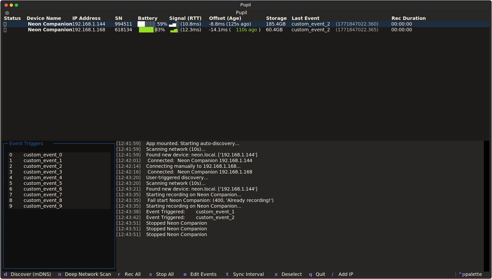

<Youtube src="Zg-Kpz3pYyM"/>

::: tip
🎬 3, 2, 1… Action! Learn how to control multiple devices simultaneously and send synchronized event markers to align data for multiperson studies.
:::

## Multiperson Eye Tracking

Social connection often happens in the blink of an eye. To capture the fast dynamics of mutual gaze and shared attention, 
researchers are shifting from single-person neuroscience to rich, multi-person perspectives. With portable eye trackers 
like Neon, capturing concurrent gaze behavior in the real world is now a reality. There is a rapidly growing interest in 
this kind of multi-person tracking, highlighted by landmark initiatives like the [Neurolive](https://pupil-labs.com/blog/neurolive-project) 
and [SocialEyes](https://pupil-labs.com/blog/socialeyes) projects exploring collective attention in live, dynamic 
environments.

Yet, whether you're analyzing a two-person dialogue or recording a multi-person sporting event, one fundamental challenge 
remains: temporal alignment. A saccade takes just 30 to 100 milliseconds. If your streams are off by even half a second, 
you don't just miss the moment, you rewrite the cause-and-effect of the interaction.

Historically, independent cameras used shared sound or visual cues, like a cinema clapperboard, to sync up. This guide 
shows how to generate that "clap" digitally using [pl-realtime-tui](https://github.com/pupil-labs/pl-realtime-tui): a tool designed to orchestrate, monitor, and synchronize 
multiple eye trackers simultaneously.

## The Challenge of Synchronization

To understand the challenge, one must look at the hardware architecture. Neon and Pupil Invisible are standalone devices. 
They don't require an external computer, and each operates its own internal clock.

It’s possible to sync independent clocks via Network Time Protocol (NTP) - see [Achieve Super-Precise Time Sync](https://docs.pupil-labs.com/neon/data-collection/time-synchronization/), 
and this is sufficient for many use cases. However, analyzing high-speed interactions may require precision of <10 ms. 
Moreover, even perfectly synced clocks experience drift over time (e.g., up to 1 second over 24 hours).

To get millisecond precision and remove drift, we need to generate shared anchor points, or digital equivalents of a 
cinema clapperboard, that exist in the data streams of all devices simultaneously.

Pupil Labs’ Realtime API offers a mechanism for this called [Time Echo](https://pupil-labs.github.io/pl-realtime-api/dev/api/async/?h=echo#time-echo-protocol). Conceptually similar to the Precision Time 
Protocol (PTP), it allows an external computer to [estimate the time difference](https://pupil-labs.github.io/pl-realtime-api/dev/methods/simple/others/#time-offset-estimation) (offset) between its own clock and 
the clock of every Neon device on a local network.

By calculating this offset (θ) and removing any network latency, the API can trigger a signal to a connected device, 
instructing it to write an [event timestamped relative to the client's (computer) clock](https://pupil-labs.github.io/pl-realtime-api/dev/methods/simple/remote-control/#with-manual-clock-offset-correction). When you import the recordings 
into your analysis pipeline, these events serve as alignment keys.

::: tip
Neon and Pupil Invisible use timestamps in nanoseconds from the [UNIX epoch](https://en.wikipedia.org/wiki/Unix_time). In other words, it reports the time in nanoseconds elapsed from 00:00:00 UTC on 1 January 1970. A common standard to report date and times.
:::

## The Solution: pl-realtime-tui

The Realtime API has always allowed users to [obtain clock offsets](https://pupil-labs.github.io/pl-realtime-api/dev/methods/simple/others/#time-offset-estimation) and [send event annotations](https://pupil-labs.github.io/pl-realtime-api/dev/methods/simple/remote-control/#with-manual-clock-offset-correction) manually. 
However, doing this for multiple devices simultaneously used to require custom scripts or developing a custom application.

::: details See How To Do So Programmatically

```py{4-16,18-31,20,40-43,65,68-73} [example_send_sync_events.py]
import time
from pupil_labs.realtime_api.simple import discover_devices

def send_event_to_all_devices(
    devices, local_timestamp_ns: int, event_name: str = "my_event"
):
    for device, _, clock_offset_ns in devices:
        print(
            f"Sending event '{event_name}' to {device.adress}..."
        )
        print(
            device.send_event(
                event_name,
                event_timestamp_unix_ns=local_timestamp_ns - clock_offset_ns,
            )
        )

def update_device_time_offsets(devices):
    updated_devices = []
    for device, _, _ in devices[:]:
        new_estimate = device.estimate_time_offset()
        new_clock_offset_ns = round(new_estimate.time_offset_ms.mean * 1_000_000)

        updated_devices.append((device, new_estimate, new_clock_offset_ns))

        print(
            f"Updated time offset for device {device.address}: "
            f"{new_estimate.time_offset_ms.mean:.1f} ms"
        )
    devices.clear()
    devices.extend(updated_devices)

def main():
    print("Discovering devices...")
    discovered_devices = discover_devices(search_duration_seconds=10.0)

    devices_info_list = []

    print("Estimating initial time offsets...")
    for device in discovered_devices:
        estimate = device.estimate_time_offset()
        clock_offset_ns = round(estimate.time_offset_ms.mean * 1_000_000)
        devices_info_list.append((device, estimate, clock_offset_ns))

    print("Discovered Devices:")
    for device, estimate, _ in devices_info_list:
        print(
            f"  - {device.phone_name} ({device.address}) - "
            f"Initial offset: {estimate.time_offset_ms.mean:.1f} ms"
        )

    # Start recording
    print("Starting recording on all devices...")
    for device, _, _ in devices_info_list:
        device.recording_start()

    print("Starting long-running update loop (updates every 5 minutes)...")
    print("Press Ctrl+C to stop the script and save recordings.")

    try:
        iteration_count = 1
        while True:
            print(f"Update Cycle {iteration_count}")

            update_device_time_offsets(devices_info_list)

            print("Sending synchronization event...")
            current_time_ns_in_client_clock = time.time_ns()
            send_event_to_all_devices(
                devices_info_list,
                local_timestamp_ns=current_time_ns_in_client_clock,
                event_name=f"5_min_sync_event_{iteration_count}",
            )

            iteration_count += 1

            print("Waiting for approx 5 minutes (300 seconds) until next update...")
            time.sleep(300)

    except KeyboardInterrupt:
        print(
            "Keyboard interrupt received. Proceeding to stop recording..."
        )

    time.sleep(2)

    # Stop recording
    print("Stopping recording and closing connections...")
    for device, _, _ in devices_info_list:
        print(f"  Stopping recording on {device.phone_name}...")
        device.recording_stop_and_save()
        device.close()

    print("Script finished.")

if __name__ == "__main__":
    main()
```

:::

To make this process more accessible, we developed [pl-realtime-tui](https://github.com/pupil-labs/pl-realtime-tui), a 
lightweight command-line tool that allows you to discover all Neon devices on your local network, calculate their 
clock offsets, and send synchronized events to all of them simultaneously. It also provides a real-time monitoring 
interface to keep track of the status of each device and its connection.



## How to Use It

If you have [Astral UV](https://github.com/astral-sh/uv)'s Python tool installed, you can try it immediately without a manual setup:

```sh [uv]
uvx --from pupil-labs-realtime-tui pl-realtime-tui
```
or if you plan to use it regularly, you can install it as a tool:

```sh [uv]
uv tool install pupil-labs-realtime-tui
pl-realtime-tui
```

Once launched, the control realtime-tui allows you to:

1. **Discover:** Automatically find all Neon devices on your local network.
2. **Sync:** Calculate the (θ) offset for every participant.
3. **Control:** Start and stop recordings on all devices with a single command.
4. **Annotate:** Send unified "Anchor" events to all data streams simultaneously.

## Using Your Anchor Events
After sending synchronized events to all your eye-tracking devices, each dataset will contain 
event annotations that correspond to the exact same physical moment in time across all participants. This enables you to 
compute metrics like mutual gaze, gaze recurrence (when subjects look at the same region at given time), or pupillary
synchrony (a cross-correlation of pupil size, a somatic marker of shared cognitive/emotional states). 

When analyzing, you simply take the timestamp for the same event on each recording as a base.

Here is a concrete example of how to do this in Python using pl-neon-recording, but the same logic applies to any analysis 
pipeline you may be using:

::: details Analyze Multiple Recordings with pl-neon-recording

```py
import pupil_labs.neon_recording as nr

recording1 = nr.open(recording_dir_1)
recording2 = nr.open(recording_dir_2)
...

rec1_timestamps = recording1.gaze.time

event_ts_rec1 = ...
event_ts_rec2 = ...
...

delta_rec2 = event_ts_rec1 - event_ts_rec2
wearer1 = recording1.info.wearer_id
wearer2 = recording2.info.wearer_id

combined_data = zip(
    rec1_timestamps,
    recording1.pupil.sample(rec1_timestamps),
    recording2.pupil.sample(rec1_timestamps - delta_rec2),
    strict=False,
    )

for time, rec1_pupil, rec2_pupil in combined_data:
    print(f"Time {time}: Pupil Size Left eye {wearer1} : {rec1_pupil.diameter_left} mm, {wearer2}: {rec2_pupil.diameter_left} mm")
```

:::

::: tip
Do you want to generate a video like the one at the beginning of this article, showing synchronized gaze data from 
multiple participants and pupil size? Try `pl-realtime-tui render` or `pl-realtime-tui render --help` for more options.
:::

## Taking it to the Next Level
While `pl-realtime-tui` provides a great foundation for orchestrating and synchronizing streams, some research 
domains require even more specialized infrastructure. If your ambitions scale to massive live events and you need 
advanced features like high-throughput streaming, mapping individual egocentric gaze onto a shared coordinate space, 
or automating collective attention analysis, we highly recommend checking out the 
[SocialEyes GitHub Repository](https://github.com/beatlab-mcmaster/SocialEyes). It is a 
powerhouse, open-source tool built by the community specifically to tackle the extreme ends of large-scale, multi-person 
tracking, with [one study](https://pupil-labs.com/blog/socialeyes) recording over 30 participants simultaneously in a live concert setting!

::: tip
💡 Need assistance in implementing your own multiperson workflow? Feel free to reach out to us via email at 
[info@pupil-labs.com](mailto:info@pupil-labs.com), on our [Discord server](https://pupil-labs.com/chat/), or visit our 
[Support Page](https://pupil-labs.com/products/support/) for dedicated support options.
:::

