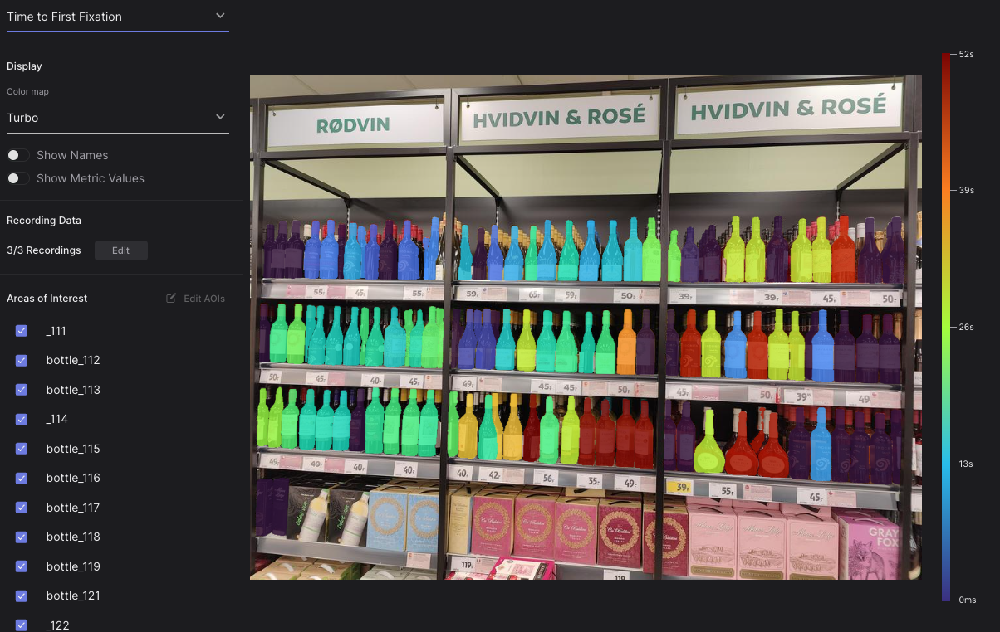
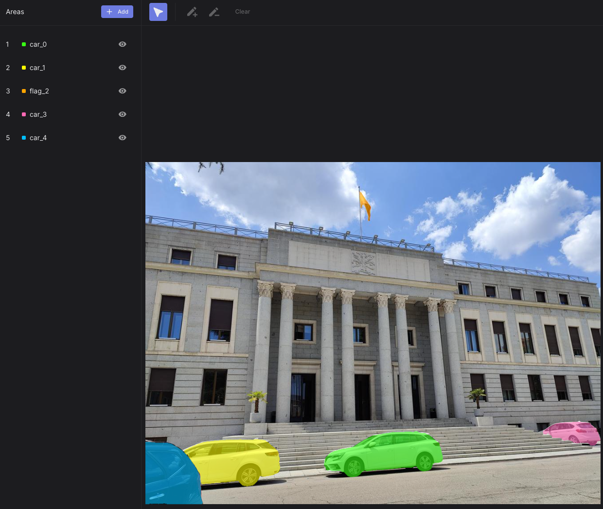

# Automate AOI Masking in the Cloud

<TagLinks :tags="$frontmatter.tags" />

<Youtube src="UgB0fk5fgpE"/>

::: tip
Are you tired of manually drawing masks? Give your wrist a break and effortlessly automate segmenting the areas of interest in the Cloud.
:::

## AOI Mask Drawing

Pupil Cloud's new [Areas Of Interest tool](https://docs.pupil-labs.com/neon/pupil-cloud/visualizations/areas-of-interest/) allows you to collide information about the number, average duration or total time an object has been fixated and gain insights about participant engagement with specific objects.

Traditionally, after employing the [Reference Image Mapper](https://docs.pupil-labs.com/neon/pupil-cloud/enrichments/reference-image-mapper/) or [Marker Mapper](https://docs.pupil-labs.com/neon/pupil-cloud/enrichments/marker-mapper/), the process of drawing AOI masks remained manual. This manual drawing, essential for data analysis, poses challenges in terms of time and precision, especially with numerous or complex objects in the image.

In this article, we introduce a way to automate your mask creation, streamlining the workflow and improving accuracy in defining areas for analysis.

## What Tools Enable This?

Recent developments in AI have made automating such image segmentation easier. Not only are new models fast and accurate at masking different objects, but now, you can also prompt them using natural language.

So you can simply type _“bottle,”_ and you will get a mask for every bottle in the image, or you can type _“flag . car”_ and get these complex shapes automatically segmented. Today, we bring you the power of [Grounded Segment Anything](https://arc.net/l/quote/okiwpscx), which, combined with our [Cloud API](https://api.cloud.pupil-labs.com/v2), allows you to get metrics over finely segmented objects.

## Steps

To utilise this tool, you will need:

1. A successful **Reference Image Mapper** or **Marker Mapper** enrichment and the corresponding reference image.
2. You will also need a **developer token** from Cloud. Simply click on the upper right profile picture to go to the Profile Settings and be able to generate a token.

Then, follow these steps:

1. Access our **[Google Colab Notebook](https://colab.research.google.com/drive/1SJQS6-P56wpDxJTNfZeuzwZADKK9h6ri?usp=sharing)** and carefully follow the instructions.

 

2. Upload your reference image, type the objects, you would like to segment, separated by a dot (e.g. car . flag) and press on the segment button.
3. After previewing the results, you can write your enrichment URL and your token, then click on submit to Cloud.

## Results

Upon completing the automated AOI mask creation process, you'll achieve pixel-perfect masks for your enrichments. These precision-crafted masks are then ready for use in Cloud. See below some examples:

## Running Locally

You can also run everything on your local machine. We have made a Docker container and Python package bundle with a web interface to make it easier to interact with. Detailed instructions on running locally can be found in the Github repository.

::: tip
Need assistance implementing your automatic segmentation in your application? Reach out to us via email at [info@pupil-labs.com](mailto:info@pupil-labs.com), on our [Discord server](https://pupil-labs.com/chat/), or visit our [Support Page](https://pupil-labs.com/products/support/) for formal support options.
:::
