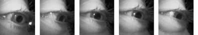
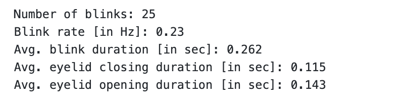
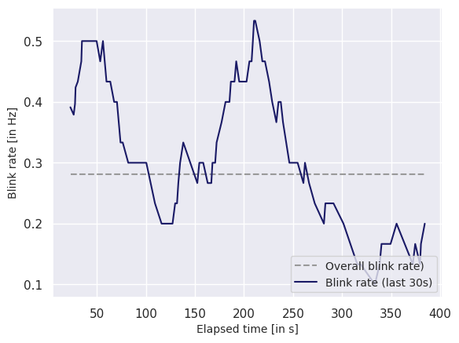

# Detecting Eye Blinks Using Pupil Lab’s Blink Detection Pipeline

<TagLinks :tags="$frontmatter.tags" />

## Blinks: Artifacts and Information

The accurate detection of blinks serves a vital role in many eye tracking applications. Its importance is twofold: firstly, it helps identify time periods affected by blink-related artifacts, and secondly, blink statistics can serve as relevant physiological, cognitive, and clinical parameters. Blink detection can even be utilized in order to control external devices, for example by detecting a sequence of blinks made in quick succession.

## Running Blink Detection Locally

Blinks are automatically detected once your recording is uploaded to Pupil Cloud. This guide shows how to apply Pupil Labs' blink detection algorithm to Neon recordings *offline* (i.e., without using Pupil Cloud) or *in real-time* (using [Pupil Lab's Realtime Python API](https://docs.pupil-labs.com/neon/real-time-api/)). This allows you to build novel applications or simply satisfy your curiosity and develop a deeper understanding of the underlying algorithms.

::: tip
If you are interested in learning more about the technical details of the underlying blink detection pipeline, we invite you to also have a look at our [**white paper**](https://assets.pupil-labs.com/pdf/Pupil_Labs_Blink_Detector.pdf).
:::

## Getting Started

To get started, check out the accompanying [GitHub repository](https://github.com/pupil-labs/real-time-blink-detection). There you can find detailed instructions on how to install all required packages as well as a [Jupyter notebook](https://github.com/pupil-labs/real-time-blink-detection/blob/main/blink_detection.ipynb) that contains all the code needed along with instructions on how to run everything.

If you don't have a recording at hand, worry not! The GitHub repository comes with an example Neon recording that you can explore.

## Results

### 1. Posthoc Blink Detection

Once you have run the first part of the notebook, you will get an output from which you can derive a number of statistics that provide various insights about your recording: the total number of detected blinks, the estimated blink rate (in Hz), and the average blink duration (in seconds), as well as eyelid closing and re-opening durations (in seconds).

<b>Figure 1.</b> Blink statistics extracted from the provided example Neon recording.

You will additionally get a visual representation of the detected blinks, providing an overview of their temporal distribution:

<b>Figure 2.</b> Visual representation of the detected blinks in the example Neon recording. Green shaded areas depict detected blink events.

The blink detector is designed to classify samples into eye lid opening and closing phases.

Note that, due to the design of the blink detector, the total blink duration doesn't (necessarily) equate to the sum of the durations of the closing and re-opening phases. This discrepancy arises because there are some frames during the period between closing and reopening of the eyelids where there is negligible movement, and thus, they are not classified as part of either the opening or the closing phase. As the total blink duration is calculated from the start time of the eyelid closing to the last frame identified as part of the re-opening sequence, it will, thus, almost always be marginally longer than the sum of the individual events. 

### 2.1. Real-Time Blink Detection

In the first section of Part 2 of the guide, you will learn how to estimate blink rate in real-time. From this, you will obtain a graph, as shown below, that is updated with every blink and shows an estimate of the current blink rate.

<b>Figure 3.</b> Realtime blink rate estimation. Shown is the blink rate estimated over the last 30 s (solid line) as well as the average blink rate for the entire recording (dashed line). 

### 2.2. Toggling Recordings Remotely Through Blinks

In the last section of the guide, you will learn how to control a Neon device through a rapid sequence of three blinks. Upon detection of said sequence, the companion device will initiate a new recording or stop an ongoing one, as illustrated in the video below:

:::tip
If you need assistance in implementing or building your own application, reach out to us via email ([info@pupil-labs.com](mailto:info@pupil-labs.com)), on our [Discord server](https://pupil-labs.com/chat/), or visit our [Support Page](https://pupil-labs.com/products/support/) for dedicated support options.
:::