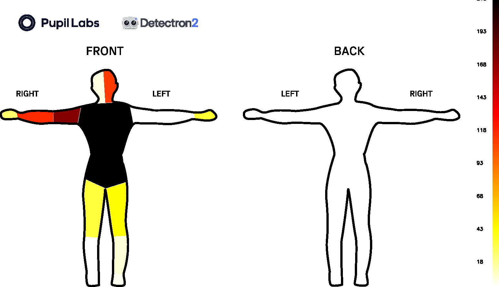

<Youtube src="nt_zNSBMJWI"/>

**Act 3, Scene 1:** _"To be or not to be?"_ But where is the audience looking? At the hand, the face or the arm?  

::: tip
Have you ever wondered which body parts we gaze upon while conversing with others? Where a professional basketball player looks just before passing? Does hand movement play a role when delivering a speech? This guide will show you how to get data that can be used to answer these questions!
:::

## Understanding Visual Behaviour on Body Parts

Understanding which body parts people look at during interactions, whether visual or otherwise, is an important topic in
fields ranging from sports science to psycholinguistics. This guide shows you how to use Neon or Pupil Invisible eye
tracking with [DensePose](https://github.com/facebookresearch/DensePose) (Github repository of [Dense Human Pose Estimation In The Wild](https://arxiv.org/abs/1802.00434))
to characterise gaze behaviour on body parts that appear in the scene video, as shown above.

## What Tools Enable This?

Pupil Cloud currently offers a [Face Mapper enrichment](https://docs.pupil-labs.com/neon/pupil-cloud/enrichments/face-mapper/), which tracks faces in scene video and determines whether they were gazed at. However, tracking the rest of the body is currently not available in Cloud. This is where our guide comes in. By following our instructions, you will be able to automatically detect and track body parts of people visible in the scene video of your recordings, and map gaze onto tracked body parts. This approach can enable a deeper understanding of how subjects (wearing the eye tracker) visually interacted with other people.

Until recently, existing methods for tracking body parts in eye tracking scene video were not very robust or accurate. However, [DensePose](https://github.com/facebookresearch/DensePose) promises to solve many of these problems, so we have decided to incorporate it into our guide.

## Steps

1. Download a recording from your project in Pupil Cloud (in Timeseries & Scene Video Format).
2. Upload (uncompressed) one of the recording folders that you're interested in to your Google Drive Account. (Don't want to use Google Drive? Check out how to [run it locally](#running-locally).)
3. Access our [Google Colab Notebook](https://colab.research.google.com/drive/1s6mBNAhcnxhJlqxeaQ2IZMk_Ca381p25?usp=sharing) and carefully follow the instructions.

  

## Results

After executing the code, new files will be generated. Check the new DensePoseColab folder for the results:

1. A video showing a bounding box that delimits each detected person, a blue shaded mask over the body parts, a yellow highlighted body part when it's gazed at, and the typical red circle for the gaze position.
2. An image showing the body segments and the number of frames in which they were gazed, as shown below:

3. Two files are also stored:

- `parts_count.csv` - shows the number of times each body part is gazed
- `densepose.csv` - follows a structure similar to `gaze.csv`, but also with a new column indicating gazed body parts

## Running Locally

You can also run everything on your local machine. However, this option is only available for Linux and MacOS users as detectron2 does not support Windows 😕. If you do not have a GPU on your computer, we strongly recommend using our Google Colab notebook. Detailed instructions on running locally can be found in the [Github repository](https://github.com/pupil-labs/densepose-module) and the associated [read the docs](https://densepose-module.readthedocs.io/).

::: tip
Need assistance implementing your own DensePose + gaze tracking application? Reach out to us via email at [info@pupil-labs.com](mailto:info@pupil-labs.com), on our [Discord server](https://pupil-labs.com/chat/), or visit our [Support Page](https://pupil-labs.com/products/support/) for formal support options.
:::
