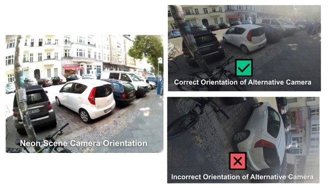

# Map Gaze Onto an Alternative Egocentric Video

<TagLinks :tags="$frontmatter.tags" />

<Youtube src="dhcN1erSTfo"/>

::: tip
Ever wanted to integrate egocentric video streams from specialized third-party cameras into your eye-tracking experiments? This Alpha Lab article shows you how! Just ensure Neon and the additional camera have similar views, then hit record.Our software will do the rest. 
:::

## Combine Neon With Specialized Egocentric Cameras

Neon features a versatile 30FPS scene camera with a large field of view, well-suited for a wide range of eye-tracking experiments. However, there are niche applications that may benefit from more specialized cameras.

For instance, in sports like baseball and clay shooting, athletes must visually track fast-moving projectiles.  To fully characterize the flight phase of these projectiles (often travelling more than 160 KPH), and the athletes' concurrent eye movements, it can be advantageous to combine Neon’s high-frequency gaze signal (200 Hz) with the video frame rates of high-speed action cameras.

Another challenging scenario arises with sharp brightness variations in the environment, for example, big illumination differences during airplane piloting studies. By mapping Neon’s gaze measurements onto a high-dynamic range video feed, visual details inside and outside the cockpit can be better distinguished.
In this guide, you will learn how to map the gaze information measured by Neon onto an alternative egocentric video, allowing you to integrate your chosen specialized camera with Neon. 

## Introducing Egocentric Video Mapper

Pupil Cloud currently offers tools like the [Manual Mapper](https://docs.pupil-labs.com/neon/pupil-cloud/enrichments/manual-mapper/) and [Reference Image Mapper](https://docs.pupil-labs.com/neon/pupil-cloud/enrichments/reference-image-mapper/), which facilitate the mapping of fixations and other gaze data onto a single static image, i.e. a fixed view of the world. However, currently there is no tool available in Pupil Cloud that dynamically maps gaze to a moving head-fixed coordinate system (i.e. a concurrent egocentric video). In this guide, we will show you a calibration-free pipeline to obtain gaze information in an alternative egocentric video.

## How Does It Work?

The Egocentric Video Mapper does not require synchronization of Neon with the additional camera at recording time. Instead, we leverage the correlation between the motion patterns observed in both cameras to obtain an accurate post-hoc synchronization of the two data streams. 

The Egocentric Video Mapper employs AI-powered feature matching methods, like [Efficient LoFTR](https://zju3dv.github.io/efficientloftr/), effectively identifying image points in the two views corresponding to the same 3D point in the scene. These methods have the ability to extract a high number of accurate image correspondences even in low-feature regions of images, whereas classical methods (e.g. SIFT) tend to produce spurious matches.

Correspondences local to each gaze measurement determine a homography mapping from Neon’s scene camera pixel space into the image space of the additional egocentric camera. By default, a new homography is computed for each gaze measurement. However, the tool allows you to control how often this mapping is updated. This reduces the time for obtaining the final mapped gaze signal. For recordings with a lot of camera movement, we recommend frequent updates to maintain mapping accuracy.

## Steps To Map Gaze Onto the Alternative Egocentric Video

1. Make a recording with Neon and the additional camera. You do not need a synchronization routine between them, this Alpha Lab guide is thought out to deal with the temporal misalignment of simultaneous videos regardless of their frame rates. 

::: tip
In order to map gaze from Neon to an alternative egocentric video, both have to be recorded at the same time. 

If you want to make sure you have gaze mapped for the whole duration of the external recording, make sure to start the external camera after and stop it before Neon. This will ensure that the gaze signal is available for the whole duration of the alternative egocentric video. 
:::

2. Download the **Timeseries Data + Scene Video** from your workspace in Pupil Cloud.
3. Upload the uncompressed folder to a Google Drive.  (Don't want to use Google Drive? Check out [how to run it locally](#running-locally).)
4. Upload the recording from the alternative camera to the same Google Drive.
5. Access our Google Colab notebook and follow the instructions outlined there. Note: You might need to upgrade to the Colab Pro plan to handle longer videos. 

  

::: tip 
To guarantee that gaze is mapped successfully do not forget to follow our recommendations in the [Setting up your cameras](#setting-up-your-cameras) section. 
:::

## Setting Up Your Cameras 

When setting up your cameras for successful egocentric video mapping there are two key factors you need to consider: overlap between the views of the two cameras and the orientation of the videos.

To get an accurate mapping of gaze measurements to the alternative video feed, it is important to have a similar egocentric view in both cameras. We recommend mounting the additional camera on the Neon user, like in the example in Figure 1. If you have some CAD design experience, you can even [design your own Neon head mount](https://github.com/pupil-labs/neon-geometry) that fits the specialized camera of your choice. Otherwise, head mounts supplied by the specialized camera manufacturers should be sufficient, you will just need a little bit of tinkering to obtain the optimal setup that works for you!

<b>Figure 1.</b>  Example of a custom Neon frame designed for clipping on an additional camera to the user. Setup in the image depicts Neon and an Insta360 GO3 camera. 

Having the same video orientation is crucial to guarantee that video synchronization is done reliably (see example below). If you have already recorded the video with the additional camera and realize that the orientation is wrong, don’t despair! There are tools that can help you rotate the whole video to the correct orientation so you don’t have to repeat your experiment. 

## Results

After executing the code, the following files will be generated:
- `alternative_camera_timestamps.csv` - follows the same structure as  world_timestamps.csv. It contains timestamps for every alternative video frame.
- When mapping fixations only:
  - `alternative_camera_fixations.csv` - follows a similar structure as fixations.csv. This way you can easily integrate it into your existing pipelines.
- When mapping the fulll gaze signal at 200Hz:
  - `alternative_camera_gaze.csv `- follows a similiar structure as gaze.csv, with the frequency of the gaze signal (200Hz) being preserved. This way you can easily integrate it into your existing pipelines.
  - `alternative_camera_gaze_overlay.mp4` (optional) - A video rendering of an alternative camera recording displaying a circle for the mapped gaze position. This video will preserve the original frame rate of the alternative camera recording.
  - `alternative_camera-neon_comparison.mp4` (optional) - A comparison video showing side by side the Neon scene camera video and the alternative camera video with their respective gaze signal overlaid.
- Mapping both the fixations and the gaze signal will result in all the files mentioned above.

## Running Locally
You can also use this tool on your own computer, without needing Google Colab. We have put everything you need in a package, including a Jupyter notebook containing all the steps to run on your recording. Detailed instructions on running locally can be found in the [Github repository](https://github.com/pupil-labs/egocentric_video_mapper). If you do not have a GPU on your computer, we strongly recommend using our Google Colab notebook. 

::: tip 
Need assistance in implementing the alternative egocentric video mapper or adapting it to your pipeline/workflow? Reach out to us via email at [info@pupil-labs.com](mailto:info@pupil-labs.com), on our [Discord server](https://pupil-labs.com/chat/), or visit our [Support Page](https://pupil-labs.com/products/support/) for dedicated support options.
:::
