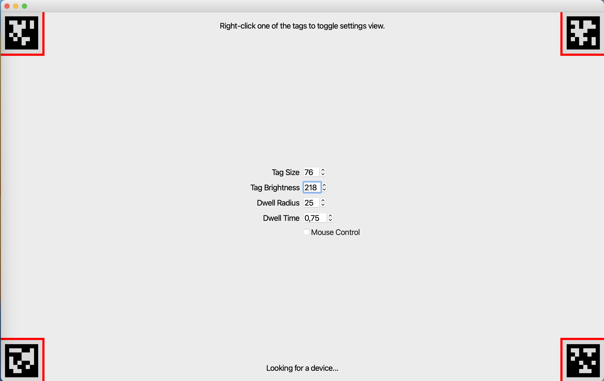

# Build Gaze-Contingent Assistive Applications

<TagLinks :tags="$frontmatter.tags" />

<Youtube src="cuvWqVOAc5M"/>

::: tip
Imagine a world where transformative assistive solutions enable you to browse the internet with a mere glance or write an email using only your eyes. This is not science fiction; it is the realm of gaze-contingent technology.
:::

## Hacking the Eyes With Gaze Contingency

'Gaze contingency' refers to a type of human–computer interaction where interfaces or display systems adjust their content based on the user's gaze. It's commonly used for assistive applications as it enables people to interact with a computer or device using their eyes instead of a mouse or keyboard, like in the video above. This is particularly valuable for individuals with physical disabilities and offers new opportunities for communication, education, and overall digital empowerment.

## Limitations and Current Prospects

Gaze-contingent assistive technologies have become much easier to use recently thanks to advancements in the field of eye tracking. Traditional assistive systems require frequent calibration, which can be problematic in practice, as highlighted in the story of [Gary Godfrey](https://pupil-labs.com/blog/community/cycling-for-als/). Modern calibration-free approaches like [Neon](https://pupil-labs.com/products/neon/) overcome this issue and provide a more robust and user-friendly input modality for producing gaze data.

We have prepared a guide to aid you in creating your very own gaze-contingent assistive applications using [Neon](https://pupil-labs.com/products/neon/).

## How To Use a Head-Mounted Eye Tracker for Screen-Based Interaction

**Mapping Gaze To Screen**

Neon is a wearable eye tracker that provides gaze data in scene camera coordinates, i.e., relative to its forward-facing
camera. We therefore need to transform gaze from _scene-camera_ to _screen-based_ coordinates in real time, such that
the user can interact with the screen. Broadly speaking, we need to locate the screen, send gaze data from Neon to the
computer, and map gaze into the coordinate system of the screen.

To locate the screen, we use [AprilTags](https://april.eecs.umich.edu/software/apriltag) to identify the image of the
screen as it appears in Neon’s scene camera. Gaze data is transferred to the computer via Neon's
[Real-time API](https://docs.pupil-labs.com/neon/real-time-api/tutorials/). We then transform gaze from _scene camera_ to _screen-based_
coordinates using a [homography](<https://en.m.wikipedia.org/wiki/Homography_(computer_vision)>) approach like the [Marker Mapper](https://docs.pupil-labs.com/neon/pupil-cloud/enrichments/marker-mapper/)
enrichment we offer in Pupil Cloud as a post-hoc solution. The heavy lifting of all this is handled by
our [Real-time Screen Gaze](https://github.com/pupil-labs/realtime-screen-gaze/) package (written for this guide).

**Gaze-Controlling a Mouse**

The second challenge is using screen-mapped gaze to control an input device, e.g., a mouse. To demonstrate how to do this, we
wrote the [Gaze-controlled Cursor Demo](https://github.com/pupil-labs/gaze-controlled-cursor-demo). This demo leverages the
[Real-time Screen Gaze](https://github.com/pupil-labs/realtime-screen-gaze/) package to obtain gaze in screen-based coordinates, and then uses
that to control a mouse in a custom browser window, as shown in the video above. A simple dwell-time filter implemented
in the demo enables mouse clicks when gaze hovers over different elements of the browser.

**It’s Your Turn…**

Follow the steps in the next section to be able to use your gaze to navigate a website and fixate on different parts to trigger a mouse click with your eyes.

## Steps

1. Follow the instructions in [Gaze-controlled Cursor Demo](https://github.com/pupil-labs/gaze-controlled-cursor-demo) to download and run it locally on your computer.
2. Start up [Neon](https://docs.pupil-labs.com/neon/data-collection/first-recording/), make sure it’s detected in the demo window, then check out the settings:
   - Adjust the `Tag Size` and `Tag Brightness` settings as necessary until all four AprilTag markers are successfully tracked (markers that are not tracked will display a red border as shown in the image below).
   - Modify the `Dwell Radius` and `Dwell Time` values to customize the size of the gaze circle and the dwell time required for gaze to trigger a mouse action.
   - Click on `Mouse Control` and embark on your journey into the realm of gaze contingency.
   - Right-click anywhere in the window or on any of the tags to show or hide the settings window.

## What’s Next?

The packages we created contain code that you can build on to fashion your own custom implementations, opening up
possibilities for navigation, typing on a virtual keyboard, and much more.

Dig in and hack away. The potential is boundless. Let us know what you build!

::: tip
Need assistance in implementing your gaze-contingent task? Reach out to us via email at [info@pupil-labs.com](mailto:info@pupil-labs.com) or on our [Discord server](https://pupil-labs.com/chat/) or visit our [Support Page](https://pupil-labs.com/products/support/) for dedicated support options.
:::