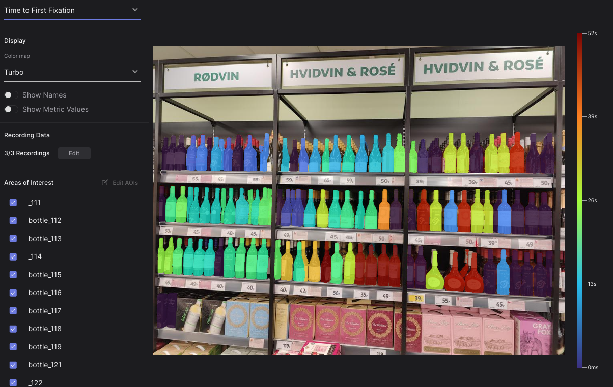
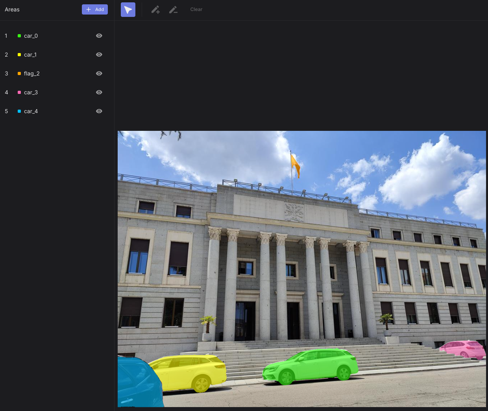

# Automate AOI Masking in Pupil Cloud

<TagLinks :tags="$frontmatter.tags" />

<Youtube src="5pJQyiojNT0"/>

::: tip
Are you tired of manually drawing masks for your areas of interest? Fully automate the process using the Pupil Cloud API!
:::

Pupil Cloud's [Areas Of Interest tool](https://docs.pupil-labs.com/neon/pupil-cloud/visualizations/areas-of-interest/) allows you to segment AOIs within a reference image or surface, as part of our [Reference Image Mapper](https://docs.pupil-labs.com/neon/pupil-cloud/enrichments/reference-image-mapper/) and [Marker Mapper](https://docs.pupil-labs.com/neon/pupil-cloud/enrichments/marker-mapper/) enrichments. This facilitates the computation of metrics, such as fixation count and total fixation duration within each AOI, that can provide insights into how participants visually engaged with their environment.

Drawing AOI masks in Cloud is a manual process where the user can outline AOIs freehand or generate polygons (with straight lines), allowing detailed shapes of the AOIs to be drawn within the image. That said, it can be time-consuming depending on the number of AOIs to be drawn, and potentially prone to human error.

In this article, we introduce a way to automate your mask creation, speeding up the workflow in defining areas for analysis.

## What Tools Enable This?

Recent developments in AI have made automating image segmentation easier. Not only are new models fast and accurate at masking different objects, but now, you can also prompt them using natural language. For example, you can simply type _“bottle,”_ and you will get a mask for every bottle in the image, or you can type _“label . shelf . bottle”_ and get all of these complex shapes automatically segmented.

In this guide, we harness the power of [Grounded Segment Anything](https://arxiv.org/abs/2401.14159) (SAM). First, we load our reference image, specify which objects/regions we want to segment, and let Grounded SAM do its magic. Then, we use our [Pupil Cloud API](https://api.cloud.pupil-labs.com/v2) to upload the generated segmentation masks and their corresponding labels. The masks and labels are added to the Pupil Cloud enrichment and will appear as AOIs ready for computation of metrics.

## Steps

Download a successful **Reference Image Mapper** or **Marker Mapper** enrichment and the corresponding reference image.

Obtain a **developer token** from Pupil Cloud (click [here](https://cloud.pupil-labs.com/settings/developer) to obtain yours).

Then, follow these steps:

1. Access our **[Google Colab Notebook](https://colab.research.google.com/drive/1SJQS6-P56wpDxJTNfZeuzwZADKK9h6ri?usp=sharing)** and carefully follow the instructions.

 

2. Upload your reference image, prompt the objects you would like to segment, separated by a dot (e.g. bottle . label) and press on the segment button.
3. After previewing the results, write your enrichment URL and token, then click on submit to Pupil Cloud.

## Segmented AOIs Ready To Go in Cloud

Upon completing the automated AOI mask creation process, you'll achieve finely segmented masks ready for use with your enrichments in Cloud. Check out these examples:

|  |  |
| ------------------------------------------------------------------------------------------------------ | ------------------------------------------------------------------ |
| An AOI heatmap showing time to first fixation on over 150 bottles in a supermarket!                    | Perfectly segmented AOIs depicting cars and a flag                 |

## Running Locally

You can also use this tool on your own computer, without needing Google Colab. We've put everything you need into a package that includes a Docker container and a Python package. It comes with a simple web interface to make it easy for anyone to use. Detailed instructions on running locally can be found in the [Github repository](https://github.com/pupil-labs/aois_module).

::: tip
Need assistance implementing automatic segmentation in your application? Reach out to us via email at [info@pupil-labs.com](mailto:info@pupil-labs.com), on our [Discord server](https://pupil-labs.com/chat/), or visit our [Support Page](https://pupil-labs.com/products/support/) for formal support options.
:::
