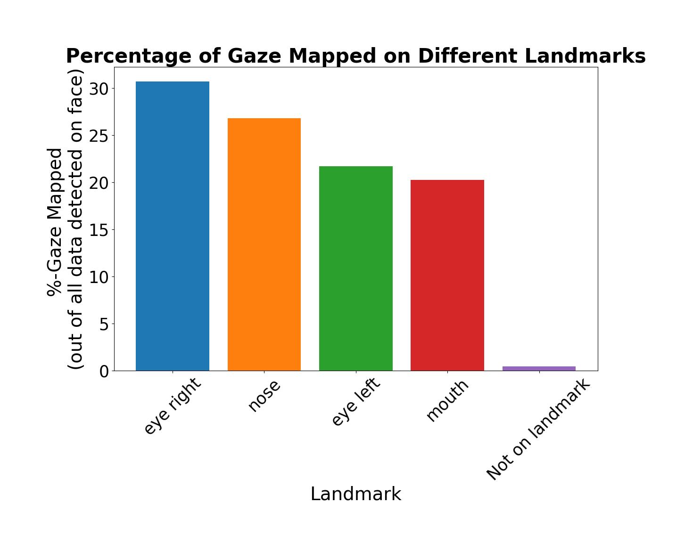

# Map Gaze Onto Facial Landmarks

<TagLinks :tags="$frontmatter.tags" />

<Youtube src="KRkgtGqLENk"/>

::: tip
Decode the cues of social interactions and cognition: Does your attention drift towards your friend's eyes, or do you gaze at their lips as they talk? This guide provides a roadmap to map gaze on facial landmarks using the output of our Face Mapper enrichment.
:::

## Analyzing Social Interactions: Mapping Gaze Onto Facial Landmarks 

Understanding where individuals direct their attention during social interactions is of significant importance across various research domains. From developmental research, exploring how infants and children focus on facial features at different developmental stages, to clinical psychology and the study of atypical behaviours, such as autism spectrum disorder.

In this guide, we'll show you how to map gaze onto facial landmarks using data exported from Pupil Cloud's Face Mapper enrichment.

## Introducing AOI Mapping for Facial Landmarks 

Pupil Cloud offers a [Face Mapper enrichment](https://docs.pupil-labs.com/neon/pupil-cloud/enrichments/face-mapper/) that tracks faces in scene videos, determines if they were gazed at, and provides coordinates for facial landmarks. However, it does not reveal _which_ facial landmarks were gazed at. That is, did they look at the mouth, eyes, or nose?

This guide introduces a tool to generate Areas of Interest (AOIs) around each facial landmark (like in the video above) and correlate the wearer's gaze with these. In short, it automatically identifies which facial landmarks were gazed at on the interlocutor's face.

## Setting Up Your Study

When setting up your experiment, precise mapping of gaze on facial landmarks hinges on two crucial factors: the proximity between the wearer and the target face, and the viewing angle.

For example, a wearer too far from the target face can result in facial landmarks appearing too small in the scene video. At the same time, sub-optimal viewing angles can cause AOIs on facial landmarks to be too small, and/or overlap. A wearer that is both close and directly facing the target face is therefore more optimal.

It is also important to optimize the AOI radius depending on the target’s proximity and viewing angle. A small AOI radius might not cover the whole facial landmark of interest. Conversely, a larger AOI radius might cause AOIs to overlap. Overlap can make it difficult to distinguish exactly which landmark was being gazed at.

## Steps To Recreate
1. Download a [Timeseries Data + Scene video](https://docs.pupil-labs.com/neon/data-collection/data-format/) from your project in Pupil Cloud.
2. Download the [Face Mapper export](https://docs.pupil-labs.com/neon/pupil-cloud/enrichments/face-mapper/) from your project in Pupil Cloud.
Upload (uncompressed) one of the subfolders (recording folder) that you're interested in to Google Drive from the raw data export.
3. Follow the instructions of this [Github repository](https://github.com/pupil-labs/gaze-on-facial-landmarks) and start mapping gaze on facial landmarks.

::: tip
Consider applying [offset correction](https://docs.pupil-labs.com/neon/data-collection/offset-correction/#using-offset-correction-to-improve-gaze-accuracy) before the recording(s) for even more accurate mapping of gaze on facial landmarks. 
:::

## Explore the Gaze Mapping Output

After running the code, new files will be generated and automatically saved within the folder that contains the Face Mapper enrichment data. Specifically, you will get:

1. The scene video of your recording rendered to show a bounding box of the detected face, a shaded circle over the eyes and nose and a shaded ellipse over the mouth, as well as the typical red circle for the gaze position. Facial landmarks that are gazed at are highlighted with a green mask. 
2. A newly generated file named `merged_data.csv`, containing all the relevant information you need, including the gaze data point information (gaze x and y coordinates), the coordinates of all facial landmarks, along with their associated timestamps, as well as the outcome of the mapping (field: `landmark`). 
3. A newly generated file named `percentages.csv`, along with a barplot showing the percentage of gaze data mapped on each facial landmark.

::: tip
Need guidance in adapting or extending this guide to match your custom analysis pipeline? Reach out to us via email at [info@pupil-labs.com](mailto:info@pupil-labs.com), on our [Discord server](https://pupil-labs.com/chat/), or visit our [Support Page](https://pupil-labs.com/products/support/) for dedicated support options.
:::

