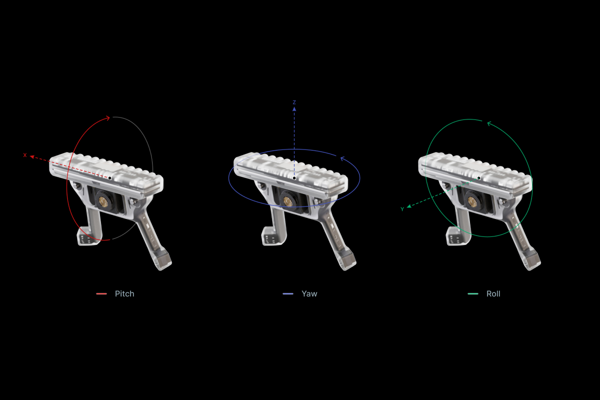

<script setup>
import TagLinks from '@components/TagLinks.vue'
</script>

# IMU Transformations

<TagLinks :tags="$frontmatter.tags" />

::: tip
Want to compare IMU and gaze data in the same coordinate system to better understand how people coordinate 
head and eye movements? The transformation functions in this tutorial will show you how!
:::

This guide contains various transformation functions that can assist when analysing Neon's IMU data.

First, it's important to understand how the IMU data should be interpreted. 
The [orientation readings of the calibrated IMU](https://docs.pupil-labs.com/neon/data-collection/data-streams/#movement-imu-data) 
are specified with respect to magnetic North and gravity. We will refer to this as the 'world coordinate system'.

To be exact, the 'world coordinate system' is distinct from the 'IMU coordinate system' - as the Neon module rotates, 
the IMU coordinate system rotates with it. The IMU's orientation readings actually specify the rotational difference between its coordinate 
system and the world coordinate system.

- Y axis = vector pointing towards magnetic North.
  - Rotations about this axis are called “roll” and range from -180 to +180 degrees. Wearing Neon normally in an upright position roughly corresponds to a roll of 0 degrees. Rightward head tilt is positive roll; leftward head tilt is negative roll.
- Z axis = vector pointing upwards, opposite to the direction of gravity.
  - Rotations about this axis are called “yaw” and range from -180 to +180 degrees. When the IMU is calibrated, a Neon module oriented at magnetic North corresponds to a yaw of 0 degrees. Leftward head turn is positive yaw; rightward head turn is negative yaw.
- X axis = cross-product of Y and Z, which is a vector pointing rightwards.
  - Rotations about this axis are called “pitch” and range from -90 to +90 degrees. Wearing Neon normally in an upright position roughly corresponds to a pitch of 0 degrees. Backward head tilt is positive pitch; forward head tilt is negative pitch



::: tip
💡 Note that Neon can sit differently on each wearer’s face, such that the headset is not necessarily in 
line with a given plane. For example, if the wearer is facing magnetic North, the IMU might 
still report some deviation from a neutral orientation.
:::

The raw gyroscope values give the rotational velocity about the X, Y, and Z axes of the IMU’s coordinate system. Their units are degrees/s (i.e., they provide the change 
over time of each of these quantities). The reference frame for specifying rotational velocities rotates with the IMU.

The raw acceleration values measure translational (i.e., linear) acceleration, in terms of g-force (units of g), 
along the X, Y, and Z axes of the IMU’s coordinate system. The reference frame for specifying acceleration values 
rotates with the IMU.

::: tip
💡 [g-force](https://en.wikipedia.org/wiki/G-force) is not the same as free-fall acceleration due 
to gravity. For example, if you are standing on the surface of the Earth, then the g-force is equal and 
opposite to gravity, keeping you at rest. In that case, if you were wearing Neon normally in an upright position, then 
acceleration along the Z axis would be +1g, while it would be 0g along the X and Y axes.
:::

It can be helpful to also try out our IMU visualization utility, [plimu](https://github.com/pupil-labs/plimu). This can assist in understanding the IMU data and the various coordinate systems.

Now that we have laid out the relationship between the IMU and world coordinate systems, and how to interpret the
readings, we can do some useful transformations.

We will use Python with the NumPy and SciPy packages for the code snippets below. Let’s start by importing those:

```python
import numpy as np
from scipy.spatial.transform import Rotation as R
```

## Obtain IMU Heading Vectors

An alternate representation of IMU data is a heading vector that points outwards from the center of the IMU. Neutral orientation of the IMU would correspond to a heading vector that points at magnetic North and that is oriented perpendicular to the line of gravity.

:::: details Code
```python
def imu_heading_in_world(imu_quaternions):
  """
  Construct heading vectors from the IMU's quaternion values.
        
  Inputs:
    - imu_quaternions (Nx4 np.array): A timeseries of quaternions
    from Neon's IMU stream.
        
  Returns:
    - headings_in_world (Nx3 np.array): The corresponding timeseries of
    IMU heading vectors in the world coordinate system.
  """

  # We start by specifying the direction of a neutral heading vector
  # in the IMU's coordinate system.
  heading_neutral_in_imu_coords = np.array([0.0, 1.0, 0.0])

  # This array contains a timeseries of transformation matrices,
  # as calculated from the IMU's timeseries of quaternions values.
  # Each of these matrices are used to transform points in the IMU
  # coordinate system to their corresponding coordinates in the world
  # coordinate system.
  imu_to_world_matrices = R.from_quat(imu_quaternions).as_matrix()
    
  # We now apply each transformation matrix to the neutral IMU heading vector
  # to obtain a timeseries of heading vectors in the world coordinate system.
  headings_in_world = imu_to_world_matrices @ heading_neutral_in_imu_coords

  return headings_in_world
```
::::

## Transform IMU Acceleration Data to World Coordinates

We mentioned above that the IMU’s acceleration data are specified with respect to the IMU’s coordinate system. Sometimes, it can be useful to have the acceleration data specified in the world coordinate system instead. The function below will perform this transformation.

### 

:::: details Code
```python
def imu_acceleration_in_world(imu_accelerations, imu_quaternions):
  """
  Transform the IMU's acceleration values to the world coordinate system.
    
  Inputs:
    - accelerations_imu (Nx3 np.array): A timeseries of acceleration data
    from the IMU, where columns are in the order: "acceleration x",
    "acceleration y", "acceleration z".
    - imu_quaternions (Nx4 np.array): A timeseries of quaternions
    from Neon's IMU stream.
    
  Returns:
    - accelerations_world (Nx3 np.array): The corresponding timeseries of
    acceleration data, expressed in the world coordinate system.
  """
    
  # This array contains a timeseries of transformation matrices,
  # as calculated from the IMU's timeseries of quaternions values.
  # Each of these matrices sends points in the IMU coordinate system to their
  # corresponding coordinates in the world coordinate system.
  imu_to_world_matrices = R.from_quat(imu_quaternions).as_matrix()
    
  accelerations_world = [imu_to_world @ imu_acceleration for imu_to_world, imu_acceleration in zip(imu_to_world_matrices, imu_accelerations)]
    
  return np.array(accelerations_world)
```
::::

## Represent IMU and Gaze Data in the Same Coordinate System

Neon simultaneously records gaze and IMU data, making it possible to study the relationship between head and 
eye movements.

To facilitate the comparison, it can be useful to represent them in the same coordinate system. The coordinates of gaze are specified with respect to the scene camera coordinate system and the function below, `gaze_scene_to_world`, uses data from the IMU to transform gaze to the world coordinate system.

:::: details Code
```python
def gaze_scene_to_world(gaze_elevations, gaze_azimuths, imu_quaternions):
  """
  Transform a 3D gaze ray to the world coordinate system.
    
  Note that the gaze data and the IMU quaternion should be sampled 
  at the same timestamps. You can linearly interpolate the IMU data
  to ensure this.
    
  The origin of the IMU coordinate system is the same as the
  origin of the world coordinate system.

  The code in this function is adapted from the `plimu` visualization utility:
  https://github.com/pupil-labs/plimu/blob/8b94302982363b203dddea2b15f43c6da60e787e/src/pupil_labs/plimu/visualizer.py#L274-L279
    
  This function makes use of the spherical_to_cartesian_scene function,
  defined below, that converts 3D gaze rays from spherical coordinates
  to Cartesian coordinates.
    
  Inputs:
    - gaze_elevations (Nx1 np.array): A timeseries of gaze elevations (degrees),
    specified in the scene camera coordinate system.
    - gaze_azimuths (Nx1 np.array): A timeseries of gaze azimuths (degrees),
    specified in the scene camera coordinate system.
    - imu_quaternions (Nx4 np.array): A timeseries of quaternion values
    from Neon's IMU.
    
  Returns:
    - gazes_in_world (Nx3 np.array): The corresponding timeseries of
    3D Cartesian gaze unit vectors, specified in the world coordinate system.
  """
    
  # The IMU and scene camera coordinate systems have a fixed
  # 102 degree rotation offset. See:
  # https://docs.pupil-labs.com/neon/data-collection/data-streams/#movement-imu-data
  imu_scene_rotation_diff = np.deg2rad(-90 - 12)
  
  # This matrix is used to transform points in the scene
  # camera coordinate system to their corresponding coordinates
  # in the IMU coordinate system.
  scene_to_imu = np.array(
      [
          [1.0, 0.0, 0.0],
          [
            0.0,
            np.cos(imu_scene_rotation_diff),
            -np.sin(imu_scene_rotation_diff),
          ],
          [
            0.0,
            np.sin(imu_scene_rotation_diff),
            np.cos(imu_scene_rotation_diff),
          ],
      ]
  )
  
  # Neon provides 3D gaze in spherical coordinates by default, 
  # so we first transform the gaze data from spherical coordinates
  # to Cartesian coordinates.
  cart_gazes_in_scene = spherical_to_cartesian_scene(gaze_elevations, gaze_azimuths)
    
  # Apply the transformation from the scene camera to the IMU coordinate system.
  gazes_in_imu = scene_to_imu @ cart_gazes_in_scene.T
  
  # This array contains a timeseries of transformation matrices,
  # as calculated from the IMU's timeseries of quaternions values.
  # Each of these matrices are used to transform points in the IMU coordinate
  # system to their corresponding coordinates in the world coordinate system.
  imu_to_world_matrices = R.from_quat(imu_quaternions).as_matrix()
  
  # Apply the transformations from the IMU to the world coordinate system.
  gazes_in_world = [imu_to_world @ gaze for imu_to_world, gaze in zip(imu_to_world_matrices, gazes_in_imu.T)]
  
  return np.array(gazes_in_world)


def spherical_to_cartesian_scene(elevations, azimuths):
  """
  Convert Neon's spherical representation of 3D gaze to Cartesian coordinates.
    
  Inputs:
    - elevations (Nx1 np.array): A timeseries of gaze elevations (degrees),
    specified in the scene camera coordinate system.
    - azimuths (Nx1 np.array): A timeseries of gaze azimuths (degrees),
    specified in the scene camera coordinate system.
    
  Returns:
    - cartesian_unit_vectors (Nx3 np.array): A timeseries of gaze unit
    vectors, in Cartesian coordinates, specified in the scene camera
    coordinate system.
  """

  elevations_rad = np.deg2rad(elevations)
  azimuths_rad = np.deg2rad(azimuths)

  # Elevation of 0 in Neon system corresponds to Y = 0, but
  # an elevation of 0 in traditional spherical coordinates would
  # correspond to Y = 1, so first we convert elevation to the
  # more traditional format.
  elevations_rad += np.pi / 2
 
  # Azimuth of 0 in Neon system corresponds to X = 0, but
  # an azimuth of 0 in traditional spherical coordinates would
  # correspond to X = 1. Also, azimuth to the right in Neon is
  # more positive, whereas it is more negative in traditional spherical coordiantes.
  # So, first we convert azimuth to the more traditional format.
  azimuths_rad *= -1.0
  azimuths_rad += np.pi / 2

  cartesian_unit_vectors = np.array([
    np.sin(elevations_rad) * np.cos(azimuths_rad),
    np.cos(elevations_rad),
    np.sin(elevations_rad) * np.sin(azimuths_rad),
  ]).T

  return cartesian_unit_vectors
```
::::

## Represent IMU and 3D Eyestate in the Same Coordinate System

The [3D eyestate estimates](https://docs.pupil-labs.com/neon/data-collection/data-streams/#_3d-eye-states) 
provided by Neon are aligned with the scene camera coordinate system. This means we can reuse elements of 
the `gaze_scene_to_world` function to reconstruct the pose of the eyes in the world coordinate system.

:::: details Code
```python
def eyestate_to_world(eyeball_centers, optical_axes, imu_quaternions):
  """
  Transforms 3D eyestate data to the world coordinate system.
  
  Note that the 3D eyestate data and the IMU quaternions should be sampled 
  at the same timestamps. You can linearly interpolate the IMU data
  to ensure this.
    
  The origin of the IMU coordinate system is the same as the
  origin of the world coordinate system.
    
  The code in this function is adapted from the `plimu` visualization utility:
  https://github.com/pupil-labs/plimu/blob/8b94302982363b203dddea2b15f43c6da60e787e/src/pupil_labs/plimu/visualizer.py#L274-L279
    
  Inputs:
    - eyeball_centers (Nx3 np.array): A timeseries of eyeball center
    estimates (mm) for one eye, as provided by Neon's 3D eyestate data stream.
    - optical_axes (Nx3 np.array): A timeseries of optical axis estimates
    (3D unit vectors) for the same eye, as provided by Neon's 3D eyestate data stream.
    - imu_quaternions (Nx4 np.array): A timeseries of quaternion values from
    Neon's IMU.
    
  Returns:
    - eyeball_centers_in_world (Nx3 np.array): The corresponding timeseries of
    eyeball center estimates (mm) for one eye, transformed to the world coordinate
    system of the IMU.
    - optical_axes_in_world (Nx3 np.array): The corresponding timeseries of optical
    axis estimates (3D unit vectors) for the same eye, transformed to the world
    coordinate system of the IMU.
  """
  
  # The eyeball centers are specified in terms of their distance from
  # the center of the scene camera, so to accurately convert them to
  # world coordinates, we need the position of the scene camera in
  # the IMU coordinate system. Here, we express that position
  # in millimeters.
  scene_camera_position_in_imu = np.array([0.0, -1.3, -6.62])

  # The coordinate system of 3D eyestate is aligned with
  # the coordinate system of the scene camera, so we can
  # make use of the scene->to->IMU transformation procedure.
  #
  # The IMU and scene camera coordinate systems have a fixed
  # 102 degree rotation offset. See here:
  # https://docs.pupil-labs.com/neon/data-collection/data-streams/#movement-imu-data
  imu_scene_rotation_diff = np.deg2rad(-90 - 12)
  
  # This matrix is used to transform points in the scene
  # camera coordinate system to their corresponding coordinates
  # in the IMU coordinate system.
  scene_to_imu = np.array(
      [
        [1.0, 0.0, 0.0],
        [
          0.0,
          np.cos(imu_scene_rotation_diff),
          -np.sin(imu_scene_rotation_diff),
        ],
        [
          0.0,
          np.sin(imu_scene_rotation_diff),
          np.cos(imu_scene_rotation_diff),
        ],
      ]
  )
  
  # Convert the coordinates of the eyeball center and optical axes
  # to the IMU coordinate system.
  eyeball_centers_in_imu = scene_to_imu @ eyeball_centers.T
  optical_axes_in_imu = scene_to_imu @ optical_axes.T
    
  # Take into account that the scene camera is offset from the IMU.
  eyeball_centers_in_imu[0, :] += scene_camera_position_in_imu[0]
  eyeball_centers_in_imu[1, :] += scene_camera_position_in_imu[1]
  eyeball_centers_in_imu[2, :] += scene_camera_position_in_imu[2]
  
  # This array contains a timeseries of transformation matrices,
  # as calculated from the IMU's timeseries of quaternions values.
  # Each of these matrices are used to transform points in the IMU
  # coordinate system to their corresponding coordinates in the world
  # coordinate system.
  imu_to_world_matrices = R.from_quat(imu_quaternions).as_matrix()
  
  # Apply the transformations from the IMU to the world coordinate system.
  eyeball_centers_in_world = [imu_to_world @ eye_center for imu_to_world, eye_center in zip(imu_to_world_matrices, eyeball_centers_in_imu.T)]
  optical_axes_in_world = [imu_to_world @ optical_axis for imu_to_world, optical_axis in zip(imu_to_world_matrices, optical_axes_in_imu.T)]
    
  return np.array(eyeball_centers_in_world), np.array(optical_axes_in_world)
```
::::

## Convert (Cartesian) World Points to Spherical Coordinates

When studying head orientation and gaze orientation as observers navigate a 3D environment, it can be useful 
to know how much these quantities deviate from pointing at a given landmark. For instance, you might want to 
know when someone’s gaze or heading deviates from pointing at the horizon. This can be simplified by 
converting world points from Cartesian to spherical coordinates. The orientation values from the IMU are already in such a format. 
For the values returned by  `gaze_scene_to_world`, the function below will do the necessary transformation. 
When wearing Neon normally, then an elevation and azimuth of 0 degrees corresponds to a neutral orientation:
i.e., aimed at magnetic North and parallel to the horizon.

:::: details Code
```python
def cartesian_to_spherical_world(world_points_3d):
  """
  Convert points 3D Cartesian world coordinates to spherical coordinates.

  The origin of the world coordinate system is the same as the origin of the
  IMU coordinate system.

  When wearing Neon normally, then an elevation and azimuth of 0 degrees corresponds
  to a neutral orientation: i.e., aimed at magnetic North and parallel to the horizon.

  Inputs:
    - world_points_3d (Nx3 np.array): A collection of 3D points in 
    Cartesian world coordinates.
        
  Returns:
    - elevation (Nx1 np.array): The corresponding elevation value, in degrees,
    for each 3D world point (i.e., vertical rotation away from neutral orientation).
    Note: neutral orientation = 0 elevation; orientation upwards is positive;
    orientation downwards is negative.
    - azimuth (Nx1 np.array): The corresponding azimuth value, in degrees, for
    each 3D world point (i.e., horizontal rotation away from neutral orientation).
    Note: neutral orientation = 0 azimuth, orientation leftwards is positive;
    orientation rightwards is negative.
  """

  x = world_points_3d[:, 0]
  y = world_points_3d[:, 1]
  z = world_points_3d[:, 2]

  radii = np.sqrt(x**2 + y**2 + z**2)

  elevation = -(np.arccos(z / radii) - np.pi / 2)
  azimuth = np.arctan2(y, x) - np.pi/2
  
  # Keep all azimuth values in the range of [-180, 180] to remain consistent
  # with the yaw orientation values provided by the IMU
  azimuth[azimuth < -np.pi] += 2 * np.pi
  azimuth[azimuth > np.pi] -= 2 * np.pi

  # Convert from radians to degrees
  elevation = np.rad2deg(elevation)
  azimuth = np.rad2deg(azimuth)

  return elevation, azimuth
```
::::

## Analysis example

Below is a brief example of how to run the functions on this page using IMU data downloaded from Pupil Cloud.

:::: details Code
```python
gaze = pd.read_csv("gaze.csv")
eye3d = pd.read_csv("3d_eye_states.csv")
imu = pd.read_csv("imu.csv")

gaze_ts = gaze["timestamp [ns]"]
eye3d_ts = eye3d["timestamp [ns]"]
imu_ts = imu["timestamp [ns]"]

# We have more gaze datapoints (sampled at 200Hz) than
# IMU datapoints (sampled at 110Hz), so linearly interpolate
# the IMU datapoints to be congruent with gaze.
quaternions_resampled = np.array([
  np.interp(gaze_ts, imu_ts, imu["quaternion x"]),
  np.interp(gaze_ts, imu_ts, imu["quaternion y"]),
  np.interp(gaze_ts, imu_ts, imu["quaternion z"]),
  np.interp(gaze_ts, imu_ts, imu["quaternion w"]),
]).T

accelerations_resampled = np.array([
  np.interp(gaze_ts, imu_ts, imu["acceleration x [g]"]),
  np.interp(gaze_ts, imu_ts, imu["acceleration y [g]"]),
  np.interp(gaze_ts, imu_ts, imu["acceleration z [g]"]),
]).T

# Put the eyestate data in a format that is compatible with
# the transformation functions from this article.
optical_axes_left = np.array([
  eye3d["optical axis left x"],
  eye3d["optical axis left y"],
  eye3d["optical axis left z"],
]).T

eyeball_centers_left = np.array([
  eye3d["eyeball center left x [mm]"],
  eye3d["eyeball center left y [mm]"],
  eye3d["eyeball center left z [mm]"],
]).T

# Now, we can apply the functions.

imu_headings = imu_heading_in_world(quaternions_resampled)

world_gazes = gaze_scene_to_world(
  gaze["elevation [deg]"],
  gaze["azimuth [deg]"],
  quaternions_resampled,
)

eye_centers_left_world, optical_axes_left_world = eyestate_to_world(
  eyeball_centers_left,
  optical_axes_left,
  quaternions_resampled,
)

world_accelerations = imu_acceleration_in_world(
  accelerations_resampled,
  quaternions_resampled,
)

gaze_elevations_world, gaze_azimuths_world = cartesian_to_spherical_world(world_gazes)
```
::::

::: tip
Need assistance with the IMU code in this article? Or do you have something more custom in mind? Reach out to us via email at [info@pupil-labs.com](mailto:info@pupil-labs.com), on our [Discord server](https://pupil-labs.com/chat/), or visit our [Support Page](https://pupil-labs.com/products/support/) for dedicated support options.
:::
