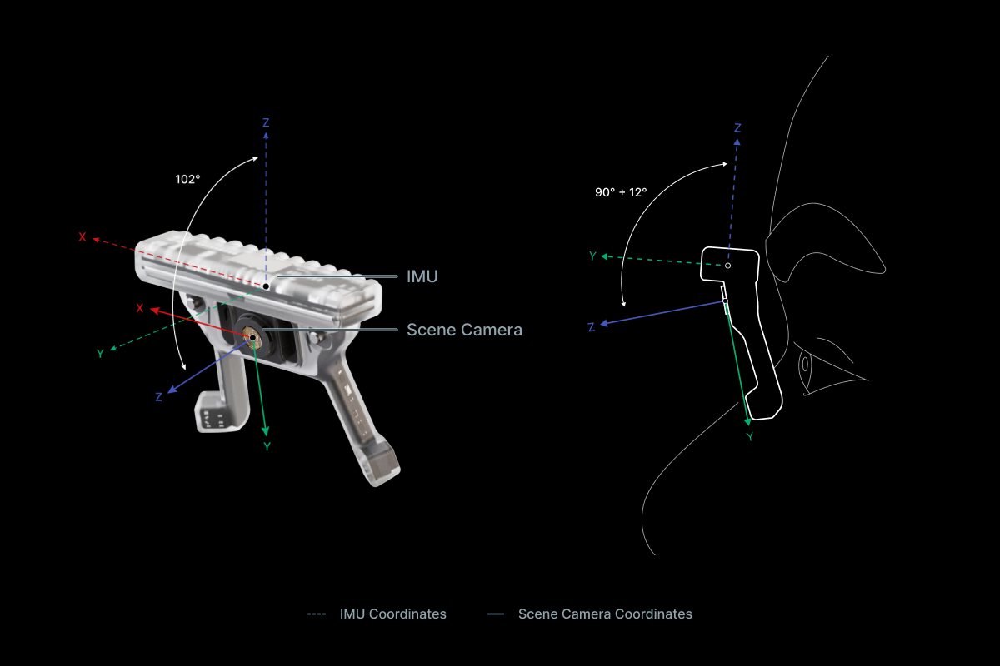

This guide contains various transformation functions that help with relating [Neon's IMU data](https://docs.pupil-labs.com/neon/data-collection/data-streams/#movement-imu-data) with other data streams.

As you work through this guide, you may want to check out the [Application Example](#application-example) to see the code in action.

## Rotation between the IMU and the World

The IMU data includes a description of how the IMU is rotated in relation to the world. Concretely, the IMU data contains quaternions that define a rotation transformation between [the world coordinate system](http://docs.pupil-labs.com/neon/data-collection/data-streams/#movement-imu-data) and the IMU's local coordinate system at different points in time.

The `transform_imu_to_world` function below demonstrates how to use these quaternions to transform data from the IMU's local coordinate system to the world coordinate system.

```python
from scipy.spatial.transform import Rotation as R

def transform_imu_to_world(imu_coordinates, imu_quaternions):
    # This array contains a timeseries of transformation matrices,
    # as calculated from the IMU's timeseries of quaternions values.
    imu_to_world_matrices = R.from_quat(
        imu_quaternions,
        scalar_first=True,
    ).as_matrix()

    if np.ndim(imu_coordinates) == 1:
        return imu_to_world_matrices @ imu_coordinates
    else:
        return np.array([
            imu_to_world @ imu_coord
            for imu_to_world, imu_coord in zip(
                imu_to_world_matrices, imu_coordinates
            )
        ])
```

### Example: Heading Vectors in World Coordinates

The `transform_imu_to_world` function can be used to calculate heading vectors of the IMU in world coordinates. The heading vector essentially describes the direction the IMU is facing. If we imagine the IMU inside the Neon module while it is worn on sombody's head, the heading vector describes the direction the wearer's face is pointing.

The "forward-facing axis" is the y-axis, so we can calculate the heading vector by transforming the `(0, 1, 0)` vector.

```python
def imu_heading_in_world(imu_quaternions):
    heading_neutral_in_imu_coords = np.array([0.0, 1.0, 0.0])
    return transform_imu_to_world(
        heading_neutral_in_imu_coords, imu_quaternions
    )
```

::: tip
Neutral orientation (i.e. an identity rotation in the quaternion) of the IMU would correspond to a heading vector that points at magnetic North and that is oriented perpendicular to the line of gravity.
:::

### Example: Acceleration in World Coordinates

The IMU’s translational acceleration data is given in the IMU's local coordinate system. To understand how the observer is accelerating through the world, it can be helpful to transform the data into the world coordinate system:

```python
accelerations_in_world = transform_imu_to_world(
    imu_accelerations, imu_quaternions
)
```

## Scene to World Coordinates

A lot of the data generated by Neon is provided in the scene camera's coordinate system, including e.g. gaze, fixation, and eye state data. This coordinate system is **not** equal to the IMU's coordinate system! There is a translation between them (simply because there is a physical distance between the camera and the IMU in the module) and also a rotation (because of how the scene camera's coordinate system is defined).

The rotation is a 102 degree rotation around the x-axis of the IMU coordinate system and the translation is along the vector `(0.0 mm, -1.3 mm, -6.62 mm)`.



We can define a `transform_scene_to_imu` function that handles the rotation between the two coordinate systems.

```python
def transform_scene_to_imu(coords_in_scene, translation_in_imu=np.array([0.0, -1.3, -6.62])):
    imu_scene_rotation_diff = np.deg2rad(-90 - 12)
    scene_to_imu = np.array(
        [
            [1.0, 0.0, 0.0],
            [
                0.0,
                np.cos(imu_scene_rotation_diff),
                -np.sin(imu_scene_rotation_diff),
            ],
            [
                0.0,
                np.sin(imu_scene_rotation_diff),
                np.cos(imu_scene_rotation_diff),
            ],
        ]
    )

    coords_in_imu = scene_to_imu @ coords_in_scene.T

    coords_in_imu[0, :] += translation_in_imu[0]
    coords_in_imu[1, :] += translation_in_imu[1]
    coords_in_imu[2, :] += translation_in_imu[2]

    return coords_in_imu.T
```

Combining the `transform_scene_to_imu` function with the `transform_imu_to_world` function allows us to go all the way from the scene camera coordinate system to the world coordinate system.

```python
def transform_scene_to_world(coords_in_scene, imu_quaternions, translation_in_imu=np.array([0.0, -1.3, -6.62])):
    coords_in_imu = transform_scene_to_imu(coords_in_scene, translation_in_imu)
    return transform_imu_to_world(coords_in_imu, imu_quaternions)
```

### Example: Eyestate in World Coordinates

The `transform_scene_to_world` function allows us to easily convert [eye state data](https://docs.pupil-labs.com/neon/data-collection/data-streams/#_3d-eye-states) given in scene camera coordinates to world coordinates.

::: warning
Note, to do this right in practice you need to make sure you sample the quaternions and eye state data at the same timestamps. Since both data streams are generated independently and do not share the same set of timestamps, this is a challenge in itself.

We are glossing over this here, but one possible solution to this is interpolating the IMU data to match the timestamps of the eye state data, which is demonstrated [here](http://docs.pupil-labs.com/alpha-lab/imu-transformations/#application-example).
:::

```python
def eyestate_to_world(eyeball_centers, optical_axes, imu_quaternions):
    """
    The eyeball_centers and optical_axes inputs are for the same eye.
    """

    # The eyeball centers are specified relative to the center of the scene
    # camera, so we need to account for the position of the scene camera in
    # the IMU coordinate system. Here, we express that position in millimeters.
    eyeball_centers_in_world = transform_scene_to_world(
        eyeball_centers, imu_quaternions
    )

    # The optical axes are unit vectors originating at the eyeball centers,
    # so they should not be translated.
    optical_axes_in_world = transform_scene_to_world(
        optical_axes, imu_quaternions, translation=np.zeros(3)
    )

    return eyeball_centers_in_world, optical_axes_in_world
```

### Example: 3D Gaze Direction in World Coordinates
Neon provides 3D gaze directions in [spherical coordinates (i.e., `azimuth/elevation [deg]`)](https://docs.pupil-labs.com/neon/data-collection/data-format/#gaze-csv). The `transform_scene_to_world` function above expects 3D Cartesian coordinates, so we need to convert the data first.

```python
def spherical_to_cartesian_scene(elevations, azimuths):
    """
    Convert Neon's spherical representation of 3D gaze to Cartesian coordinates.
    """

    elevations_rad = np.deg2rad(elevations)
    azimuths_rad = np.deg2rad(azimuths)

    # Elevation of 0 in Neon's system corresponds to Y = 0, but
    # an elevation of 0 in traditional spherical coordinates would
    # correspond to Y = 1, so we convert elevation to the
    # more traditional format.
    elevations_rad += np.pi / 2

    # Azimuth of 0 in Neon's system corresponds to X = 0, but
    # an azimuth of 0 in traditional spherical coordinates would
    # correspond to X = 1. Also, azimuth to the right for Neon is
    # more positive, whereas it is more negative in traditional
    # spherical coordiantes. So, we convert azimuth to the more
    # traditional format.
    azimuths_rad *= -1.0
    azimuths_rad += np.pi / 2

    return np.array(
        [
            np.sin(elevations_rad) * np.cos(azimuths_rad),
            np.cos(elevations_rad),
            np.sin(elevations_rad) * np.sin(azimuths_rad),
        ]
    ).T
```

Now we can transform the data to world coordinates. Since we are dealing with 3D directions, rather than 3D points here, it does not make sense to apply the translation that we used in the `transform_scene_to_world` function above. We are thus setting it to zero here.

```python
def gaze_3d_to_world(gaze_elevation, gaze_azimuth, imu_quaternions):
    cart_gazes_in_scene = spherical_to_cartesian_scene(gaze_elevation, gaze_azimuth)
    return transform_scene_to_world(cart_gazes_in_scene, imu_quaternions, translation_in_imu=np.zeros(3))
```

## World Spherical Coordinates
Using the transformations introduced above, we can transform various data into cartesian world coordinates. For some purposes, it is more intuitive to have the data in spherical coordinates though. For instance, you might want to know when someone’s gaze or heading deviates from parallel with the horizon, i.e. if they are looking/facing upwards or downwards.

Converting data into spherical world coordinates makes this obvious. When wearing Neon, an elevation and azimuth of 0 degrees corresponds to a neutral orientation: i.e., aimed at magnetic North and parallel to the horizon. A positive elevation corresponds to looking upwards, and a negative elevation corresponds to looking downwards.

The [Euler angles from the IMU](https://docs.pupil-labs.com/neon/data-collection/data-streams/#euler-angles) are already in a compatible format. For gaze data in world coordinates, the `cartesian_to_spherical_world` function below will do the necessary transformation.

```python
def cartesian_to_spherical_world(world_points_3d):
    """
    Convert points in 3D Cartesian world coordinates to spherical coordinates.

    For elevation:
      - Neutral orientation = 0 (i.e., parallel with horizon)
      - Upwards is positive
      - Downwards is negative

    For azimuth:
      - Neutral orientation = 0 (i.e., aligned with magnetic North)
      - Leftwards is positive
      - Rightwards is negative
    """

    x = world_points_3d[:, 0]
    y = world_points_3d[:, 1]
    z = world_points_3d[:, 2]

    radii = np.sqrt(x**2 + y**2 + z**2)

    elevation = -(np.arccos(z / radii) - np.pi / 2)
    azimuth = np.arctan2(y, x) - np.pi / 2

    # Keep all azimuth values in the range of [-180, 180] to remain
    # consistent with the yaw orientation values provided by the IMU.
    azimuth[azimuth < -np.pi] += 2 * np.pi
    azimuth[azimuth > np.pi] -= 2 * np.pi

    elevation = np.rad2deg(elevation)
    azimuth = np.rad2deg(azimuth)

    return elevation, azimuth
```

## Application Example

Below, we present a video showing how some of the functions in this article were used to visualize different combinations of head and eye movements in world coordinates. The code for producing the visualization [can be found here](https://github.com/pupil-labs/pupil-docs/tree/master/alpha-lab/imu-transformations/imu_heading_visualization.ipynb).

<Youtube src="3OdkHo3ThAE"/>

## Related content

It can also be helpful to try out our IMU visualization utility, [plimu](https://github.com/pupil-labs/plimu). This can assist in understanding the IMU data and the various coordinate systems. For example, some of the code in this article is [adapted from it](https://github.com/pupil-labs/plimu/blob/8b94302982363b203dddea2b15f43c6da60e787e/src/pupil_labs/plimu/visualizer.py#L274-L279).

::: tip
Need assistance with the IMU code in this article? Or do you have something more custom in mind? Reach out to us via email at [info@pupil-labs.com](mailto:info@pupil-labs.com), on our [Discord server](https://pupil-labs.com/chat/), or visit our [Support Page](https://pupil-labs.com/products/support/) for dedicated support options.
:::
