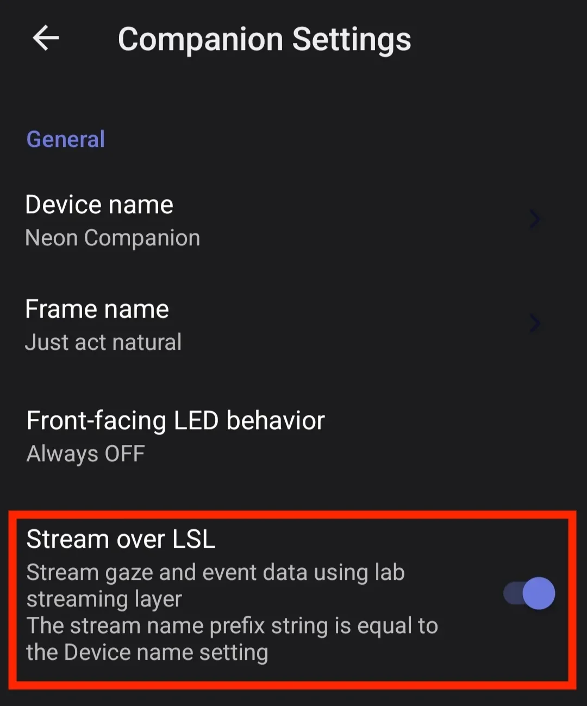
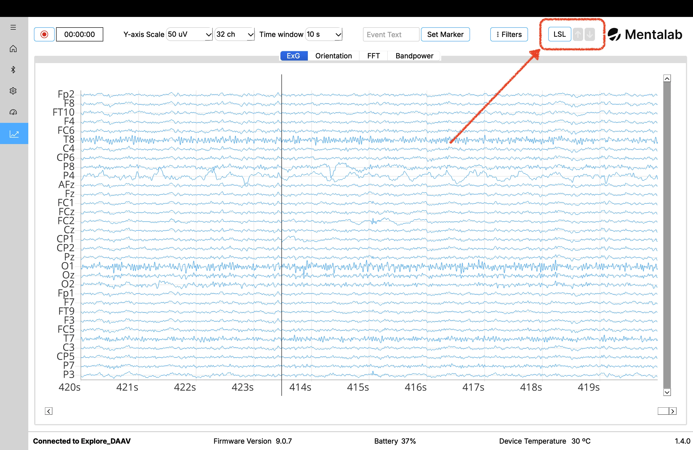
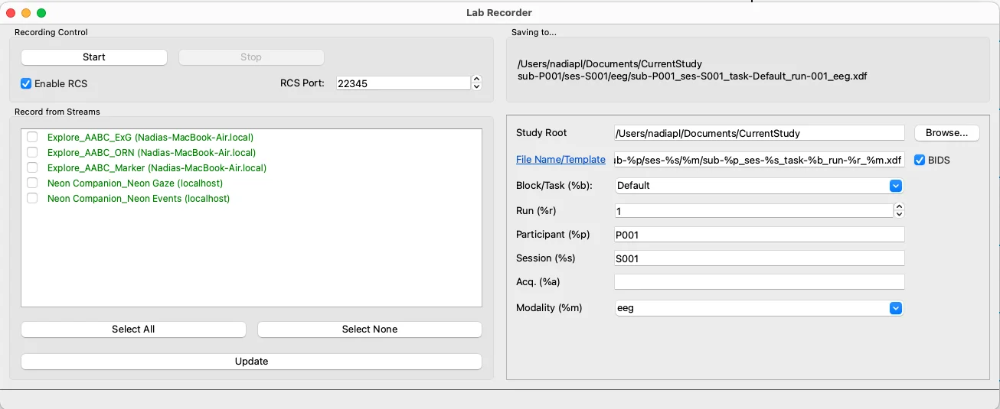
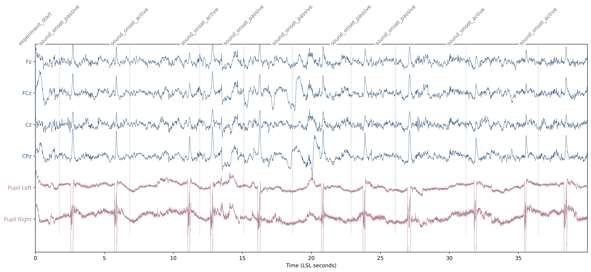

<Youtube src="mMOvOm2Nhro"/>

:::tip
Bridge the gap between brainwaves and eye movements; combine independent data streams into a single file, and conquer clock drift for flawless multimodal experiments.
:::

## The Challenge of Timing

A big challenge associated with multimodal recording is synchronization. When capturing brain activity alongside eye movements, you are juggling data produced by different devices, on different operating systems, using different internal clocks.

For instance, Neon timestamps are generated from its own internal clock, while Mentalab Explore Pro timestamps EEG data on its host PC. Because these clocks operate independently, they might not be in sync to start with, and can drift apart over time. To analyze these signals together, you need a reliable way to align them. This is where Lab Streaming Layer (LSL) comes in.

This tutorial uses [Neon](https://pupil-labs.com/products/neon) and [Mentalab](https://mentalab.com/) Explore Pro EEG as a concrete example to explain how multimodal synchronization with LSL works in practice and how you can achieve millisecond-precision alignment in your own research.

## Setup

You will need:

- Neon glasses connected to the Companion Device running the Neon Companion App
- Mentalab Explore Pro EEG connected to a PC running the Explore Desktop software
- LSL Lab Recorder installed on the same computer

All devices must be on the same local network (typically the same Wi-Fi). This is essential because LSL relies on the network to exchange timing information and estimate clock offsets. 

:::tip
For sub-ms synchronization accuracy between LSL and Mentalab Explore Pro, use the Mentalab Explore Pro in combination with Mentalab Hypersync.
:::

### Enable Neon Streaming

In the Neon Companion App, enable **Stream over LSL**. The phone begins broadcasting eye tracking data and event streams. Each sample is marked with Neon's local time.

{width=300px style="display:block;margin:0 auto;"}

### Enable Explore Pro Streaming

In Explore Desktop, connect via Bluetooth and enable LSL output in settings. These samples use the PC’s clock.

{width=800px style="display:block;margin:0 auto;"}

### Record with Lab Recorder

Launch Lab Recorder on the PC and refresh the stream list. Select:
- `Explore_<Device ID>_ExG`
- `[Device Name]_Neon Gaze`
- `[Device Name]_Neon Events`

{width=800px style="display:block;margin:0 auto;"}

When you hit Start, Lab Recorder captures the streams and the synchronization metadata simultaneously.

:::tip
For the EEG streams, we only need to select the `Explore_<device_id>_ExG`. Markers and motion data (`_Marker & _ORN`) are out of the scope of the present tutorial.  
:::

::: details Want to know more about how LSL works?
A typical LSL setup comprises a recording computer running ‘LSL Lab Recorder’, and one or more experiment devices (e.g. Neon and Mentalab EEG) streaming data over the LSL network to the recording computer. In this context, LSL doesn’t sync Neon and Mentalab EEG clocks directly to each other. Instead, each device keeps its own time, and the host computer acts as a reference. LSL calculates the time differences (clock offset) between the devices and the reference, and then both data streams can be adjusted onto the same unified timeline:
- **The Reference:** Lab Recorder acts as the central timekeeper
- **Independent Offsets:** LSL measures network latency to estimate how far "ahead" or "behind" each device is compared to the reference, rather than trying to force the devices’ clocks to match in real-time.
- **The Recording:** Lab Recorder saves the raw data, the original timestamps, and these offset estimates into a single `.xdf` file.
- **The Reconstruction:** Synchronization is reconstructed post-hoc. Tools like `pyxdf` apply the stored offsets to map all data onto a single, unified timeline.
:::

## Experimental Workflow

With the technical link established and the streams converging in Lab Recorder, you can stop worrying about network lag or clock drift and focus on the experimental design. To demonstrate this, let’s apply this setup to a classic Sensory Attenuation paradigm. Head to [this GitHub repository](https://github.com/pupil-labs/neon-eeg-sync) for the PsychoPy script and sample data.

### The Paradigm: Active vs. Passive

This task compares how the brain processes self-generated stimuli versus external ones.

- **Active:** The participant presses a button to trigger a tone.
- **Passive:** The tone plays automatically.
In EEG, self-generated tones usually show reduced N1/P2 amplitudes. In pupillometry, they self-generated tones elicit larger pupil responses compared to the passively listened ones.

### Running the Task

Use the provided PsychoPy script to manage stimulus delivery and markers.

1. **Update IP:** Ensure the script points to your Neon Companion’s IP address.
2. **Run the script**: When running the script and right before starting with the main experiment, a window will appear with instructions guiding the participant through the task. During the experiment, three types of information are generated:
   - Continuous EEG data from Explore Pro
   - Continuous gaze and pupil data from Neon
   - Event markers indicating stimulus onset and condition
    
    The script sends event markers (e.g., "Sound Onset") via two paths:
    - **LSL Stream (**`PSY_MARKERS_TASK`**):** Recorded in the `.xdf` file for alignment with EEG.
    - **Neon Real-Time API:** Embedded directly into the Neon recording for use in Pupil Cloud or Neon Player.

As the participant completes the task, Lab Recorder is silently doing the heavy lifting. Pairing every brainwave and eye movement with the exact moment a stimulus was presented. The final result is a single `.xdf` file that contains the entire multi-layered story of the experiment.

### Analysis

Once the `.xdf` file is loaded into an analysis environment (like MNE-Python or MATLAB), the clock offsets are applied automatically. Because the markers, EEG, and pupil data now share a reference timeline, you can precisely epoch the data:

*Example: "Show me the EEG voltage and pupil diameter from -200ms to +800ms relative to the 'Active Tone' marker."*

{width=800px style="display:block;margin:0 auto;"}
***Figure 1.** Time-series visualization of synchronized multimodal data. The plot displays the first 40 seconds of the task, integrating preprocessed midline EEG channels (Fz, FCz, Cz, CPz) with left and right pupil diameter from the Neon eye tracker. Vertical dashed markers indicate time-aligned experimental events.*{.image-caption}

## Taking Your Research Further

In this guide, we’ve demonstrated how to bridge the gap between neural and eye tracking data using LSL. By leveraging Neon and Mentalab Explore Pro together, you can move beyond single-stream recordings to high-precision, multimodal experiments where data is perfectly aligned on a shared timeline.

**Coming soon:** A dedicated Neon Player plugin for loading and visualizing multimodal `.xdf` files.

::: tip
If you need more help or would like assistance setting up your specific experimental workflow, we are here to support you. You can reach out to us directly at [info@pupil-labs.com](mailto:info@pupil-labs.com), join the conversation on our [Discord server](https://pupil-labs.com/chat/), or visit our [Support Page](https://pupil-labs.com/products/support/) for more formal support options and documentation.
:::