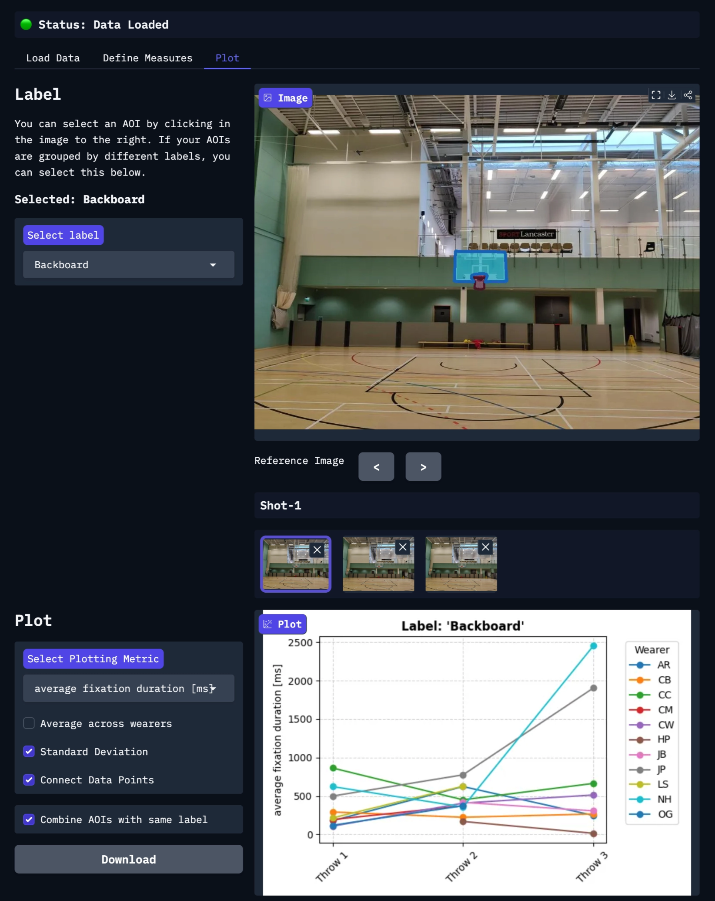

<Youtube src="-cEUJZOBNLQ"/>

::: tip
Visualize your AOI data over time, conditions, participant groups, or even different contexts. Simply paste your project folder URL to load your enrichments and explore!
:::

## See the Bigger Picture

While capturing what a person is looking at is fascinating in itself, sometimes we are more interested in how our gaze 
changes over time or how it differs between people. For example, how do our fixations change as we become experts at a task, 
or how do patients differ from controls. Or maybe you want to know how long it takes shoppers to discover your product 
when it is placed on a different shelf. We’ve built an interactive tool that leverages our Pupil Cloud API to allow you to take a deep dive into your enriched data by plotting AOI metrics across different measurement points. No coding required!

## Bridging the Gap Between Metrics and Comparison

Pupil Cloud provides a robust pipeline for analyzing gaze data in dynamic environments. Using enrichments like the [Auto-Image Mapper](https://docs.pupil-labs.com/neon/pupil-cloud/enrichments/auto-image-mapper/#auto-image-mapper), you can map fixations onto a static reference image, define Areas of Interest (AOIs), and group them using [Labels](https://docs.pupil-labs.com/neon/pupil-cloud/areas-of-interest/#areas-of-interest-aois). Cloud also offers excellent built-in visualizations, such as AOI Heatmaps and [bar charts](https://docs.pupil-labs.com/neon/pupil-cloud/visualizations/bar-chart/), which allow you to quickly quantify engagement for specific areas.

For example, if you run three Auto-Image Mapper enrichments across three different store locations, Cloud allows you to generate detailed bar charts for each individual location to see how much attention a specific product attracted, or aggregate the data across all locations. To view the broader trends across all stores, you can simply export these charts or view them side-by-side.

To build on these capabilities and offer a new, interactive way to explore your data, we’ve built an experimental Gradio web application.

This tool leverages the Pupil Cloud API to automatically retrieve and pool data from multiple enrichments into a single interface. Rather than viewing charts side-by-side, the app loads your reference image interactively. You can assign data segments from different wearers, recordings, and enrichments to different blocks, which can represent different time-points, conditions, or different wearer groups. When you click on any AOI in the image, the app instantly generates a unified plot displaying the metrics for that specific AOI across all your selected enrichments. 

Whether you are comparing product discovery times across different store layouts or tracking expert versus novice behaviors across multiple trials, this approach allows you to rapidly spot trends visually.

## Steps to Recreate

Simply run the Google Colab cell to start the tool, then copy your Project URL and a developer token that you can obtain from your account settings into the respective fields to get started. You can also download the code and run it locally. 

::: tip
All you have to do is prepare a [project folder](https://docs.pupil-labs.com/neon/pupil-cloud/projects/#projects) to which you have assigned the appropriate recordings, run your enrichments, and define your AOIs. The tool will take all enrichments available under this project folder, so make sure to only keep the enrichments that you want to include in the visualizations.
:::

 

## Workflows
Though very flexible, the tool is generally intended for three different workflows:

1. **Event-based comparisons:** For comparing different trials or conditions within a single, continuous recording. Differentiate the trials using events, then run separate enrichments for each segment using those specific start and end events.

   > **Example:** A basketball player makes five free-throw attempts in one recording. Demarcate each throw with events (e.g., "Throw 1 start", "Throw 1 end"). You would then create five separate RIM enrichments, one for each throw.

2. **Session-based comparisons:** Measurements involve multiple recordings, either from the same participant over time or between different groups (e.g., patients vs. controls). All recordings can be processed in a single enrichment, with group or session data stored in the wearer profile. 

    >**Example 1 (Repeated Measures):** You want to track an air traffic controller’s progress across training intervals. You can create a new wearer profile or a separate enrichment for each session.

    >**Example 2 (Group Comparisons):** You want to compare beginners vs. experts in chess. Label their group association directly in the wearer profile (e.g., "Beginner 1," "Expert 3").

3. **Comparisons across different environments:** To analyze how metrics for a specific Area of Interest (AOI) change across different contexts, use separate RIM enrichments and reference images for each environment. To aggregate this data, you use the same AOI labels across enrichments. You can switch between the different reference images and see the selected AOIs. Using AOI labels you can also easily group them in different ways.

    > **Example:** You may want to know how a product stands out in different showroom designs. These each require their own enrichments. In each, assign the product the corresponding labels across the different enrichments.

## An eye for change
After you have loaded your data by copying the project URL and assigned the data segments to your different measurements, the interactive reference image appears. Here, your AOIs are highlighted in purple. Clicking on these will immediately generate a visualization of how the metric of choice changes over time. Below you see an example of basketball players making three attempts at a free throw, and their average fixation duration on the backboard.

<figure style="display: block; margin: 2rem auto; text-align: center;">
  
  <figcaption style="font-style: italic; font-size: 0.9em; color: #555; margin-top: 0.6rem; padding: 0 10px;">
    Overview of the tool interface and main controls; data show gaze behavior over repeated basketball shots.
  </figcaption>
</figure>

::: tip
Do you need assistance setting up your project to run this tool? Reach out to us via email at [info@pupil-labs.com](mailto:info@pupil-labs.com), on our [Discord server](https://pupil-labs.com/chat/), or visit our [Support Page](https://pupil-labs.com/products/support/) for formal support options.
:::
