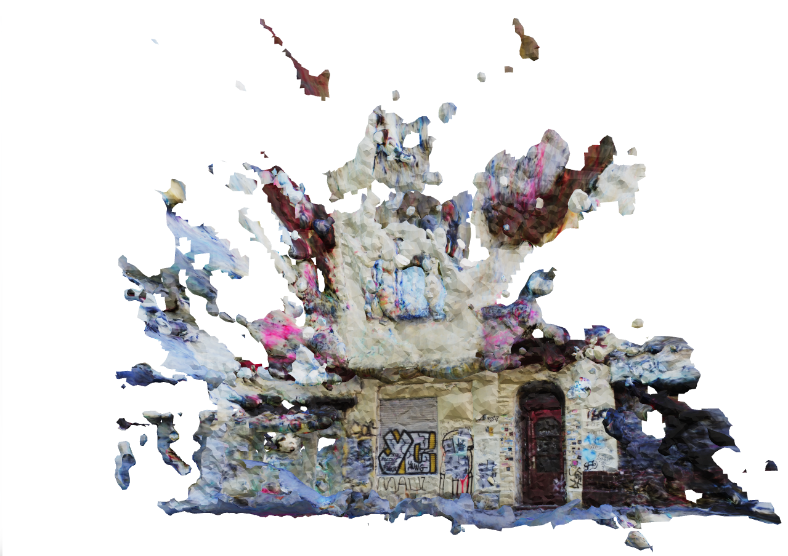

<script setup>
import TagLinks from '@components/TagLinks.vue'
</script>

<!-- <head> <script type="module" src="https://ajax.googleapis.com/ajax/libs/model-viewer/3.0.1/model-viewer.min.js"></script> </head> -->

# Create 3D Models of Your Environment Using Reference Image Mapper and Nerfstudio

<TagLinks :tags="$frontmatter.tags" />

<Youtube src="7W2DCkPfFLE"/>

::: danger
🕰️ - _Great Scott! This content is highly experimental. Using it will take you on a wild ride into the future, but beware - you'll be going solo. Consider yourself warned!_ 🎢
:::

If you watched the accompanying video, you have witnessed 3D environment reconstructions based on eye tracking recordings. In essence, we have explored how to augment the output of our [Reference Image Mapper enrichment](https://docs.pupil-labs.com/neon/pupil-cloud/enrichments/reference-image-mapper/) to show a third person view of an eye tracking recording. Other wordly, huh?

A third person view allows you to see more of the environment and how your partipant explores and visually interacts with it. Let's break it down – in the video, the green points (actually camera frustrums) denote where the “user’s head” was during the recording, while the yellow line illustrates a gaze ray from the head to the object that's looked at. You can also see a 3D heat-map showing which areas attracted attention.

## A 3D View?

We perceive the world around us in 3D and for many years, we have tried to capture and reconstruct this 3D world using photogrammetry or special cameras. This approach was traditionally quite expensive and/or required specific types of cameras capable of recording depth and localising themselves in the scene.

But nowadays, thanks to recent advances in deep learning, we have an easier way to reconstruct 3D environments. Isn't that exciting?!

## What Are NeRFs and How Do They Work?

That advance we are talking about is [Neural Radiance Fields](https://arxiv.org/pdf/2003.08934.pdf) or NeRFs 🔫. NeRFs are a novel method that use deep neural networks. They learn how light and colour vary based on the viewer's location and direction. By providing them with a set of images of a scene from different angles, it can generate novel views that were never actually captured by the camera.

With this technique, we can create high-fidelity and photorealistic 3D models that can be used for various applications such as virtual reality, robotics, urban mapping, or in our case, to understand how a person was moving and looking in their environment. This approach doesn't need endless pictures of the environment, just a small set of frames and camera poses (where the camera was located and where it pointed to).

## That Sounds Cool! How Do We Get Those?

Once you have made a recording, it is not known where the camera was during each frame, and this is crucial information needed to train the NeRF. No worries, COLMAP to the rescue! You can think of COLMAP as a puzzle solver. It takes your frames and figures out where the camera was located and where it was pointing. Something similar is used within our Reference Image Mapper enrichment. In fact, we use the poses this enrichment produces, and transform them to something nerfstudio can understand.

## Now, What Is Nerfstudio?

[nerfstudio](https://docs.nerf.studio/) 🚜 is an open-source package that allows users to interactively create, visualise and edit NeRFs, and bundles several tools including a way to generate 3D meshes from the NeRF.

Under the hood, nerfstudio is built on top of PyTorch and PyQt, and uses ZeroMQ, ThreeJS and ReactJS for real-time rendering. It leverages the NeRF codebase to load and manipulate the models, and provides a high-level interface to interact with them. nerfstudio is still in active development, and new features and improvements are being added regularly.

## Great, How Can I Generate My Own?

This is not gonna be an easy path...

<details>
    <summary>But if you insist...</summary><br>
<!-- This is collapsed   -->
    
### What You’ll Need

- A powerful computer with CUDA support (e.g. an Nvidia GPU) is a **must** for this to work
- A completed Reference Image Mapper enrichment (static environments work best here, like in the accompanying videos)
- Your computer needs to support [openGL](https://www.opengl.org/), which sadly excludes Macs.

### Get Your Development Environment Ready

Follow nerfstudio [installation guide](https://docs.nerf.studio/quickstart/installation.html), to install the dependencies and nerfstudio from source. 
Alternatively, here is the basic code to create a [*conda*](https://anaconda.org/) environment that can run this:

Creating the CONDA environment and installing COLMAP:

```bash
conda create --name {ENV_NAME} python=3.8
conda activate {ENV_NAME}
conda install-c conda-forge colmap
pip install -U pip setuptools
```

Checkout which CUDA version you have and install the appropiate pytorch and torchvision wheels.

```bash
pip install torch torchvision functorch --extra-index-url https://download.pytorch.org/whl/cu117
pip install git+https://github.com/NVlabs/tiny-cuda-nn/#subdirectory=bindings/torch
```

Installing further dependencies:

```bash
pip install glfw
pip install pyrr
pip install trimesh
pip install PyOpenGL
pip install PyOpenGL_accelerate
```

Cloning the mapping tool and installing it:

```bash
# Get gaze mapping repo
git clone https://github.com/pupil-labs/pyflux.git pyflux
cd pyflux
pip install -e .
```

Cloning the nerfstudio repository at 0.1.19, and installing it:

```bash
cd ..
git clone https://github.com/nerfstudio-project/nerfstudio.git nerfstudio_git #Clone it at 0.1.16
cd nerfstudio_git
git checkout 7ae2fce
pip install -e .
```

If everything went sucessfully, it will take you around 20 minutes to install everything.

### Generate a Token

Now, you will need a developer token from Pupil Cloud, so click on your profile picture at the top right of the page, select "Account Settings" on the drop-down. On the left side panel click on the "Developer" section and "New Token".

Once showing, copy the token. Note that you won't be able to see it again, so please store it securely and if you ever doubt if you expose it, delete it and create a new one.

<!-- <div class="mb-4" style="display:flex;justify-content:center;">
  <v-img class="rounded" :src="require('../media/alpha-lab/generate-token.png')"
  width="100%"
  alt="Screenshot of Cloud Developer's page with tokens generated"
  title="Screenshot of Cloud Developer's page with tokens generated" />
</div> -->
<!-- TODO: UPDATE IMAGE -->

### Time To Define Your Parameters

Navigate to your `pyflux` folder. Inside the `pyflux` repository folder you will find a `config.json` file where you can directly change the paths, IDs and token to your own. See the description below for a better understanding of each field.

```json
{
    "NERFSTUDIO_PATH": "/nerfstudio", # Path to your nerfstudio git clone
    "BASE_PATH": "/nerf_dir", # Path for a working directory, whichever you want
    "API_KEY": "XgZUjCbXbZwjg2v4JzCs6hbkygjsYWHTBSooXXXXXXXX", # API key from Pupil Cloud
    "WORKSPACE_ID": "f66d330c-1fa1-425d-938a-36be565XXXXX",
    "PROJECT_ID": "29119766-3635-4f0f-af57-db0896dXXXXX",
    "ENRICHMENT_ID": "95882476-0a10-4d8e-9941-fe0f77eXXXXX",
    "EXPERIMENT_NAME": "building", # The experiment name of your choice
    "bbox": 2.3, # Bounding box size for nerfstudio
    "far_plane": 7.0 # Far plane clip for the OpenGL visualisation
}
```

### Time To Run It.

With the conda environment active, the ids set on the config file and on the pyflux folder, we will run the following comands in the terminal:

`python prepare_enrichment.py`

This will download ALL recordings in the enrichment to `{BASE_PATH}/{EXPERIMENT_NAME}` that we defined on the JSON file. It will also prepare a set of frames to be used by NERF.

#### Time To “Cherry Pick” Frames

It's time for some manual labour, so navigate to `{BASE_PATH}/{EXPERIMENT_NAME}/raw_frames` and remove all those frames where there is any occlusion, such as the Companion Device (phone) or body parts (like your hands). Otherwise, you will end up with a weird mesh or fancy piece of abstract art.

### Continue Running It

Run `python pyflux/consolidate_raw_frames.py` in your terminal, to reorganise the frames.

Run `python pyflux/run_nerfstudio.py`, this will run colmap on the selected frames, train the NeRF and export the mesh.

::: warning
Depending on amount of GPU RAM, running the mesh export from the same run as the NeRF training causes problems. <br> In that case run `run_nerfstudio.py` again, only for the export (set flags in code). <br> You will also have to get the right value for timestamp from the `{BASE_PATH}/outputs/{EXPERIMENT_NAME}/nerfacto` folder.
:::

If you got to here, congrats! You are almost there. By now, you should already have a 3D model, like the one below:



<!-- <template>
  <div>
    <model-viewer src="../public/assets/building.glb" ar ar-modes="webxr scene-viewer quick-look" camera-controls poster="poster.png" shadow-intensity="1">
    <div class="progress-bar hide" slot="progress-bar">
        <div class="update-bar"></div>
    </div>
    <button slot="ar-button" id="ar-button">
        View in your space
    </button>
    </model-viewer>
  </div>
</template> -->

### To Blender!

Now it's time again for more manual fine-tuning, you will need to use [Blender](https://www.blender.org/) or Maya to open the mesh export `.obj` `({BASE_PATH}/exports/{EXPERIMENT_NAME}/mesh.obj)`, prune it if necesary, and export it as `.ply` format.

### Almost There!

The only step missing now is to generate a video like the one on the header of this article. Let's create the visualisation!

`python pyflux/viz/rimviz.py`

This will open a new window on your computer with OpenGL and create a visualisation. So there you go!

You can close anytime the visualisation by pressing `ESC` or it will close after the recording is over.

::: warning
The code right now will generate the visualisation, taking all recordings from the enrichment. If you want to generate a visualisation for a specific recording, you will have to change the code of pyflux.
:::

</details>

## Why Is This Not a Cloud Feature?

While showing gaze heat-maps in 3D as demonstrated in this tutorial is a very exciting and promising tool, it is still in an experimental stage and not quite reliable. The tool uses advanced AI techniques like NeRFs and requires a powerful computer with CUDA support to generate 3D models, which can be expensive, and it would fail with occlusions. Therefore, although the tool is visually impressive, it is not yet a reliable or practical solution for most research or commercial applications.
