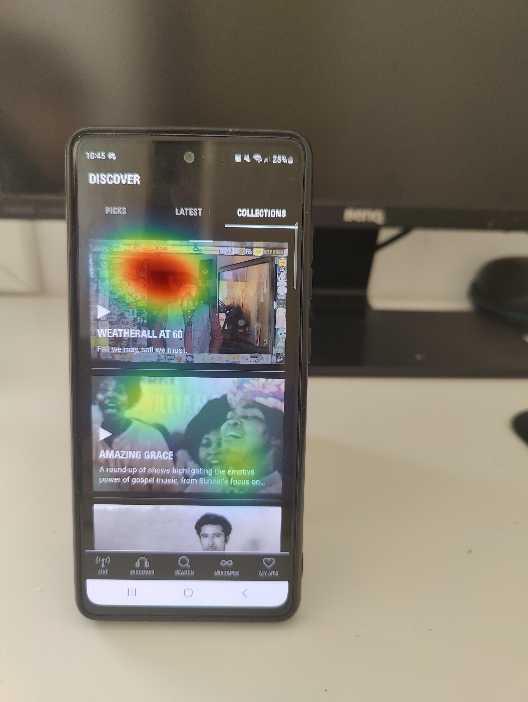
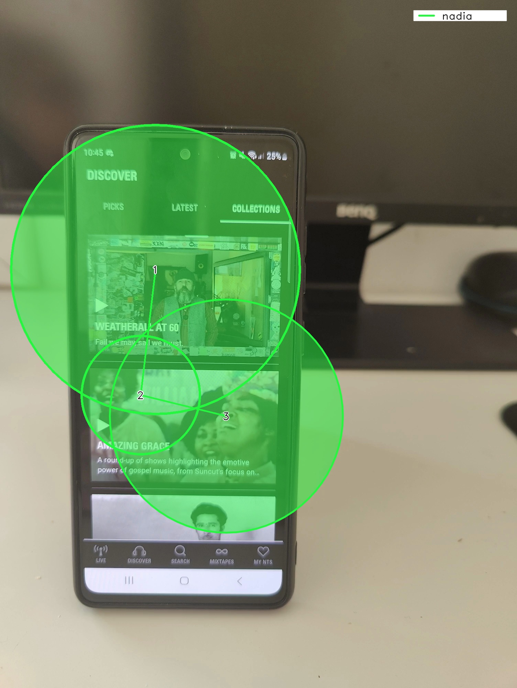

# Uncover Gaze Behaviour on Phones

<TagLinks :tags="$frontmatter.tags" />

<Youtube src="gp5O1uskDME"/>

::: tip
What catches your attention and how do you visually navigate through the interface of a mobile app? In this article, we use Neon, our wearable eye tracker, and all the other tools you need to address these questions.
:::

## Gaze Behaviour During Mobile App Engagement

UI/UX and neuromarketing researchers frequently investigate users visual engagement with mobile apps. Wearable eye tracking can provide valuable insights into user experience during mobile browsing. In this article, we used Neon, to capture and analyse users' viewing behaviour when focusing on small icons and features within a mobile app. We employed both quantitative and qualitative analyses to address these questions.

## Overcoming Usability Challenges With Neon

In the past, wearable eye tracking faced challenges in usability primarily due to calibration limitations, which may have made mobile browsing measurements difficult and/or time-consuming in practice. However, we believe that Neon overcomes these obstacles by offering calibration-free gaze estimation with very good accuracy. For this reason, we wanted to try out Neon when tracking gaze during mobile browsing, and put together an article so you can replicate what we did.

## Leveraging Pupil Cloud and Alpha Lab Tutorials To Explore User Gaze Dynamics

1. We placed the phone in a static position on a desk, allowing us to interact with the app. This setup was crucial for utilizing our [Reference Image Mapper](https://docs.pupil-labs.com/neon/pupil-cloud/enrichments/reference-image-mapper/) enrichment which specifically requires the scene to have relatively static features in the environment and for enabling comparisons between subjects.

2. We used Pupil Cloud's [Reference Image Mapper](https://docs.pupil-labs.com/neon/pupil-cloud/enrichments/reference-image-mapper/) to map gaze onto a 2D reference image of the environment that contained our test phone, like in the videos and snapshots.

3. We exported the data to analyse offline for a more in-depth exploration. For the offline analysis, we used existing Alpha Lab tutorials that allowed us to [generate scanpaths](/scanpath-rim/), [define areas of interest (AOIs) and calculate gaze metrics](/aoi-sam/), and [map gaze onto dynamic content](/map-your-gaze-to-a-2d-screen/).

The following section presents the results of our analyses, each accompanied by a brief description for clarity.

### Heatmaps and Scanpaths

    

        
    

    

        
    

Two valuable visualisations for understanding gaze behaviour on mobile screens are heatmaps and scanpaths (left and right images, respectively).

Heatmaps visually represent the app areas that receive the most attention, with warmer colours denoting higher fixation rates. These heatmaps can be easily generated within Pupil Cloud using the Reference Image Mapper.

Scanpaths depict the sequence of eye movements and fixations during visual exploration. The circle size in the scanpath corresponds to fixation duration; larger circles indicate longer user focus on specific screen areas. In the example provided, the focus was primarily on the top panel of the app, as indicated by the largest fixation circle among the three fixations used to generate this scanpath. For those interested in generating this visualisation, our [scanpath tutorial](/scanpath-rim/) provides a step-by-step guide.

### Calculation of Gaze Metrics on AOIs

Examining eye tracking data provides valuable insights into user behaviour, but relying solely on visualisations like heatmaps and scanpaths might not always reveal the complete picture. To gain a more comprehensive understanding, we conducted a quantitative analysis of our data. This involved calculating gaze metrics such as dwell time and time to first contact. These metrics offer tangible and quantitative outcomes about the salience of each AOI.

Dwell time signifies the total duration of fixation on a specific AOI, serving as an indicator of attentional allocation. Longer dwell times suggest prolonged focus on an AOI. On the other hand, the time to first contact measures how quickly an AOI captures a user's attention, indicating its prominence.

As shown in this example, there are clear differences between the areas of interest in both attentional allocation and salience that became evident thanks to the quantitative analysis that focused on the measures mentioned earlier. In line with the heatmap and scanpath visualizations, it is evident that dwell time is higher in AOI-1 compared to the other two areas of interest. Additionally, the time to first contact metric revealed that users directed their attention more swiftly towards AOI-0.

For a detailed explanation and visual representation of these metrics, you can refer to our [AOI tutorial](/aoi-sam/), which provides step-by-step instructions and charts for your analysis.

### Map Your Gaze Onto Dynamic Phone Screen Content

<Youtube src="RKrf3YQjzao"/>

Until now, the tools that we have used have been limited to mapping gaze onto static images. However, the dynamic realm of mobile phones makes it important to study gaze behaviour in a more natural context, particularly during scrolling. We, therefore, used the [dynamic screen mapping tutorial](/map-your-gaze-to-a-2d-screen/) for this purpose. This approach provided a more comprehensive understanding of gaze behaviour in dynamic interfaces.

Upon reviewing the recording, Neon demonstrated good accuracy in capturing gaze behaviour, offering a useful high-level overview of the wearer's focal points.

Another very useful facet of this tool is its ability to generate a CSV file with 2D x, y coordinates for gaze data on the screen, enabling extensive customisation and in-depth analysis, though beyond this article's scope.

## Let’s Wrap It Up!

In this article, we assessed whether Neon is capable of characterizing viewing behaviour on mobile apps. The techniques outlined in this tutorial are not confined to our specific application; they hold significant value for various UI/UX and neuromarketing research endeavours. By integrating Neon with the methodologies discussed here, researchers can acquire invaluable insights into user engagement.

::: tip
Curious about how Neon can fit into your work? Need assistance in implementing your own analysis pipelines? Reach out to
us [by email](mailto:info@pupil-labs.com) or visit our [Support Page](https://pupil-labs.com/products/support/)!
:::

