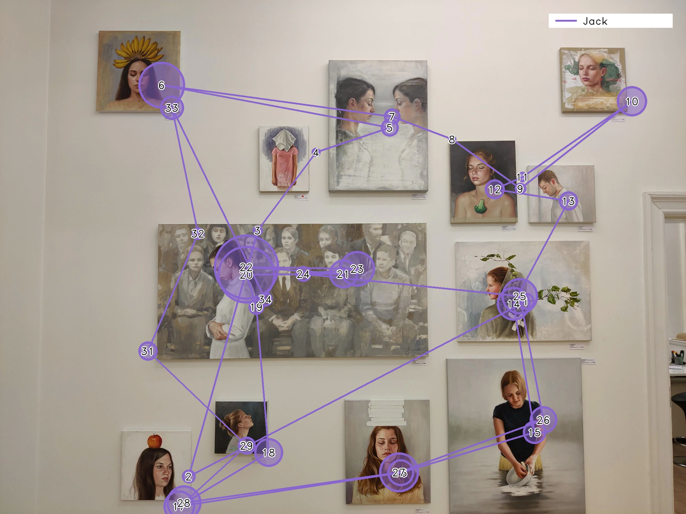
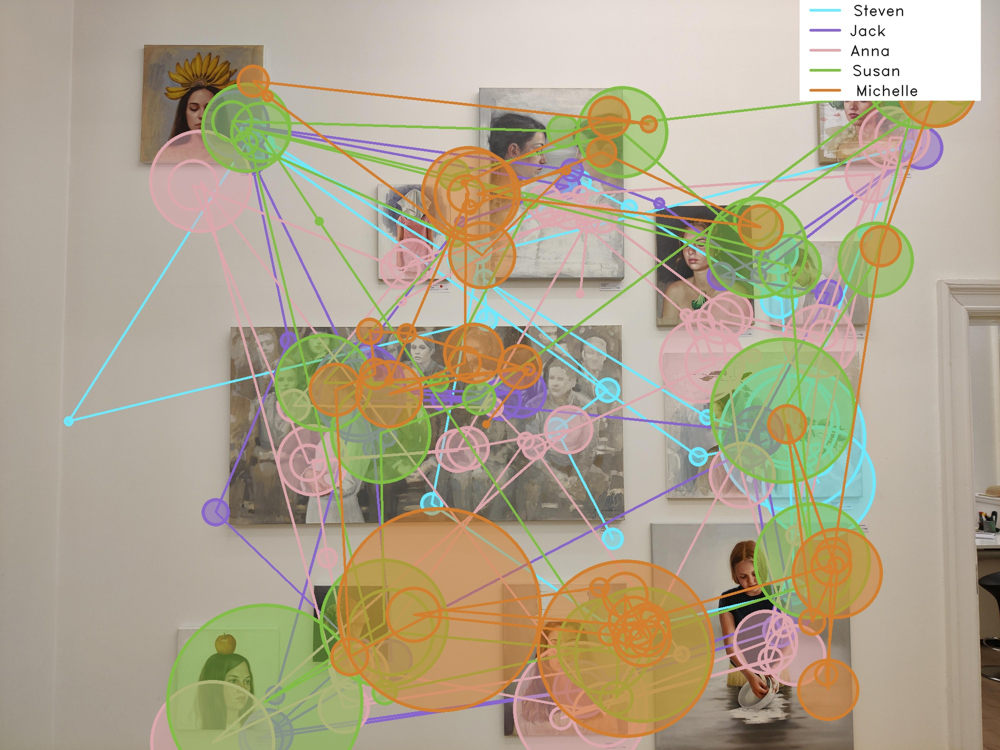

# Generate static and dynamic scanpaths with Reference Image Mapper

<TagLinks :tags="$frontmatter.tags" />

<Youtube src="7V3X4XmbRAM"/>

::: tip
Picture this: Build and customize scanpath visualizations with your Reference Image Mapper exports!
:::

## Visualizing gaze exploration with scanpaths

Scanpaths are graphical representations of gaze over time. They provide a glimpse into how the observer has focused their attention on different aspects of a scene, making them a valuable tool for understanding a person's visual attention and perception. The video above illustrates this concept. It shows:

- Fixation locations, visualized as blue numbered circles
- Fixation durations, which are mapped to the size of the circles. Longer fixations correspond to larger circles
- Saccades, represented by blue lines connecting the fixations
- Saccade amplitudes, reflected by the length of the lines. Longer lines correspond to larger saccade amplitudes, indicating larger shifts in gaze

In this guide, we will show you how to generate both static and dynamic scanpath visualisations using your Reference
Image Mapper exported data.

::: tip
Before continuing, ensure you are familiar with the [Reference Image Mapper](https://docs.pupil-labs.com/pupil-cloud/enrichments/reference-image-mapper/)
enrichment. Check out [this explainer video](https://www.youtube.com/watch?v=ygqzQEzUIS4&t=56s) for reference.
:::

## Extending current tools

The [Reference Image Mapper](https://docs.pupil-labs.com/pupil-cloud/enrichments/reference-image-mapper/) enrichment available in Pupil Cloud is a tool that maps gaze onto
2D images and can subsequently generate heatmaps. However, it currently does not support the production of scanpath visualizations.
Thus, we chose to develop a script that shows you how to build your own scanpaths using Reference Image Mapped data.

## Steps

1. Run a [Reference Image Mapper enrichment](https://docs.pupil-labs.com/enrichments/reference-image-mapper/) and download the results
2. Download [this script](https://gist.github.com/elepl94/9f669c4d81e455cf2095957831219664) and follow the [installation instructions](https://gist.github.com/elepl94/9f669c4d81e455cf2095957831219664#installation)

## Review the scanpaths

<Youtube src="X43aTIRjwgQ"/>

After the script has completed its execution, you'll find the resulting scanpath visualizations stored in a newly created
sub-folder named "scanpath." For each participant, you will obtain a reference image with the scanpath superimposed on it.
You will also find a video featuring a dynamic scanpath overlay. Finally, if you had multiple participants, an aggregated
visualization combining all participants' scanpaths will be available, enabling a more comprehensive overview of the subjects'
gaze behavior.

