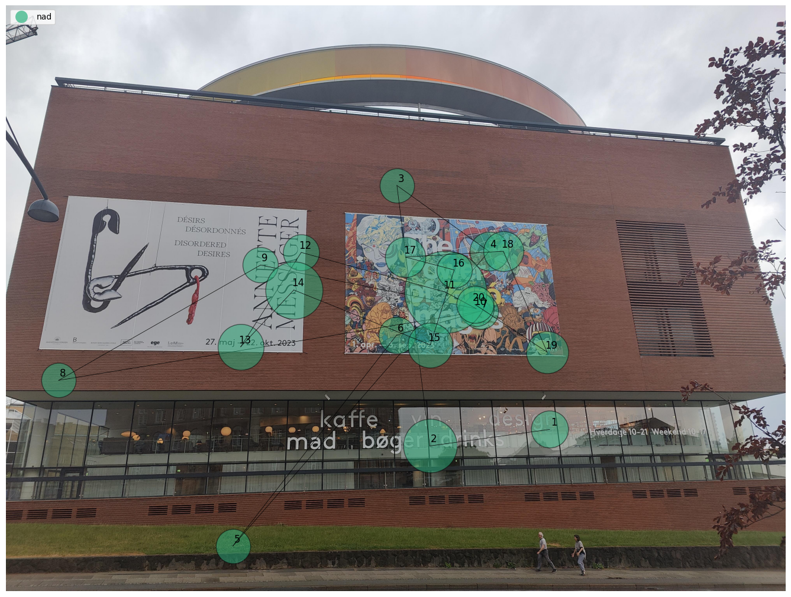

# Generate Scanpath Visualisations

<TagLinks />

<Youtube src="F52WXh1txVs"/>

::: tip
Picture this: Build and customise scanpath visualisations with your Reference Image Mapper or Manual Mapper exports!
:::

## Visualising Gaze Exploration With Scanpaths
Scanpaths are graphical representations of gaze over time. They show how an observer has focused attention on different aspects of a scene, making them a valuable tool for understanding a person's visual attention and perception. The video above illustrates this concept. It shows:
- Fixation locations, visualised as numbered circles
- Fixation durations, which are mapped to the size of the circles. Longer fixations correspond to larger circles.

In this guide, we will show you how to generate static and dynamic scanpath visualisations using your Reference Image Mapper or Manual Mapper exported data.

::: tip
Before continuing, ensure you are familiar with the [Reference Image Mapper](https://docs.pupil-labs.com/neon/pupil-cloud/enrichments/reference-image-mapper/) and the [Manual Mapper](https://docs.pupil-labs.com/neon/pupil-cloud/enrichments/manual-mapper/) enrichments.
:::

## Extending Current Tools
The [Reference Image Mapper](https://docs.pupil-labs.com/neon/pupil-cloud/enrichments/reference-image-mapper/) and the [Manual Mapper](https://docs.pupil-labs.com/neon/pupil-cloud/enrichments/manual-mapper/) enrichments available in Pupil Cloud are tools that map fixations onto 2D images. Following the completion of these enrichments, you can generate heatmaps and Areas of Interest. However, they currently do not support the production of scanpath visualisations. Thus, we chose to provide an easy click-and-run solution that allows you to build your own scanpaths using the enrichment data. 

To automate the process as much as possible, you can download your data directly via the Pupil Cloud API. Alternatively, you can manually download the data and upload the unzipped folder to your Google Drive. 

## Steps
1. Run a [Reference Image Mapper](https://docs.pupil-labs.com/neon/pupil-cloud/enrichments/reference-image-mapper/) or a [Manual Mapper](https://docs.pupil-labs.com/neon/pupil-cloud/enrichments/manual-mapper/) enrichment.
2. Data from your enrichment needs to be loaded onto Google Drive. You can choose between one of the two options:
- Use a Pupil Cloud API token to have the enrichment loaded into Google Drive automatically. You simply need to obtain a developer token from Pupil Cloud (click [here](https://cloud.pupil-labs.com/settings/developer) to obtain yours).
- Download the enrichment manually from Pupil Cloud and then upload it to your Google Drive.
3. Access our **[Google Colab Notebook](https://colab.research.google.com/drive/13FIZroc7ckyOs7APSSskqo7ew2JAZR-q?usp=sharing)** and carefully follow the instructions.

 

If you want to work with the code locally, feel free to download it [here](https://gist.github.com/nadje/7a8f1e5590ab9022be4253a5b0d8d238).

## Review the Scanpaths
After running the notebook, you'll find the following files in your folder:
- **Static scanpath visualisation**: Saved as `scanpath_image.png`, showing the reference image used for your enrichment with the scanpath superimposed on it. The scanpath will include the participant(s) you selected and the number of fixations chosen for visualisation. If you have multiple participants, an aggregated visualisation combining all participants' scanpaths will be available, enabling a more comprehensive overview of the subjects' gaze behaviour.

- **Dynamic scanpath visualisation**: A video featuring a dynamic scanpath overlay will be saved in your folder, separately for each wearer, e.g., `scanpath_video_nadia.mp4`. 

::: tip
Need guidance in further customising your scanpath visualisations? You can refer to our [legacy scanpath visualisation](https://gist.github.com/elepl94/9f669c4d81e455cf2095957831219664) or reach out to us via email at [info@pupil-labs.com](mailto:info@pupil-labs.com), on our [Discord server](https://pupil-labs.com/chat/), or visit our [Support Page](https://pupil-labs.com/products/support/) for dedicated support options.
:::

