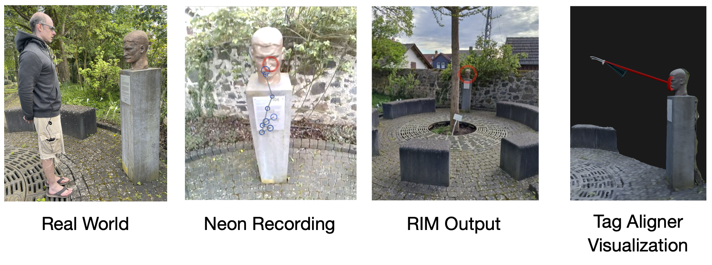
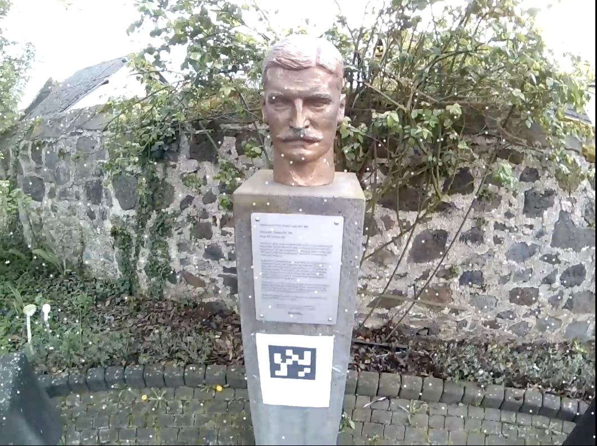
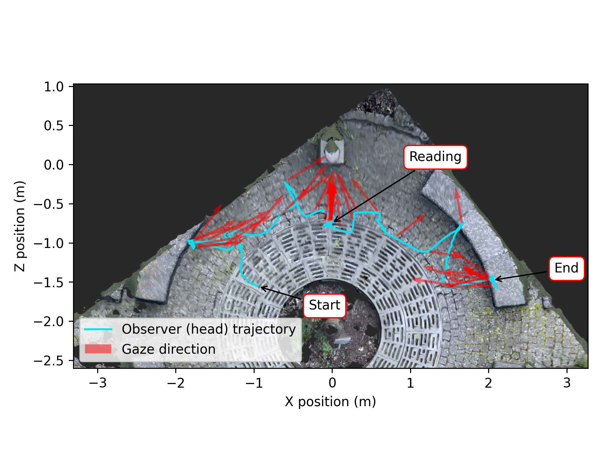

# Map Gaze Into a User-Supplied 3D Model

<Youtube src="3N8jGLYCrNk"/>

::: tip
Experience your participants' journey and gaze direction in a real-world environment, digitally reimagined! Use Tag Aligner to combine Neon eye tracking and headpose data with a 3D model of your choice.
:::

## Real-world Positions and Rotations

It’s often useful to know the position of an observer in an environment and how they orient their head and gaze while navigating it. For example, consider museum goers viewing artwork. Knowing their precise position and gaze direction, and being able to replay their actions, can provide vital insights into how they engage with different pieces, whether they follow a particular sequence, or how they interact with informational displays. This may help identify areas for improving exhibit design and optimizing the overall visitor experience, in addition to shedding light on how people choose to experience museums, or other spaces, in general.

Given a 3D model of a real-world environment, you can map gaze and head-pose data from Neon into the 3D model. This allows you to visualize the observers trajectory and how they direct their gaze within the scene.

In this guide, we'll show you how to do this using data from Neon + Reference Image Mapper and the 3D model of your choice. If you're not already familiar with our Reference Image Mapper enrichment, be sure to check out [the Reference Image Mapper documentation](https://docs.pupil-labs.com/neon/pupil-cloud/enrichments/reference-image-mapper/).

## Transforming Poses From Reference Image Mapper Data

For context, our Reference Image Mapper enrichment uses 3D features of a scene to map gaze onto a reference image. Under the hood, Reference Image Mapper builds a sparse 3D model of the environment and calculates camera poses relative to it. However, the origin, scaling, and orientation of the coordinate system for these camera poses is arbitrary (e.g., they are not specified in meters or feet). Thus, building a transformation between the Reference Image Mapper model and a user-supplied model can enable richer visualizations and open up a wealth of analysis possibilities.

<b>Figure 1.</b> The white dots on this image (statue of <a href="https://en.wikipedia.org/wiki/Theodor_Koch-Grunberg">Theodor Koch-Grünberg</a>) represent key points of a sparse 3D model built from a Reference Image Mapper enrichment scanning recording. The model is used by Reference Image Mapper to calculate scene camera positions in an arbitrary coordinate system.

By placing a stationary AprilTag marker with a known size, position, and rotation, in a Reference Image Mapper-enriched recording, we can determine a transformation that aligns the camera poses to your coordinate system.

The AprilTag marker only needs to be present in one recording, to compute the transformation. It can then be applied to all other recordings from that Enrichment.

The aligned poses can then be used for analysis or to visualize observer motion and gaze within the 3D model!

## Steps To Recreate

1. AprilTags are the key to Tag Aligner, hence the name, so make sure you have one printed and at the ready! You will want a tag from the “tag36h11” family. We have already prepared [a PDF of them](https://github.com/pupil-labs/pupil-helpers/blob/master/markers_stickersheet/tag36h11_full.pdf?raw=True) for you. The marker will need to be clearly visible to the scene camera for this tool to work, so you'll need to make it large enough. Make sure to include a white border around the printed AprilTag.
2. Grab a copy of [Tag Aligner](https://github.com/pupil-labs/tag-aligner) and follow the instructions in the README.
3. If you want to visualize the aligned poses and gaze, then be sure to check out the “Bonus” section of the Tag Aligner repo, where we offer a real-time visualization, a Blender plugin, and a Python notebook with some basic analysis.

## Working With Aligned Poses

You have now expanded the analysis possibilities of Neon + Reference Image Mapper to the third dimension!

After running the Tag Aligner tool, you will find a file in the recording folder, called "aligned_poses.csv", with the scaled and aligned poses of the scene camera over time.

If you run the bonus section, you will also have a pop-up interactive window that renders a glTF model of your environment that you can use to visualize the aligned poses and gaze. We also provide a Blender Add-on to import the Tag Aligner data as an animation track. It is found in [the Github repo](https://github.com/pupil-labs/tag-aligner).

Finally, you can analyze the results further to gain other insights. For example, you might want to plot an overhead view of the wearer’s trajectory. To get you started, we plotted the “translation_z” against the “translation_x” columns - check out the result below.

## Related Content

Be sure to check out our AlphaLab article about how to [Map Gaze Onto a 3D Model of an Environment](https://docs.pupil-labs.com/alpha-lab/nerfs/) using Neural Radiance Fields.

::: tip
Need assistance with aligning your AprilTags or applying the transformations to your Reference Image Mapper recordings? Or do you have something more custom in mind? Reach out to us via email at [info@pupil-labs.com](mailto:info@pupil-labs.com), on our [Discord server](https://pupil-labs.com/chat/), or visit our [Support Page](https://pupil-labs.com/products/support/) for dedicated support options.
:::