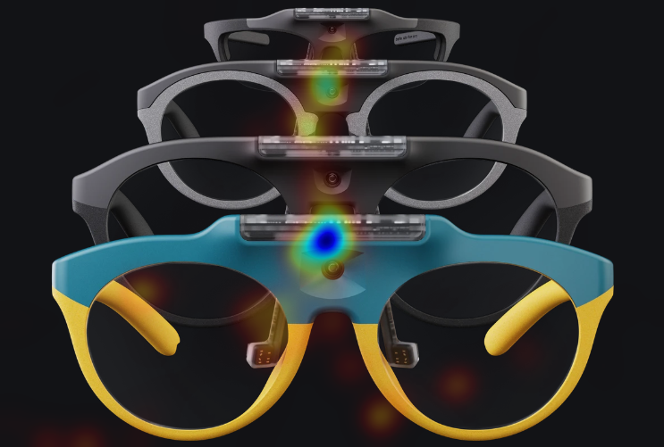
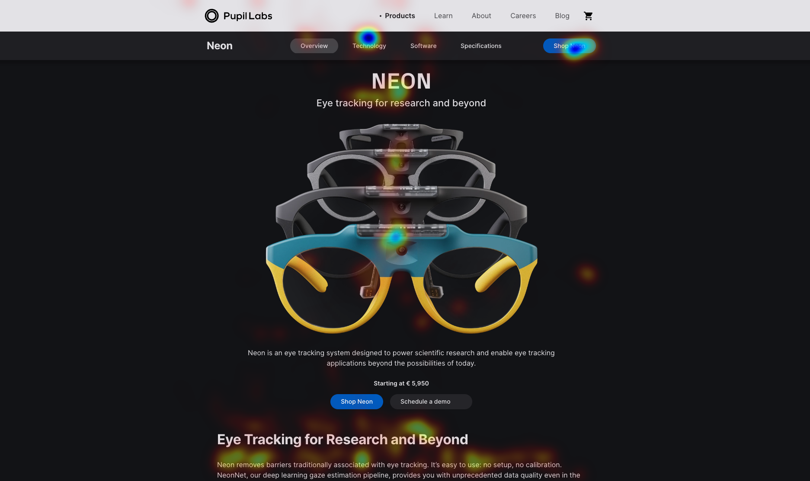

# Map Gaze Onto Website AOIs 

<TagLinks :tags="$frontmatter.tags" />

<Youtube src="DzK055NbRPM"/>

::: tip
Want to see your website through your users' eyes? Discover what really captures their attention as they scroll using our website AOI Tool + Neon eye tracking! 
:::

## Understanding Gaze Patterns in Web Interaction

Understanding where people focus their attention on websites is key to optimizing user interfaces and improving user experiences, whether individuals are making decisions about online shopping or simply browsing content. This knowledge is also useful for educational technology, commonly referred to as EdTech. Consider interactive displays in classrooms or online learning platforms—grasping how users interact with these tools is fundamental for enhancing learning outcomes.

By gathering data on gaze patterns during these interactions, designs can be tailored to prioritize user needs. This results in websites that are easier to navigate, applications with better user interfaces, online stores that offer more intuitive shopping experiences, and EdTech applications that foster more effective learning environments.

In this guide, we will introduce a desktop application featuring an integrated browser that incorporates AprilTag markers onto webpages. This tool integrates with Neon, facilitating the recording and visualization of gaze data mapped onto areas of interest on a website.

## Introducing Web Gaze Mapping

Pupil Cloud offers powerful tools like the [Marker Mapper](https://docs.pupil-labs.com/neon/pupil-cloud/enrichments/marker-mapper/) and [Reference Image Mapper](https://docs.pupil-labs.com/neon/pupil-cloud/enrichments/reference-image-mapper/) enrichments, which enable users to map gaze onto areas of interest. However, they do not provide a turnkey solution for defining AOIs on a website and importantly, maintaining gaze mapping even during scrolling—a behavior typical of regular website usage.

By following this guide, you can easily define AOIs on websites of your choice and record Neon data. Importantly, with this tool, the AOIs are not lost as you scroll. Afterward, you'll receive gaze mapping for each AOI, including individual AOI heatmaps and a full-page heatmap.

### How Does This Tool Work?

We leverage [Playwright](https://playwright.dev/), an open-source automation library for browser testing and web scraping, alongside AprilTags automatically placed on the webpage within the browser interface. Through Playwright, we generate AOIs using selectable web elements, while the AprilTags facilitate the real-time transformation of gaze data from *scene-camera* to *screen-based* coordinates. For a deeper understanding of this transformation, refer to [the documentation](https://docs.pupil-labs.com/alpha-lab/gaze-contingency-assistive/#how-to-use-a-head-mounted-eye-tracker-for-screen-based-interaction).

## Steps To Recreate

Explore the [GitHub repository](https://github.com/pupil-labs/web-aois) and follow these simple steps:

1. Define Areas of Interest (AOIs) on your selected website.
2. Put Neon and start collecting data.
3. Process your recording to generate CSV files with gaze mapped onto AOI coordinates.
4. Visualize the data with customized heatmaps.

## Visualize Mapped Gaze Data

After running the code, new files will be generated. 

- For every AOI, you will get `png` files with transparent and overlaid heatmaps and csv files with the gaze data mapped on the AOI coordinates.
- A transparent and overlaid heatmap will also be provided for the full page (e.g., see below), along with a `gaze.csv` file that will include the mapped gaze data to the webpage in full.

    

        
    

    

        
    

<b></b> Heatmaps generated for one AOI (left) and for the entire page (right).

You can find a detailed list of the outputs [in this section of our Github repository](https://github.com/pupil-labs/web-aois?tab=readme-ov-file#output-files). 

<!--  -->

This data can be used to generate outcome metrics like time to first gaze (e.g., how long it took for the user to gaze at each AOI for the first time) or dwell time/total gaze duration (e.g., sum of the gaze sample durations, defined as the period between the timestamps of consecutive gaze samples).

::: tip
Need guidance in calculating even more metrics for your website AOIs? Reach out to us [by email](mailto:info@pupil-labs.com), on our [Discord server](https://pupil-labs.com/chat/), or visit our [Support Page](https://pupil-labs.com/products/support/) for dedicated support options.
:::

