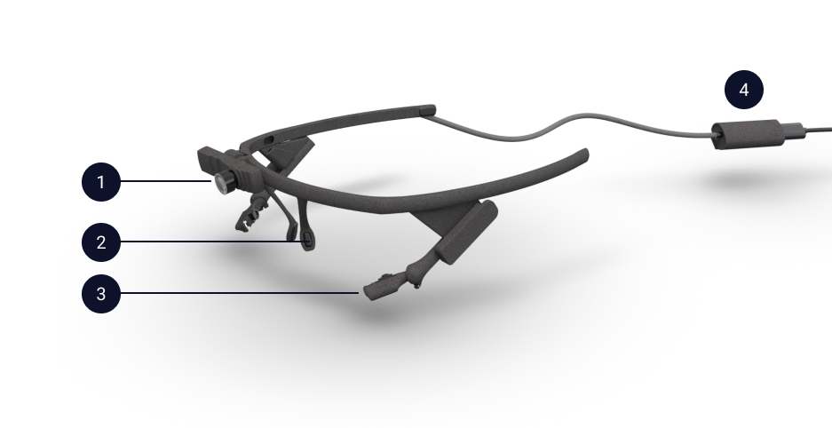
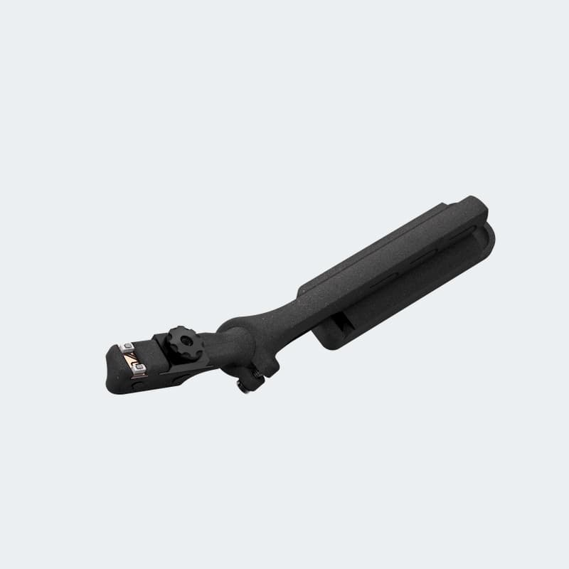

# Hardware
You wear Pupil Core headset like a pair of glasses. The headset is designed to be lightweight and adjustable in order to accommodate a wide range of users.

::: tip
There are many Pupil Core headset configurations. So, your headset might look different from images and videos below.
:::

**Terminology**
1. World camera
2. Nose support
3. Eye camera(s): Eye cameras are [adjustable](#headset-adjustments)
4. USB-C connector clip: connect your Pupil Core headset to your computer via USB-C to USB-A cable.

## What's in the box

- Pupil Core headset
- USB-C to USB-A cable
- Additional Parts
  - Eye camera arm extenders
  - Additional world camera lens (depending on configuration)
  - Silicone nose pads

## Headset Adjustments

### Slide Eye Camera
The eye camera arm slides in and out of the headset frame. You can slide the eye camera arm along the track.

<Youtube src="GsJt3PTUg1k"/>

### Rotate Eye Camera
The eye camera arm is connected to the eye camera via the ball joint. You can rotate about its ball joint. There are 6 degrees of freedom to the ball joint. Try twisting and hinging movements to get a good image of the eye.

<Youtube src="sxXwIm0WUpc"/>

<Youtube src="rJcNm5_L6QU"/>

### Rotate World Camera
You can rotate the world camera up and down to align with your FOV.

<Youtube src="rrJHhMPXjKo"/>

### Ball Joint Set Screw
You can adjust the set screw to control the movement of the eye camera about the ball joint.

We recommend setting the set screw so that you can still move the eye camera by hand but not so loose that the eye camera moves when moving the head.

You can also tighten the set screw to fix the eye camera in place.

<video width="100%" controls>
  <source src="./eyecam-screw.mp4" type="video/mp4">
</video>

::: tip
Before you calibrate, make sure to properly adjust the headset to get optimal eye detection and world camera FOV.
:::

## Focus Cameras

### Focus World Camera
Set the focus for the distance at which you will be calibrating by rotating the camera lens.

<video width="100%" controls>
  <source src="./worldcam-focus.mp4" type="video/mp4">
</video>

### No Focus 200Hz Eye Camera

::: warning
200Hz eye cameras **do not** need to be focused, and **can not be focused**. The lens of the 200Hz eye camera is arrested using glue. Twisting the lens will risk breaking the mount.
:::

### Focus 120Hz Eye Camera
If you have a 120Hz eye camera, make sure the eye camera is in focus. Twist the lens focus ring of the eye camera with your fingers or lens adjuster tool to bring the eye camera into focus.

<video width="100%" controls>
  <source src="./eye-adjust.mp4" type="video/mp4">
</video>

## Additional Parts

### World Camera Lens
The high speed world camera comes with two lenses.
A narrow angle lens and a wide angle lens. The default lens is the wide angle lens. Check out the camera [field of view table](/software/pupil-capture/#camera-field-of-view-fov "Pupil Labs camera field of view table") for exact FOV measurements for each lens at different resolutions. 

The world camera lens are interchangeable, so you can swap between the two lenses provided for wide angle or narrow angle field of view.

::: warning
If you change lenses, you will need to re-estimate the [camera intrinsics](/terminology/#camera-intrinsics). Otherwise, 3d calibration and subsequently gaze
estimation will be inaccurate. Check out [these instructions](/software/pupil-capture/#camera-intrinsics-estimation) 
for details of how to re-estimate the camera intrinsics.
:::

<Youtube src="TDa3A8L1i4o"/>

### Eye Camera Arm Extender
If you need to adjust the eye cameras beyond the built in adjustment range, you can use the orange arm extenders that are shipped with your Pupil headset.

<Youtube src="Wbuot169IQ8"/>

Steps:
1. Unplug your eye camera.
1. Slide the existing eye camera arm off the headset.
1. Slide the arm extender onto the triangular mount rail on the headset frame.
1. Slide the camera onto the extended mount rail.
1. Plug the camera back in.

The eye camera arm extender works for all existing 120 and 200Hz systems.

::: tip
Starting on `2018-02-01` the arm extender is shipped with all Pupil Core headset orders. If you have an older headset, you can get the extender from our [Shapeways store](http://shpws.me/PL6w).
:::

### Nose Pads
All Pupil Core headsets come with 2 sets of nose pads. You can swap the nose pads to customize the fit.

<Youtube src="dinaWX5tkPA"/>

::: tip
Depending on your configuration, some additional parts may be included with your Pupil headset.
:::

## Care Instructions
Pupil Core eye tracking headsets contain cameras and sensitive electronic components, do not rinse or wet-clean.

- Frames and nose pads can be cleaned with an alcohol based disinfectant applied on damp cloth.
- Scene camera and eye camera lenses can be carefully cleaned with a microfiber cloth if dust is visible.

### Disinfecting Pupil Core
All Pupil Core eye tracking headsets are cleaned with disinfectant prior to shipping. You may want to disinfect the frames between uses.

The disinfectant we use is made from 22.0g Ethanol, 21.0g 2-Propanol, 8.0g 1-Propanol per 100 grams of solution. One such brand name that we use is "Vibasept". We use the wetted towlettes (wipes). Similar products should be available globally under different brand names.
