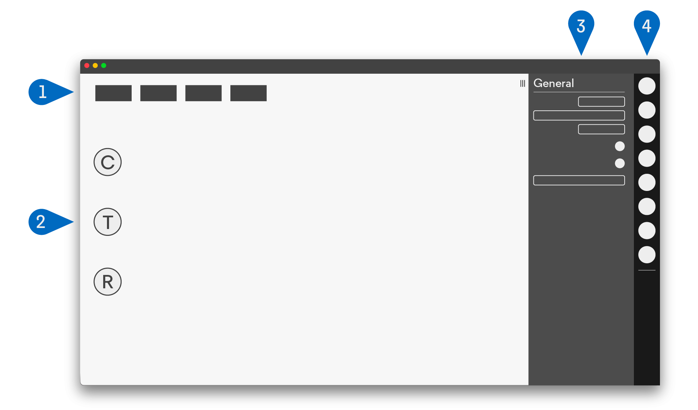
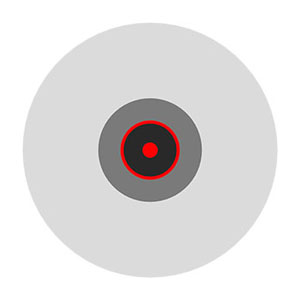
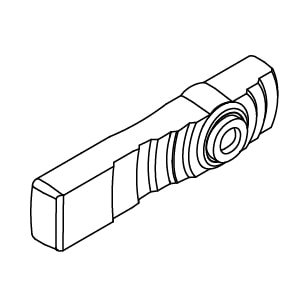
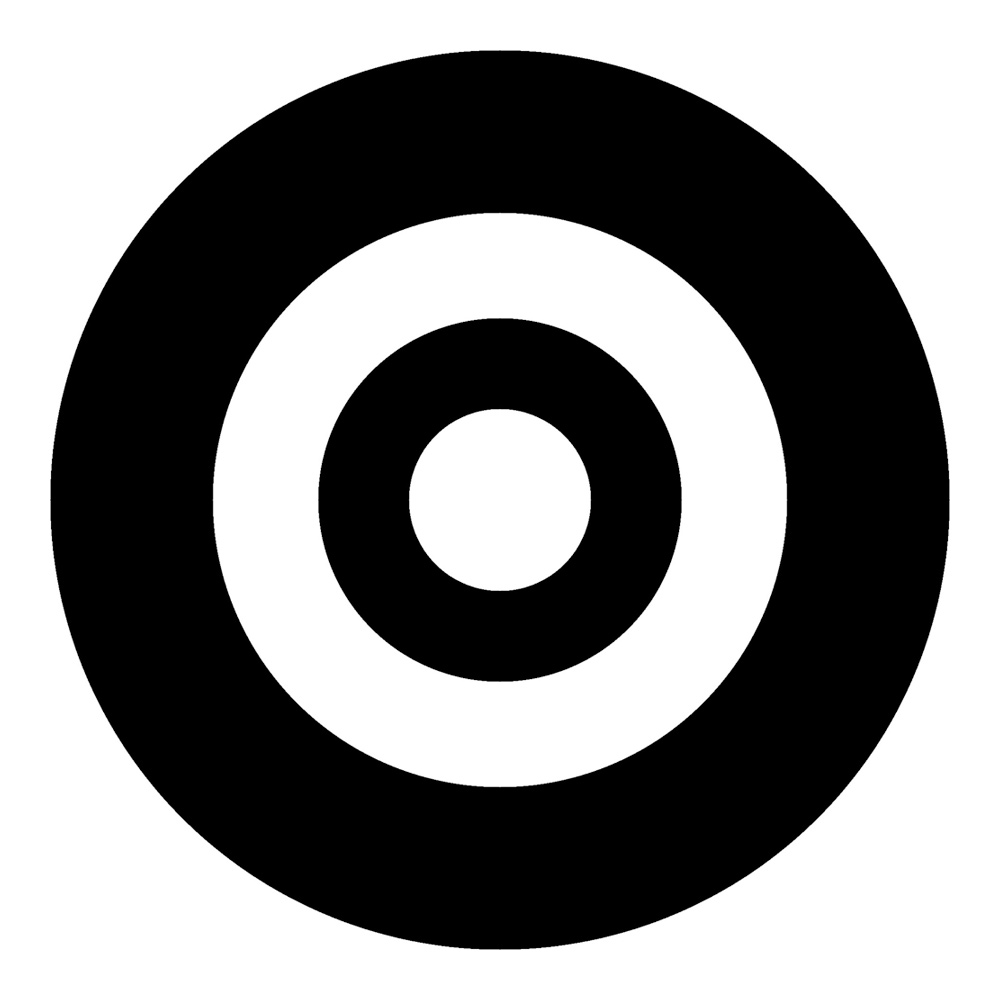
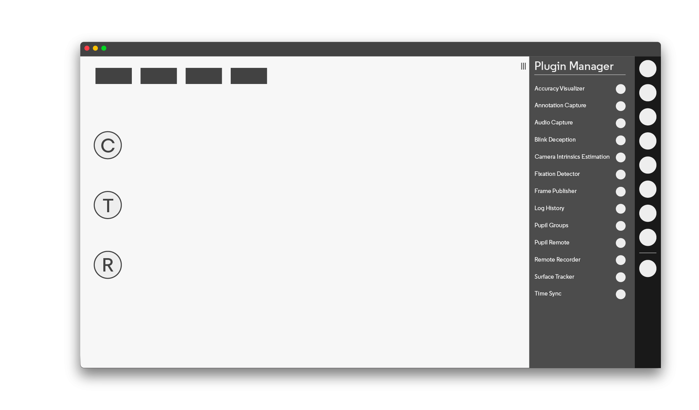
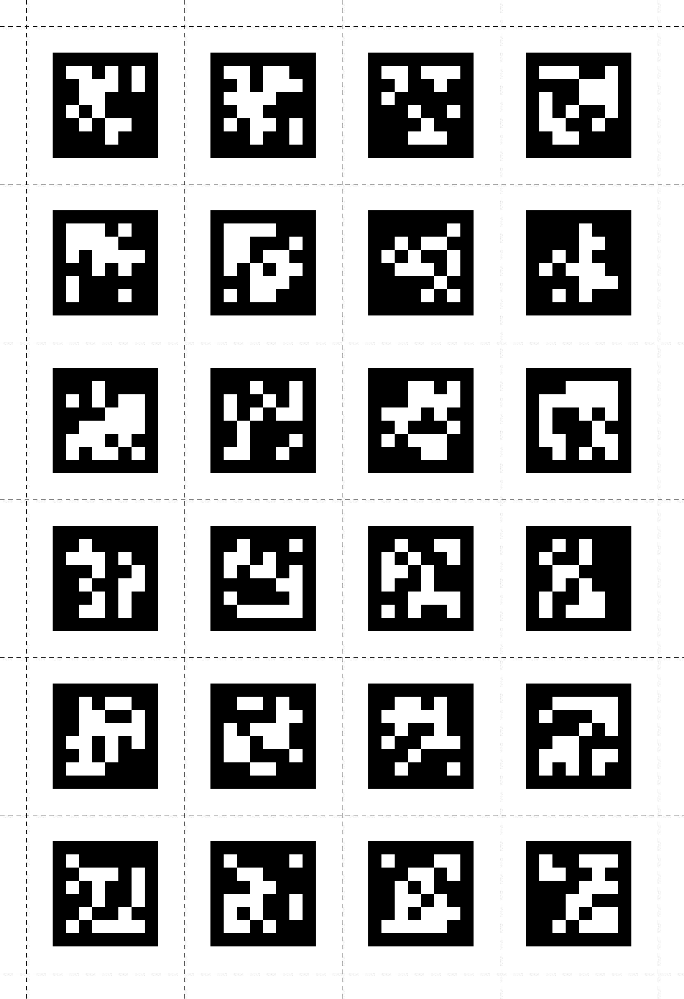

# Pupil Capture

Pupil Capture is the software used with your Pupil Core Headset. The software reads the video streams coming in from the world camera and the eye camera(s). Pupil Capture uses the video streams to detect your pupil, track your gaze, detect and track markers in your environment, record video and events, and stream data in realtime.


## World Window

The World window is the main control center for Pupil Capture. It displays a live world camera video feed from your Pupil Core headset.



1. **Graphs**: This area contains performance graphs. By default the graphs `CPU`, `FPS`, and pupil algorithm detection confidence will be displayed. You can control graph settings with the System Graphs plugin.
1. **Hot keys**: This area contains clickable buttons for plugins.
1. **Menu**: This area contains settings and contextual information for each plugin.
1. **Sidebar**: This area contains clickable buttons for each plugin. System plugins are loaded in the top and user added plugins are added below a horizontal separator.

### Keyboard Shortcuts

| Keyboard Shortcut | Description                                                  |
| :---------------- | :----------------------------------------------------------- |
| `r`               | Start and stop recording                                     |
| `c`               | Start and stop calibration                                   |
| `t`               | Start and stop validation                                    |
| `a`               | Surface tracker: Add new surface                             |
| `x`               | Add annotation (default keyboard shortcut)                   |
| `i`               | Camera intrinsic estimation: Take snapshot of circle pattern |

## Video Source Selection

By default Pupil Capture will use Local USB as the capture source.
If you have a Pupil Core headset connected to your computer you will see videos displayed from your Pupil Core headset in the World and Eye windows.
If no headset is connected or Pupil Capture is unable to open capture devices it will simply display a gray screen.

<!-- TODO: Replace with new visualization
<video width="100%" controls class="mb-5">
  <source src="../../media/core/videos/backend-manager.mp4" type="video/mp4">
</video>
-->

## Troubleshooting

### Windows

Videos do not appear in Pupil Capture. This could mean that drivers were not automatically installed when you run Pupil Capture as **administrator**. You should first try to run Pupil Capture as **administrator** (right click `pupil_capture.exe` > Run as administrator). If that does not work, follow the troubleshooting steps below:

1. In `Device Manager` (`System > Device Manager`)
2. `View > Show Hidden Devices`
3. Expand `libUSBK Usb Devices`, `Cameras`, and `Imaging Devices` categories.
4. For each **Pupil Cam** device (even hidden devices) click `Uninstall` and check the box agreeing to `Delete the driver software for this device` and press `OK`
5. Unplug Pupil headset (if plugged in) and plug back in.
6. Right click on `pupil_capture.exe` > Run as administrator. This should install drivers automatically.

Still having trouble? [Chat with us.](https://pupil-labs.com/chat "Pupil Labs chat on DiscordApp")

### Linux

#### Cameras listed as unknown
If the cameras are listed as `unknown` and you are not able to access cameras in Pupil Capture. Please try the following:

1. Shut down Pupil Capture if it is still running.
2. Add your user to the `plugdev` group by executing the following command in the terminal:

```sh
sudo usermod -a -G plugdev $USER
```

#### Buttons not clickable
If you can't click on any button please check if you are using wayland.
```sh
echo $XDG_SESSION_TYPE
```
If this command outputs "wayland" please change to xserver in the login screen of your OS.

### macOS 12 Monterey and newer

Due to new [technical limitations](https://github.com/libusb/libusb/issues/1014), Pupil Capture and Pupil Service need to be started with administrator privileges to get access to the video camera feeds. To do that, copy the applications into your /Applications folder and run the corresponding command from the terminal:

Pupil Capture:

```zsh
sudo /Applications/Pupil\ Capture.app/Contents/MacOS/pupil_capture
```

Pupil Service:

```zsh
sudo /Applications/Pupil\ Service.app/Contents/MacOS/pupil_service
```

**Note**: The terminal will prompt you for your administrator password. It will not preview any typed keys. Simply hit enter once the password has been typed.

**Note**: When recording with administrator privileges, the resulting folder inherits admin file permissions. Pupil Player will detect these and ask you for the administrator password to reset the file permissions. This will be only necessary once per recording.

## Pupil Detection

Pupil Core's algorithms automatically detect the participant's pupil. It runs two detection pipelines in parallel, the 2D and the 3D pupil detection.

2D detection uses computer vision technology to detect the pupil location in the camera image.

3D detection uses a 3D model of the eye(s) that updates based on observations of the eye. This enables the system to compensate for movements of the Pupil Core eye tracking headset on the participant's face (also known slippage). To build up an initial model, we recommend to look around your field of view when putting on the headset.

<video width="100%" controls>
  <source src="./pd.mp4" type="video/mp4">
</video>

### Fine-tuning Pupil Detection

As a first step it is recommended to check the eye camera resolution as some parameters are resolution dependent.

#### Pupil Detector 2D Settings

Some settings of the 2D pupil detector can be adjusted to improve pupil detection. For a better visualization of these settings, go to the `General Settings` menu of the eye windows and enable the `Algorithm Mode` view. The detector settings can be adjusted in the `Pupil Detector 2D` plugin.

- `Pupil Min/Max` : In `Algorithm Mode` the two red circles represent the min and max pupil size settings. The green circle visualizes the current apparent pupil size. Set the min and max values so the green circle (current pupil size) is within the min/max range for _all_ eye movements.
- `Intensity Range` : Defines the minimum "darkness" of a pixel to be considered as the pupil. The pixels considered for pupil detection are visualized in blue when in `Algorithm Mode`. Try to minimize the range so that the pupil is always fully covered while having as little leakage as possible outside of the pupil. Be aware that this is dependent on the brightness and therefore has a strong interaction with `Video Source/Sensor Settings/Absolute Exposure Time`.

::: tip
Keep in mind that pupil size values are defined in pixels and are therefore dependent on the resolution settings of your sensor.
:::

## Calibration

### Calibration Process

Pupil Core headsets have two types of cameras attached. One camera records the subject's field of vision - we call this the `world camera`. Additionally there are one or more cameras recording the participant's eye movements - we call these the `eye cameras`. The data collected during the calibration period is used afterwards to correlate the world camera with the eye cameras.

<video width="100%" controls>
  <source src="./clb-hd.mp4" type="video/mp4">
</video>

Pupil Core headsets come in a variety of configurations. Calibration can be conducted with a monocular or binocular eye camera setup.>

<video width="100%" controls>
  <source src="./clb-mobo.mp4" type="video/mp4">
</video>

<div style="display:flex;" class="pb-4">
    <p style="flex-grow:1;display:flex;justify-content:center;">Monocular</p>
    <p style="flex-grow:1;display:flex;justify-content:center;">Binocular</p>
</div>

### Before Every Calibration

Before starting a calibration, ensure that the participant's pupil is robustly detected and tracked, and that the headset is comfortable for the participant. Make sure that the world camera is in focus for the distance at which you want to calibrate, and that you can see the entire area you want to calibrate within the world camera's field of view (FOV).

<div style="display:flex; flex-wrap: wrap;" class="pb-4">
<div style="flex-grow:1;display:flex;flex-direction:column;align-items:center;" class="pa-2">



<p>Your Pupil is properly detected by the camera.</p>
</div>

<div style="flex-grow:1;display:flex;flex-direction:column;align-items:center;" class="pa-2">



<p>Make sure the world camera is in focus.</p>
</div>
</div>

### Choreographies

All calibrations require a participant to look at a specific point in the real world or on screen. The way in which markers are presented is called a `Choreography`. Pupil Core provides different choreographies for common use cases.

#### Screen Marker Calibration Choreography

This is the default choreography, and a quick way to get started.

<video width="100%" controls>
  <source src="./clb-s.mp4" type="video/mp4">
</video>

1. Select the `Screen Marker` choreography
2. Select your `Monitor` (if more than 1 monitor)
3. Press `c` on your keyboard or click the blue circular `C` button in the left hand side of the world window to start calibration.
4. Follow the marker on the screen with your eyes. Try to keep your head still during calibration.
5. The calibration window will close when calibration is complete.

If your participants have trouble following the markers, you can adjust the `Marker size` or `Sample duration` parameters.
We recommend to enable `Use fullscreen` for best marker visibility.

#### Calibration Marker

If you're not going to do calibration on screen with the `Screen Marker` choreography, you will need to download the Pupil's Circular Calibration Marker. This marker can be automatically detected by Pupil software in the world video.

In most use cases you will only need to use the `Pupil Calibration Marker`. The `Stop Marker` is used if you want to be able to conclude a calibration sequence by showing this marker.

::: tip
Make sure to always use the **v0.4 marker design** for best detection performance!
:::

<div style="display:flex; flex-wrap: wrap;" class="pb-4">
<div style="flex-grow:1;display:flex;flex-direction:column;align-items:center;" class="pa-2">



<p>Pupil Calibration Marker v0.4</p>
</div>
<div style="flex-grow:1;display:flex;flex-direction:column;align-items:center;" class="pa-2">


<p>Pupil Calibration Stop Marker v0.4</p>
</div>
</div>

[Download Pupil Labs Calibration Marker v0.4](./v0.4_marker.pdf) to print or display on smartphone/tablet screen.

#### Single Marker Calibration Choreography

Calibrate using a single marker, either with a printed (physical) markers or a digital marker displayed on screen. Gaze at the center of the marker and move your head in a spiral motion. You can also move your head in other patterns. This choreography enables you to quickly sample a wide range of gaze angles and cover a large range of your FOV.

1. Select `Single Marker` choreography
2. Press `c` on your keyboard or click the blue circular `C` button on the left hand side of the world window to start calibration.
3. Look at the center of the marker.
4. Slowly move your head while gazing at the center of the marker. We have found that a spiral pattern is an efficient way to cover a large area of the FOV.
5. Press the `C` button on your keyboard or show the stop marker to stop calibrating.

::: tip
This paper introduces and evaluates this type of single marker calibration - <code>CalibMe: Fast and Unsupervised Eye Tracker Calibration for Gaze-Based Pervasive Human-Computer Interaction</code>
:::

#### Natural Features Calibration Choreography

This choregraphy is used only in special situations.

<video width="100%" controls>
  <source src="./clb-natural.mp4" type="video/mp4">
</video>

1. Select `Natural Features Calibration`
1. Press `c` on your keyboard or click the blue circular `C` button in the left hand side of the world window to start calibration.
1. Ask the subject (the person wearing the Pupil headset) to look a point within their field of vision. Note: pick a salient feature in the environment.
1. Click on that point in the world window.
1. Data will be sampled.
1. Repeat until you have covered the subject's field of view (generally about 9 points should suffice)
1. Press `c` on your keyboard or click the blue circular `C` button in the left hand side of the world window to stop calibration.

### Gaze Mapping and Accuracy

With the 2D Gaze Mapping, you should easily be able to achieve tracking accuracy within the physiological limits (sub 1 deg visual degrees). Using the 3D Gaze Mapping you should achieve 1.5-2.5 deg of accuracy.

- Any monocular calibration is accurate only at its depth level relative to the eye (parallax error).
- Any calibration is only accurate inside the field of view (in the world video) you have calibrated. For example: If during your calibration you only looked at markers or natural features (depending on your calibration choreography) that are in the left half, you will not have good accuracy in the right half.
- Calibration accuracy can be visualized with the `Accuracy Visualizer` plugin. If the `Accuracy Visualizer` plugin is loaded, it will display the residual between reference points and matching gaze positions that were recorded during calibration.
- Gaze Prediction Accuracy can be estimated with an accuracy test. Start the accuracy by running a normal calibration procedure but press the `T` button in the world window and **not** the `C` button. After completing the test, the plugin will display the error between reference points and matching gaze positions that were recorded during the accuracy test.

**Accuracy** is calculated as the average angular offset (distance) (in degrees of visual angle)
between fixation locations and the corresponding locations of the fixation targets.

**Precision** is calculated as the Root Mean Square (RMS) of the angular distance (in degrees of visual angle)
between successive samples during a fixation.

## Recording

<video width="100%" controls>
  <source src="./rec.mp4" type="video/mp4">
</video>

Press `r` on your keyboard or press the circular `R` button on the left hand side of the world window to start recording. You will see red text with the elapsed time of recording next to the `R` button. To stop recording, press `r` on your keyboard or press the `R` button on screen.

You can change recording settings in the `Recorder` plugin menu. Set the folder where recordings are saved under `Path to recordings`. Set the recording name in `Recording session name`.

::: tip
Note - you must specify an existing folder, otherwise the `Path to recordings` will revert to the default path.
:::

### Recording files

If you open up a recording session folder you will see a collection of video(s) and data files. Take a look at [Recording format](/software/recording-format/)/ for an overview.

## Plugins

Open the `Plugin Manager` menu on the right.



It lists all available plugins.
Click the button next to the plugin's name to turn on or off the plugin.

### Third-party plugins

You can easily load third party plugins. Third party plugins will appear in the
Pupil Capture or Pupil Player plugin list. Copy the plugin to the plugins folder
within the `pupil_capture_settings` or `pupil_player_settings` folder.

### Fixation Detector

The online fixation detector classifies fixations based on the dispersion-duration principle. A fixation is visualized as a yellow circle around the gaze point that is shown in the Pupil Capture `world` window.

You can find more information in our [dedicated fixation detection section](/terminology/#fixations "Pupil Core terminology - fixations").

### Network plugins

Pupil Capture has a built-in data broadcast functionality. It is based on the network library [ZeroMQ](http://zeromq.org/)
and follows the [`PUB-SUB` pattern](http://zguide.zeromq.org/php:chapter1#Getting-the-Message-Out). Data is published with an affiliated topic.
Clients need to subscribe to their topic of interest to receive the respective data. To reduce network traffic, only data
with at least one subscription is transferred.

#### Network API plugin

The `Network API` plugin provides a high level interface to control Pupil Capture over the network (e.g. start/stop a recording). It also functions as the entry point to the broadcast infrastructure.

<video width="100%" controls>
  <source src="./pr.mp4" type="video/mp4">
</video>

The section `Pupil Remote` allows you to specify the network interface. By default, Pupil will listen on the primary network interface. You can specify a custom port, or even choose a different interface.

::: tip
See the developer documentation on how to access Pupil Remote from your own application.
:::

The `Network API` plugin also broadcasts video frames from the world and eye cameras. You can change the image format in the `Frame Publisher` section.

For a demonstration of how to receive and decode world frames, please take a look at the `recv_world_video_frames` helper scripts in [the pupil-helpers repository](https://github.com/pupil-labs/pupil-helpers/tree/47ce5d4f99488492a4481a629fc7325c6107fbb6/python).

#### Pupil Groups

`Pupil Groups` can help you to collect data from different devices and control an experiment with multiple actors (data generators and sensors) or use more than one Pupil device simultaneously:

- Load the `Pupil Groups` plugin from the `General` sub-menu in the GUI.
- Once the plugin is active it will show all other local network Pupil Group nodes in the GUI
- Furthermore, actions like starting and stopping a recording on one device will be mirrored instantly on all other devices.

::: tip
For this to work your network needs to allow `UDP` transport. If the nodes do not find each other, create a local wifi network and use that instead.
:::

::: tip
Pupil Groups can easily be integrated in your own app or device.
Take a look at [the developer docs](/developer/network-api/) to get started.
:::

#### Pupil Time Sync

If you want to record data from multiple sensors (e.g. multiple Pupil Capture instances)
with different sampling rates it is important to synchronize the clock of each sensor.
You will not be able to reliably correlate the data without the synchronization.

The [Pupil Time Sync protocol](https://github.com/pupil-labs/pupil/blob/0fbccd412a9e0ff553eb91727dd0da54d33e9637/pupil_src/shared_modules/time_sync_spec.md)
defines how multiple nodes can find a common clock master and synchronize their time with it.

The Pupil Time Sync plugin is able to act as clock master as well as clock follower.
This means that each Pupil Capture instance can act as a clock reference for others
as well as changing its own clock such that it is synchronized with another reference
clock.

Pupil Time Sync nodes only synchronize time within their respective group. Be aware
that each node has to implement the same protocol version to be able to talk to
each other.

::: tip
See the <a href="https://github.com/pupil-labs/pupil-helpers/tree/62ea54001fd051528bf24537bbd4f5f89e3391e8/network_time_sync">pupil-helpers</a> for example Python implementations.
:::

::: tip
For this to work your network needs to allow `UDP` transport. If the nodes do not find each other, create a local wifi network and use that instead.
:::

#### Remote Recorder

::: warning
Depreciation warning: Pupil Mobile app is no longer maintained.
:::

The Pupil Mobile app can be controlled via Pupil Capture when connected. This includes changing camera and streaming
settings. The `Remote Recorder` plugin extends this list with the possibility
to start and stop recording on the Android device.

### Surface Tracking

The `Surface Tracker` plugin allows you to define planar surfaces within your environment to track areas of interest (AOI). Surfaces are defined with [Apriltag Markers](https://april.eecs.umich.edu/software/apriltag.html).

::: tip
The legacy surface tracker used simple square markers, which are less robust to detect.
For all new projects we strongly recommend using Apriltags.
You can find more information on the legacy markers below.
:::

#### Markers

There are many different Apriltag types, currently we support 7 families listed below. You can click on the links to download the individual markers from the [AprilTags repository](https://github.com/AprilRobotics/apriltag-imgs/tree/master/ "April Tags Github Repository"). For your convenience we have also prepared some tags from the **tag36h11** family in the two images below.

Additionally, we created a PDF with one page per tag for all 587 tags from the **tag36h11** family here: [tag36h11_full.pdf](https://github.com/pupil-labs/pupil-helpers/blob/master/markers_stickersheet/tag36h11_full.pdf?raw=True).
You can use this to print custom marker sheets by printing multiple pages per sheet.

::: warning
Note that the markers require a white border around them for robust detection. In our experience, this should be at least equal to the width of the smallest white square/rectangle shown in the Marker. Please ensure you include a sufficient border around when displaying markers on screen or printing the markers.
:::

If you want to generate your own marker sheets or similar PDFs of other families, you can find more information in the [the pupil-helpers repository](https://github.com/pupil-labs/pupil-helpers/tree/master/markers_stickersheet).

Supported Apriltag families:

- [tag25h9](https://github.com/AprilRobotics/apriltag-imgs/tree/master/tag25h9)
- [**tag36h11 (default)**](https://github.com/AprilRobotics/apriltag-imgs/tree/master/tag36h11)
- [tagCircle21h7](https://github.com/AprilRobotics/apriltag-imgs/tree/master/tagCircle21h7)
- [tagCircle49h12](https://github.com/AprilRobotics/apriltag-imgs/tree/master/tagCircle49h12)
- [tagCustom48h12](https://github.com/AprilRobotics/apriltag-imgs/tree/master/tagCustom48h12)
- [tagStandard41h12](https://github.com/AprilRobotics/apriltag-imgs/tree/master/tagStandard41h12)
- [tagStandard52h13](https://github.com/AprilRobotics/apriltag-imgs/tree/master/tagStandard52h13)

Apriltags ready to use:

<div class="pb-4" style="display:grid;grid-template-columns:1fr 1fr;gap:40px;">
  <a download="apriltags_tag36h11_0-23.jpg" href="/core/software/pupil-capture/apriltags_tag36h11_0-23.jpg" title="AprilTags 0-23">



  </a>
  <a download="apriltags_tag36h11_24-47.jpg" href="/core/software/pupil-capture/apriltags_tag36h11_24-47.jpg" title="AprilTags 0-23">


  </a>
</div>

Markers can be printed on paper, stickers, or displayed on a screen.

#### Preparing your Environment

A surface can be based on one or more markers.
The markers need to be placed in close proximity or within your desired AOI.
If your AOI is for example a computer monitor, you could display your markers in the corners of the screen or place them somewhere on the bezel.
If your AOI is a magazine page, you could place the markers in the corners of the page, or anywhere else on the page where they are not occluding the content.
When placing your markers please follow the guidelines:

- All markers of a surface need to lie within the same two dimensional plane.
- An individual marker can be part of multiple surfaces.
- The used markers need to be unique, i.e. you may not use multiple instances of the same marker in your environment.
- Using more markers to define a surface yields greater robustness in the tracking of that surface.
- Surfaces defined with more than 2 markers are detected even if some markers lie outside of the camera image or are obscured.

#### Defining a Surface

Surfaces can be defined with Pupil Capture in real-time, or post-hoc with Pupil Player.
In both cases the necessary steps are as follows:

<video width="100%" controls>
  <source src="./srf-tracking.mp4" type="video/mp4">
</video>

- Prepare your environment as described above.
- Turn on the `Surface Tracker` plugin .
- Make sure the camera is pointing at your AOI and the markers are well detected.
  In the post-hoc case (using Pupil Player) seek to a frame that contains a good view of your desired AOI.
- Add a new surface by clicking the `Add surface` button.
- Give your surface a name.
- Click the `edit surface` button and move the corners of your surface into the desired position.
  In the real-time case (using Pupil Capture) this is much easier if you freeze the video by clicking the `Freeze Scene` button.
- If markers have been erroneously added or left out, click the `add/remove markers` button and afterwards onto the according marker to add/remove them from your surface.

#### Reusing Surface Definitions

Your surfaces are automatically saved in a file called `surface_definitions` in the `pupil_capture_settings` directory.

If you restart Pupil Capture or the Surface Tracker plugin, your surface definitions from previous sessions will be loaded.

The `surface_definitions` file is copied into each recording folder as well, so you will have access to your surface definitions in Pupil Player.
You can copy & paste this file to move definitions from one session or recording to another.

#### Gaze Heatmaps for Surfaces

You can display gaze heatmaps for each surface by enabling `Show Heatmap` in the `Surface Tracker` menu.
Two heatmap modes are supported:

- `Gaze within each surface`: Visualizes the distribution of gaze points that lie within each surface.
- `Gaze across different surfaces`: Color codes the surfaces to visualize the amount of time spend gazing on each surface in relation to other surfaces.
  Red color represents a lot of gaze points or time spent. Blue color represents few gaze points or little time spent.

The smoothness of the heatmap in `Gaze within each surface` mode can be set using the `Heatmap Smoothness` slider, which will effectively change the bin size of the underlying histogram.
In the online case the heatmap is computed over the most recent data.
The exact time window to consider can be set using the `Gaze History Length` field.

#### Performance Settings

The detector for Apriltag Markers offers two parameters `Use high resolution` and `Sharpen image` that are turned on by default. If you are experiencing high CPU load you can try turning off those settings. This will result in less CPU load but also decreases the detection rate.

#### Further Functionality

- You can click the `Open Surface in Window` button to open a view of the surface in a separate window. Gaze positions on the surface will be visualized in this window in real-time.
- Streaming Surfaces with Pupil Capture - Detected surfaces as well as gaze positions relative to the surface are broadcast under the `surface` topic. Check out [this video](http://youtu.be/qHmfMxGST7A) for a demonstration.
- Surface Metrics with Pupil Player - if you have defined surfaces, you can generate surface visibility reports or gaze count per surface.

#### Legacy Markers

The legacy surface system used simple square markers, which are less robust to detect.
For all new projects we strongly recommend using Apriltags!

### Blink Detector

The online blink detector classifies [blinks](/terminology/#blinks) according to onset and offset thresholds
associated with [2D pupil confidence](/terminology/#confidence). See the
[Blink Detector documentation](/software/pupil-player/#blink-detector) for more information.

Read more about accessing blink detection results in real-time in the [developer documentation](/developer/network-api/#blink-messages).

### Annotations

The `Annotation Capture` plugin allows you to mark timestamps with a label -- sometimes
referred to as triggers. These labels can be created by pressing their respective hotkey
or by sending a message with the topic `annotation`. This is useful to mark external
events (e.g. "start of condition A") within the Pupil recording. The `Annotation Player`
plugin is able to correlate and [export these events](/software/pupil-player/#annotation-export)
as well as add new ones.

You can also create [remote annotation](/developer/network-api/#remote-annotations)
events programmatically and send them to Pupil Capture via the
[Pupil Core Network API](/developer/network-api/).

### Camera Intrinsics Estimation

This plugin is used to calculate [camera intrinsics](/terminology/#camera-intrinsics), which will enable one to correct camera distortion. Pupil Capture has built in, default camera intrinsics models for the high speed world camera and the high resolution world camera. You can re-calibrate your camera and/or calibrate a camera that is not supplied by Pupil Labs by running this calibration routine. We support two different distortion models, radial distortion and fisheye distortion. For cameras with a FOV of 100 degrees or greater (like e.g. the high speed world camera) the fisheye distortion model usually performs better, for cameras with a smaller FOV (e.g. the high resolution world camera) we recommend the radial distortion model.

1. Select `Camera Intrinsics Estimation`
2. Click on 'show pattern' to display the pattern
3. Resize the pattern to fill the screen
4. Hold your Pupil headset and aim it at the pattern.
5. With the world window in focus, press `i` on your keyboard or the circular `I` button in the world windows to detect and capture a pattern.
6. Data will be sampled and displayed on the screen as a border of the calibrated pattern. (Note - make sure to move your headset at different angles and try to cover the entire FOV of the world camera for best possible calibration results)
7. Repeat until you have captured 10 patterns.
8. Click on `show undistorted image` to display the results of camera intrinsic estimation. This will display an undistorted view of your scene. If well calibrated, parallel lines in the real world will appear as parallel lines in the undistorted view.

Note that in some rare cases the processing of the recorded patterns can fail, which would lead to a warning message in the world window. In this case just repeat the above process from step 6 and try to get a better coverage of the entire FOV of the camera.

:::tip
If you are having trouble estimating camera intrinsics, [Chat with us.](https://pupil-labs.com/chat "Pupil Labs chat on DiscordApp")
:::

#### Camera Intrinsics Persistency

Newly estimated camera intrinsics are saved to the Pupil Capture session settings folder:

- From bundle: `Home directory -> pupil_capture_settings`
- From source: `repository directory -> capture_settings`
  Specifically, the intrinsics are saved to a file with the name pattern `<camera name>.intrinsics` which includes the relevant intrinsics for each calibrated resolution. See the [developer docs](/developer/recording-format/#other-files) on how to read these files manually.

Pupil Capture provides [prerecorded intrinsics](https://github.com/pupil-labs/pupil/blob/master/pupil_src/shared_modules/camera_models.py#L26-L152) for the following cameras:

| Camera name           |               Resolutions                | Notes                                                     |
| :-------------------- | :--------------------------------------: | :-------------------------------------------------------- |
| Pupil Cam1 ID2        | `640x480`<br/>`1280x720`<br/>`1920x1080` | Pupil Core high-speed scene camera                        |
| Pupil Cam2 ID0/1      |         `192x192`<br/>`400x400`          | Core headset eye camera;<br/>max. 200 Hz sampling rate    |
| Pupil Cam3 ID0/1      |         `192x192`<br/>`400x400`          | HTC Vive add-on eye camera;<br/>max. 200 Hz sampling rate |
| Logitech Webcam C930e | `640x480`<br/>`1280x720`<br/>`1920x1080` | Pupil Core high-definition scene camera (discontinued)    |
| Pupil Cam1 ID0/1      |         `320x240`<br/>`640x480`          | eye camera (discontinued);<br/>max. 120 Hz sampling rate  |

When a recording is started in Pupil Capture, the application saves the active camera intrinsics to the `world.intrinsics`, `eye0.intrinsics`, and `eye1.intrinsics` files within the recording.

#### Camera Intrinsics Selection

Pupil Capture selects the active camera intrinsics following these priorities:

1. Active camera name and resolution match a **custom** intrinsics estimation.
1. Active camera name and resolution match a **prerecorded** intrinsics estimation.
1. Fallback to a "dummy calibration" ([pinhole camera model without distortion, focal length 1000px](https://github.com/pupil-labs/pupil/blob/master/pupil_src/shared_modules/camera_models.py#L659-L664)).

Pupil Player follows the same priorities as Pupil Capture but expects the custom intrinsics to be present within the recording under the `<video file name>.intrinsics` file name pattern, e.g. `world.intrinsics`.

#### Camera field of view (FOV)

Based on the estimated intrinsics, one can calculate the camera's field of view (FOV).

**Field of view in degrees:**
| Camera name | Resolution | Horizontal | Vertical | Diagonal |
| :----------------------------------------- | :---------: | :--------: | :------: | :------: |
| Pupil Cam1 ID2 (default – wide-angle lens) | `1920x1080` | 155° | 85° | --- |
| | `1280x720` | 103° | 54° | 122° |
| | `640x480` | 103° | 73° | 134° |
| Pupil Cam1 ID2 (narrow-angle lens) | `1920x1080` | 62° | 36° | 69° |
| | `1280x720` | 42° | 24° | 47.5° |
| | `640x480` | 42° | 32° | 51° |
| Pupil Cam2 ID0/1 | `400x400` | 39° | 39° | 53° |
| | `192x192` | 37° | 37° | 51° |
| Pupil Cam3 ID0/1 | `400x400` | 71° | 71° | 91° |
| | `192x192` | 69° | 69° | 88° |
| Logitech Webcam C930e (discontinued) | `1920x1080` | 82° | 53° | 91° |
| | `1280x720` | 80° | 51° | 89° |
| | `640x480` | 64° | 52° | 77° |
| Pupil Cam1 ID0/1 (discontinued) | `640x480` | 51° | 39° | 62° |
| | `320x240` | 51° | 39° | 61° |
