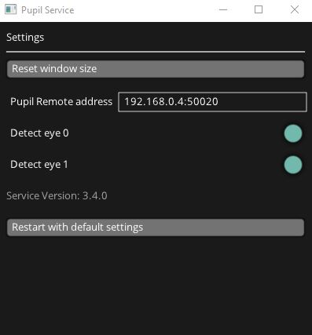

# Pupil Service
Pupil Service is like Pupil Capture except it does not have a world video feed, and comes with a slimmed down GUI. 
It is intended to be used with VR and AR eye tracking setups.

:::tip
The tools introduced in the [hmd-eyes project](https://github.com/pupil-labs/hmd-eyes) are made to work with Pupil Service and Pupil Capture alike.
:::

## Service Features
With the Pupil Service GUI you can define a [Pupil Remote Address](/developer/network-api/#pupil-remote)
and toggle to open and close the left and right eye windows.

Note that the eye windows opened by Pupil Service are equivalent to those of Pupil Capture, giving you access to all
associated [pupil detection settings](/software/pupil-capture/#fine-tuning-pupil-detection).

A powerful feature of Pupil Service is low latency gaze mapping – Pupil Service maps gaze as soon as a new pupil datum 
is available. Pupil Capture, on the other hand, queues incoming pupil data until the scene camera returns a new frame. Afterward, the queued pupil data is mapped in bulk. 

Pupil Service also uses less system resources. 

Check out the [Network API documentation](/developer/network-api/#communicating-with-pupil-service) for examples of 
communicating with Pupil Service!

## Clients
An example client for Unity3d can be found [here](https://github.com/pupil-labs/hmd-eyes/releases/latest)
