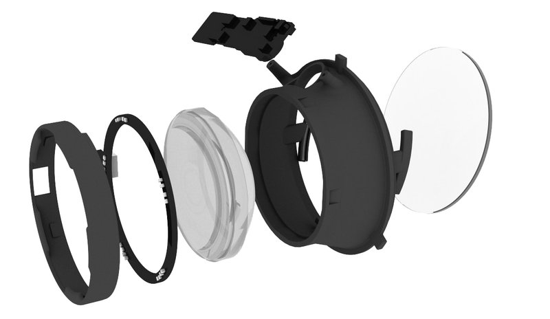

# Oculus Rift DK2 Add-On <Badge text="Discontinued!" type="danger"/>
Add eye tracking powers to your Oculus Rift DK2 with our 120hz eye tracking add-ons.
This page will guide you through all steps needed to turn your Oculus DK2 into an eye tracking HMD using the Pupil Oculus DK2 eye tracking add-on cups.

::: danger
Pupil Labs no longer sells Oculus Rift DK2 add-ons. This documentation is for archival purposes only.
:::

## Install lens in cup
Take the lens out of an existing Oculus lens cup.
Remove the LED ring and insert the lens into the Pupil eye tracking cup.
Install the LED ring and connect the LED power supply.

<Youtube src="AVeUwAFKmAc"/>

<Youtube src="ztT9WkDhpow"/>

<Youtube src="_Y0_4LDhphY"/>

## Install cup in DK2

<Youtube src="5LqjfgbDydM"/>

## Route cables
Route the USB cables through the vent holes in the top of the Oculus DK2.

<Youtube src="bvdxMYtzVTE"/>

## Connect cameras
Connect the eye tracking cup to the USB cable. Remove the old cup and insert the eye tracking cup in the DK2.

#### USB and Camera IDs
Once you plug the usb cables into your computer:

- the right eye camera will show up with the name: `Pupil Cam 1 ID0`
- the left eye camera will show up with the name: `Pupil Cam 1 ID1`

Both cameras are fully UVC compliant and will work with OpenCVs video backend, Pupil Capture, and libraries like `libucv` and `pyuvc`.