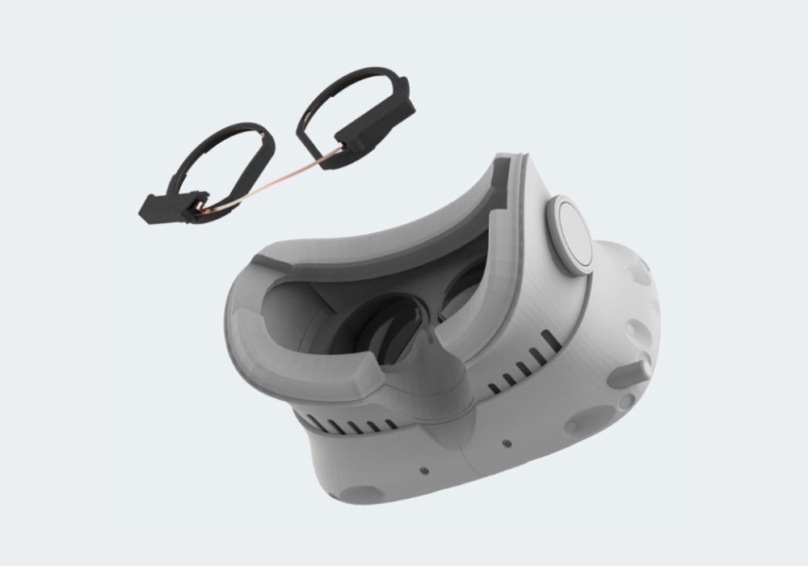

# HTC Vive Add-On
Add eye tracking powers to your HTC Vive with our 200Hz binocular eye tracking add-on.
This section will guide you through all steps needed to turn your HTC Vive into an eye tracking HMD using a Pupil Labs eye tracking add-on.

## Install the Vive add-on

<Youtube src="HGMjJLnK2_4"/>

## Install the Vive Pro add-on

<Youtube src="ZRdWlmxBH30"/>

## Install the 200Hz Vive and Vive Pro add-on

<Youtube src="eVsNdQL7VEI"/>

## A detailed look
Detailed look at the engagement process between the eye tracking ring and the lens holding geometry.
**Do not follow these steps.**
Just have a look to get a feeling for the snap-in part to the guide above.

## HTC Vive USB connection options
The HTC Vive has one free USB port hidden under the top cover that hides the cable tether connection.
This gives us two options to connect the pupil eye tracking add-on:

#### Connect the add-on to the free htc-vive usb port.
his means the cameras share the VIVEs usb tether bandwidth with other usb components inside the Vive.
This works but only if the following rules are observed:

- Disable the HTC-Vive built-in camera in the VR settings pane to free up bandwidth for Pupil’s dual 200Hz video streams.

or

- Enable the HTC-Vive built-in camera and set it to 30hz.

#### Run a separate USB lane along the tether
If you want full frame rate and resolution for both the Vive’s camera and the add-on you will have to connect the Pupil add-on to a separate usb port on the host PC.
We recommend this approach.

## USB Connection and Camera IDs
Once you plug the usb cables into your computer:

- The right eye camera will show up with the name: `Pupil Cam 3 ID0`
- The left eye camera will show up with the name: `Pupil Cam 3 ID1`

## Interfacing with other software or your own code
Both cameras are fully UVC compliant and will work with OpenCVs video backend, Pupil Capture, and libraries like `libucv` and `pyuvc`.
