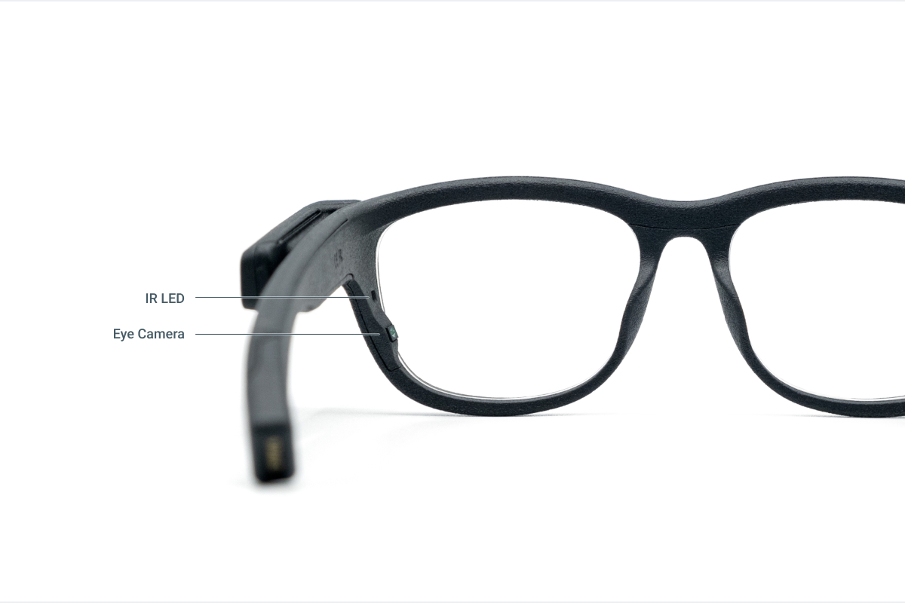
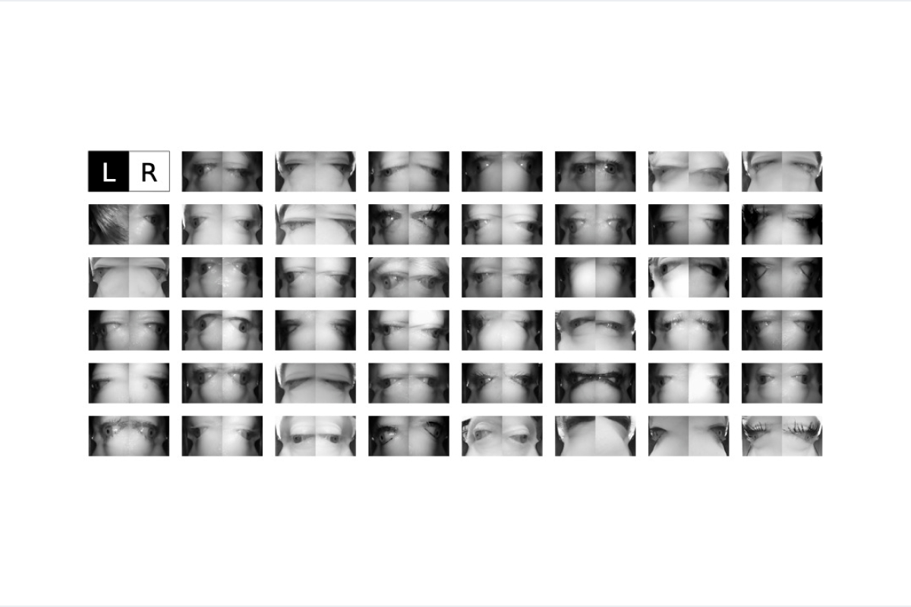
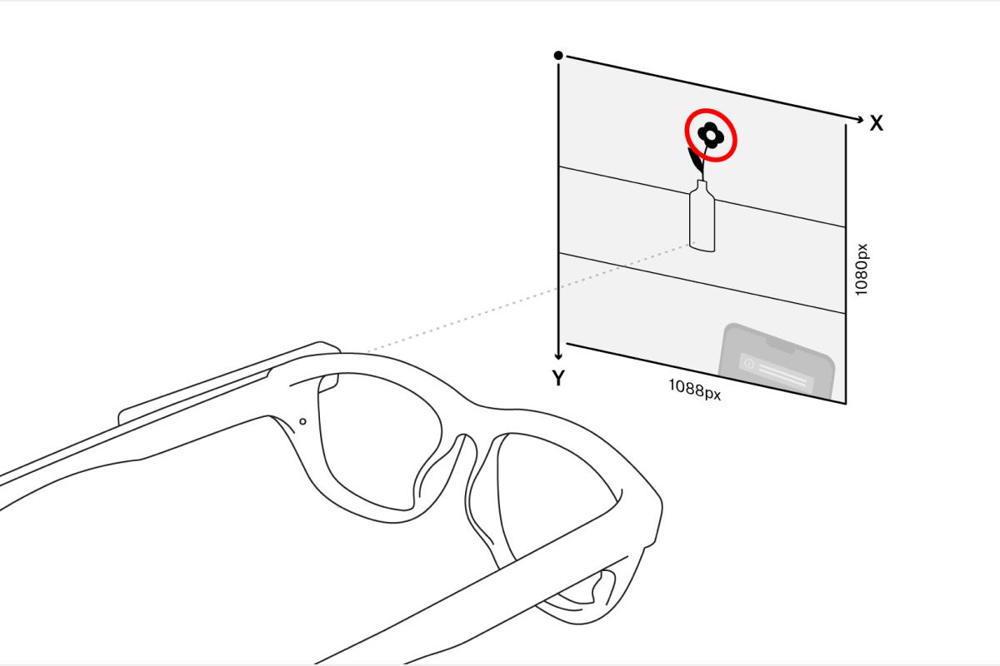
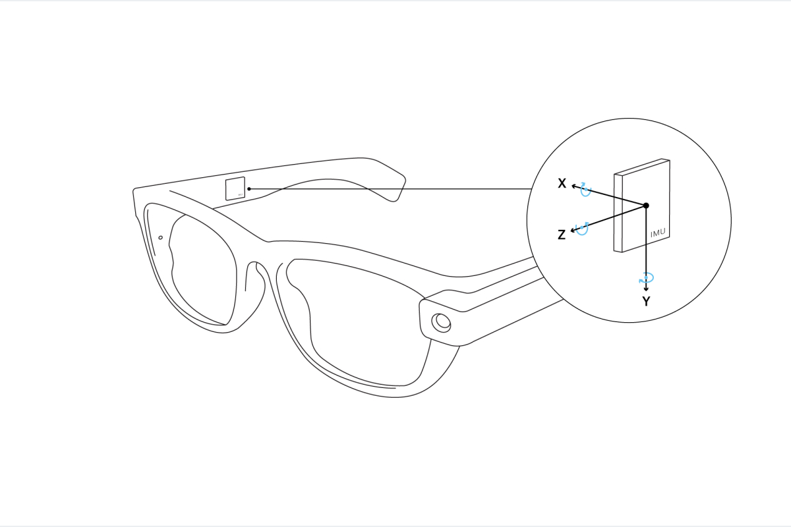

# Data Streams
Pupil Invisible glasses include a number of sensors providing different types of data. Some data streams are available in real-time (see [real-time API](/real-time-api/)), while others are computed in Pupil Cloud post hoc after uploading. All data is fully accessible and can be downloaded from Pupil Cloud in convenient formats.

## Eye Videos
Pupil Invisible glasses feature two eye cameras, one for each eye. They are fully embedded into the frame. The sensors record IR video at 200 Hz and with a resolution of 192x192px. Right next to each camera is an IR LED, which guarantees good illumination of the eye in dark environments.

Below you can find a collection of example image pairs recorded with different subjects:

## Gaze
While recording, the Pupil Invisible Companion device calculates gaze data in real-time. The exact framerate of this signal depends on the model of phone you use as Companion device. On a OnePlus 8 device it is +120 Hz. Other apps running simultaneously on the phone may decrease the framerate.

After a recording is uploaded to Pupil Cloud, gaze data is automatically re-computed at the full framerate of 200 Hz.

Gaze data is output in pixel space of the scene camera image, which has a resolution of 1088x1080px. The origin is in the top-left corner of the image.

The gaze estimation algorithm is based on end-2-end deep learning and provides gaze data robustly without requiring a calibration. You can find a high-level description as well as a thorough evaluation of the accuracy and robustness of the algorithm in our [white paper](https://arxiv.org/pdf/2009.00508).

## Fixations & Saccades
The two primary types of eye movements exhibited by the visual system are fixations and saccades. During fixations, the eyes are directed at a specific point in the environment. A saccade is a very quick movement where the eyes jump from one fixation to the next. Properties like the fixation duration are of significant importance for studying gaze behavior.

Fixations and saccades are calculated automatically in Pupil Cloud after uploading a recording and are included in the recording downloads. The deployed fixation detection algorithm was specifically designed for head-mounted eye trackers and offers increased robustness in the presence of head movements. Especially movements due to vestibulo-ocular reflex are compensated for, which is not the case for most other fixation detection algorithms. You can learn more about it in the [Pupil Labs fixation detector whitepaper](https://docs.google.com/document/d/1dTL1VS83F-W1AZfbG-EogYwq2PFk463HqwGgshK3yJE/export?format=pdf) and in our [publication](https://link.springer.com/article/10.3758/s13428-024-02360-0) in *Behavior Research Methods* discussing fixation detection strategies.

We detect saccades based on the fixation results, considering the gaps between fixations to be saccades. Note, that this assumption is only true in the absence of smooth pursuit eye movements. Additionally, the fixation detector does not compensate for blinks, which can cause a break in a fixation and thus introduce a false saccade.

The downloads for gaze mapping enrichments ([Reference Image Mapper](/pupil-cloud/enrichments/reference-image-mapper/#export-format), [Marker Mapper](/pupil-cloud/enrichments/marker-mapper/#export-format)) also include mapped fixations, i.e. fixations in reference image or surface coordinates respectively.

## Blinks
During blinks the eye is briefly covered by the eye lids, which serves the purpose of spreading tears across the cornea. The blink rate and blink duration are however also correlated with cognitive processes, which makes it an interesting physiological signal.

Blinks are detected automatically in Pupil Cloud after uploading a recording. They are available as part of the [recording exports](/data-collection/data-format/).

The blink detection algorithm is operating directly on the eye video to detect the movement patterns of blinks. Read more about the algorithm in the [Pupil Labs blink detector whitepaper](https://docs.google.com/document/d/1JLBhC7fmBr6BR59IT3cWgYyqiaM8HLpFxv5KImrN-qE/export?format=pdf). The algorithm will soon be released as open-source.

## Scene Video
The scene camera is attached to the left temple of the Pupil Invisible glasses. It records video at 30 Hz and 1088x1080px resolution with a field of view of 82°x82°.

The scene camera is detachable and can be removed and re-attached freely even during a recording. Scene video capture will automatically resume as soon as the camera is attached again.

## Audio
A microphone is integrated into the scene camera module, such that audio can be recorded if the scene camera is connected. Recorded audio will be part of the resulting scene video.

Audio recording is disabled in the Pupil Invisible Companion app by default. You can enable it in the settings.

## Inertial Measurements
An inertial measurement unit (IMU) is integrated into the right temple of the Pupil Invisible glasses. It measures the rotation speed and translational acceleration of the Pupil Invisible glasses.

After uploading to Pupil Cloud, absolute roll and pitch values of the glasses are computed from the inertial measurements using [Madgwick's algorithm](https://x-io.co.uk/downloads/madgwick_internal_report.pdf).

The IMU is oriented in the frame, such that the x-axis points to the right, the y-axis points downwards and the z-axis points to the front.
