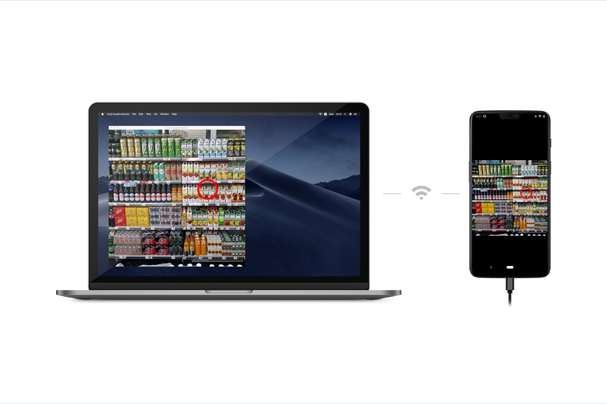
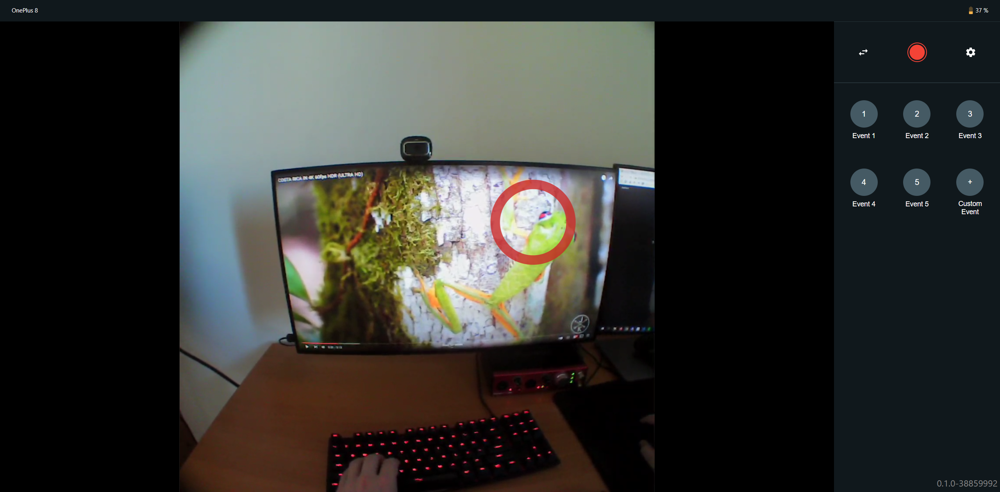

# Monitor your Data Collection in Real-Time

Using the **Monitor app** you can easily monitor your data collection in real-time and remote control all your Pupil Invisible devices from another device. It's a web-app that can be opened in any browser on a computer, tablet or phone! The only requirement is that the Companion device and the device you use to access the Monitor app are connected to the same network.

To access the Monitor app make sure the Pupil Invisible Companion app is running and visit the page [pi.local:8080](http://pi.local:8080) on your monitoring device.

::: tip
The Pupil Invisible Companion app can display a QR code that gets you straight to the monitor website. Just select `Streaming` in the menu!
:::

## The App's User Interface

Once the page has loaded, you will be presented with a live stream of the scene camera with a gaze overlay. On the right-hand side you can find a record button, that allows you to remotely start and stop a recording on the device.

If you have multiple Pupil Invisible devices connected to the network, you can switch between devices using the switch button.

Using the various event buttons, you can remotely save an [event](/data-collection/events/) in a recording to mark points of interest. In the settings view you can customize the according event names.

## Connection Problems?

In case you have trouble connecting to your Pupil Invisible please consider the following:

- First, make sure the Companion phone and the device you are using for monitoring are both connected to the same network.
- The local network must allow MDNS and UDP traffic for the app to work. In large public networks, this may be prohibited for security reasons. You can circumvent this by running a separate WiFi using the phone's hot spot functionality or an extra router.

If you still have trouble, please reach out to us in [chat](https://pupil-labs.com/chat/)!

## Conclusion

The Monitor app allows you to easily monitor your data collection and remotely control all your Pupil Invisible devices.

If you want to go further and get real-time access to the generated data for custom processing, please check out our [real-time API](/real-time-api/).

If you want to save events programmatically in real-time during your data collection, check out our how-to guide on [Tracking your Experiment Progress using Events](/real-time-api/track-your-experiment-progress-using-events/) using the real-time API.
