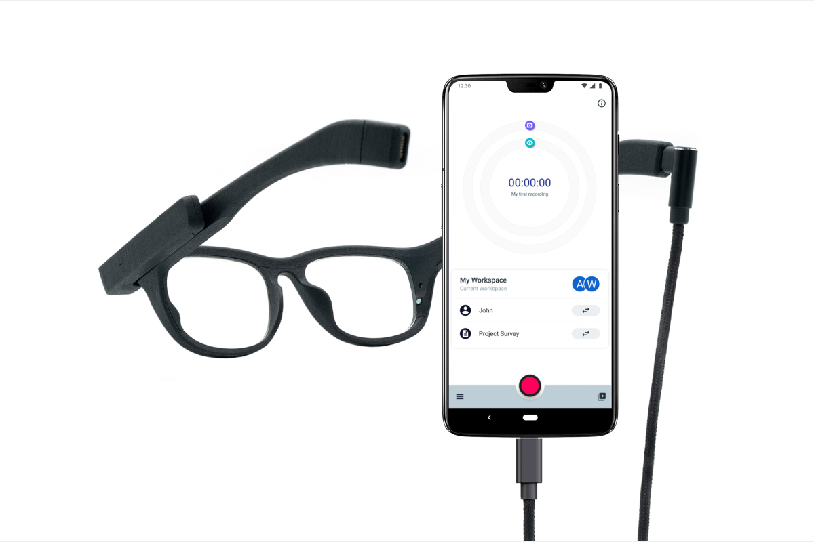
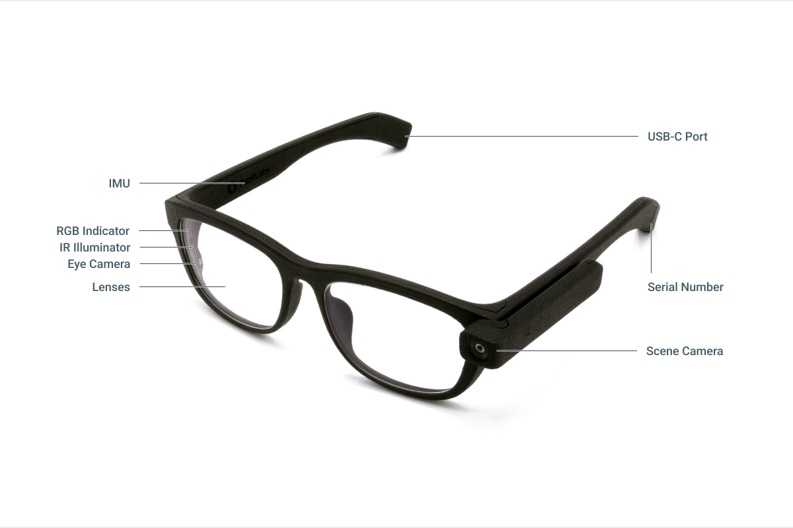

# Technical Overview

The Pupil Invisible glasses connect to the Companion device (Android Phone) with a USB-C cable. The Companion device supplies the glasses with power and receives the raw sensor data for storage and further processing. Use the Pupil Invisible Companion App to make recordings, preview real-time gaze and world video, stream data over the network, set up wearers, select templates, and preview and upload recordings to Pupil Cloud.

While looking almost like normal glasses, the Pupil Invisible glasses are filled with sensors and electronics:

- **Eye Cameras**: A binocular pair of infrared cameras with matching 850nm infrared illuminator **LEDs** are used to capture [eye videos](/invisible/basic-concepts/data-streams/#eye-videos). The raw data is saved with each recording and is used for real-time [gaze](/invisible/basic-concepts/data-streams/#gaze) estimation.

- **Scene Camera**: A detachable scene camera is located on the left arm of the glasses capturing [scene video](/invisible/basic-concepts/data-streams/#scene-video). A **microphone** is integrated into the camera module to capture [audio](/invisible/basic-concepts/data-streams/#audio). You can detach and attach the camera at any time before, during, and after a recording. The app will capture scene video during a recording automatically whenever it is attached. Capturing audio is optional and settable in the Companion app settings.
 
- **IMU**: A 6-degrees-of-freedom IMU is integrated into the right arm of the glasses. It captures the [inertia](/invisible/basic-concepts/data-streams/#inertial-measurements) of the glasses, including translational acceleration, rotational speed, pitch and roll.

- **Indicator LED**: An RGB LED is located in the front-right of the glasses to notify the wearer in case of issues. For example, if the Companion device is running out of battery or storage space, the indicator light will start blinking (the Companion device will also start vibrating!).

- **Lenses**: A pair of exchangeable lenses sits in the front of the glasses. The glasses ship with clear plano lenses, as well as a pair of shaded lenses. Lenses with prescription values can be obtained from any optician or via our [lens kit](https://pupil-labs.com/products/invisible/accessories/). See our how-to guide on [exchanging lenses](/invisible/glasses-and-companion/hardware-handling/exchange-lenses/) for more information.

- **USB-C Connector**: The connector is used to connect the glasses to the Companion device. Always use the cable that was provided with your Pupil Invisible system to guarantee a stable connection!

- **Serial Plaque**: The glasses serial number can be found on a plaque at the tip of the left arm.

:::danger
The electronics and sensors are sensitive! Please follow our how-to guide when [cleaning and disinfecting](/invisible/glasses-and-companion/hardware-handling/clean-and-disinfect/)  your glasses.
:::