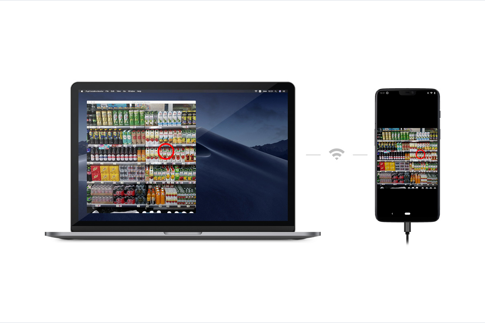

# Understand the Ecosystem
The Neon ecosystem contains a range of tools that support you during data collection and data analysis. This overview introduces all the key components so you can become familiar with all tools at your disposal.

## Neon Companion app
You should have already used the Neon Companion app to [make your first recording](/neon/getting-started/first-recording.html). This app is the core of every Neon data collection.

When your Neon is connected to the Companion device, it supplies it with power and the app calculates a real-time gaze signal. When making a recording, all generated data is saved on the Companion device.

The app automatically saves [UTC timestamps](https://en.wikipedia.org/wiki/Coordinated_Universal_Time) for every generated data sample. This allows you to easily sync your data with other 3rd party sensors, or to sync recordings from multiple subjects that have been made in parallel.

## Pupil Cloud
Pupil Cloud is our web-based storage and analysis platform located at [cloud.pupil-labs.com](https://cloud.pupil-labs.com/). It is the recommended tool for handling your Neon recordings.
It makes it easy to store all your data securely in one place and it offers a variety of options for analysis.

Once a recording is uploaded to Pupil Cloud the processing pipeline begins adding several additional low-level data streams to it - including the 200 Hz gaze signal and fixation data. Some of this data (e.g. the 200 Hz gaze signal) is not available outside of Pupil Cloud.

From here, you can either download the raw data in a convenient format or use some of the available analysis algorithms to extract additional information from the data. For example, use the [Face Mapper](/enrichments/#face-mapper) to automatically track when subjects are looking at faces. Or use the [Reference Image Mapper](/enrichments/#reference-image-mapper) to track when subjects are looking at objects of interest represented by a reference image.

We have a strict [privacy policy](https://pupil-labs.com/legal/) that ensures your recording data is accessible only by you and those you explicitly grant access to. Pupil Labs will never access your recording data unless you explicitly instruct us to.

If Cloud upload is enabled in the Neon Companion app, then recordings will be uploaded automatically to Pupil Cloud. No additional effort is required for data logistics.

## Neon Monitor
  

   
All data generated by Neon can be monitored in real-time using the Neon Monitor app. To access the app simply visit [neon.local:8080](http://neon.local:8080) in your browser while being connected to the same WiFi network as the Companion device.

The real-time streaming app enables you to monitor and control a recording session remotely without having to directly interact with the Companion device carried by the subject. You can view the scene video and gaze data remotely in your browser. You can also start and stop recordings and annotate important moments in time with [events](https://docs-staging.pupil-labs.com/neon/general/events/). All data will be saved with the recording on the Companion device.

## Real-Time API
All data generated by Neon is accessible to developers in real-time via our **Real-Time API**. Similar to the Neon Monitor app, it allows you to stream data, remotely start/stop recordings and save events. The only requirement is that the Companion device and the computer using the API are connected to the same WiFi network.

This enables you to e.g. implement Human Computer Interaction (HCI) applications with Neon or to streamline your experiments by remotely controlling your devices and saving events automatically.

Check-out out our [real-time API tutorial](https://docs-staging.pupil-labs.com/neon/real-time-api/tutorials/) to learn more!

For a concrete usage example, see [Track your Experiment Progress using Events](/neon/real-time-api/track-your-experiment-progress-using-events/)!

