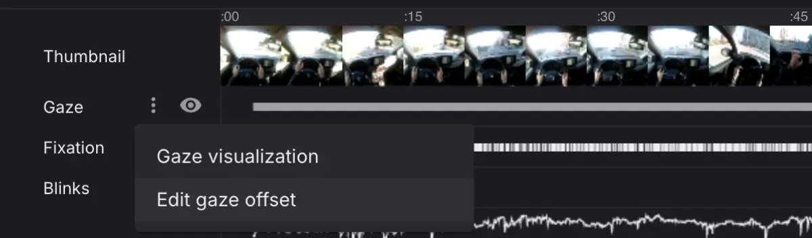

# Offset Correction on Pupil Cloud

For some subjects, you may find a constant offset in their gaze estimates. This gaze offset can be [compensated for in the Invisible Companion app](/data-collection/offset-correction/) before starting a recording, or post hoc in Pupil Cloud as shown below. Open the dropdown menu of the gaze track in the timeline, select Edit gaze offset to enter the gaze offset correction view.

Once you enter the `Edit Gaze Offset` view, simply drag the gaze circle to apply the correction. See the video below for reference.

- The grey circle indicates the raw gaze estimate provided by the gaze estimation pipeline of Pupil Invisible.
- The red circle indicates the gaze position with the current offset applied.
- The blue circle indicates the offset correction applied in the Invisible Companion app.

<video width="100%" controls>
  <source src="./offset-correction.mp4" type="video/mp4">
</video>

::: tip
Modifying the gaze offset impacts all downstream data, such as fixations, mapped gaze from enrichments, and visualizations. Where possible, data is updated instantly. If not, the respective data will be deleted, requiring (partial) re-computation of enrichments or visualizations. In that case, the enrichment or visualization will be shown as _Not Started_ and you need to re-run them.
:::
