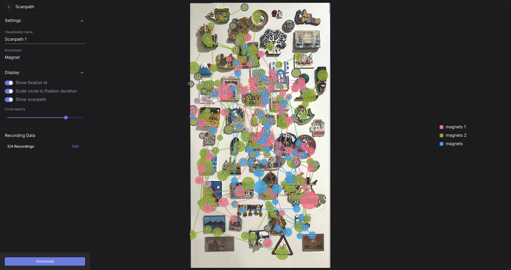

# Scanpath

<Youtube src="6xn2ehOLS94"/>

The output of the [**Reference Image Mapper**](/pupil-cloud/enrichments/reference-image-mapper/), [**Marker Mapper**](/pupil-cloud/enrichments/marker-mapper/), and [**Manual Mapper**](/pupil-cloud/enrichments/manual-mapper/) enrichments can be visualized as a scanpath over the reference image or surface.

A scanpath is a graphical representation of fixations over time, showing how a participant’s visual attention moves across a scene. Scanpaths are a great tool for analyzing visual attention and perception, as they reveal which parts of a scene drew focus and in what order.

- Fixation locations - Visualised as numbered circles
- Fixation durations - Mapped to the size of the circles. Longer fixations correspond to larger circles
- Saccades - Assuming a task without smooth pursuit movements, saccades are represented by lines connecting sequential fixations. Saccade distances between sequential fixations are reflected by the length of the lines. Longer lines correspond to bigger gaze shifts.

## Setup

To visualize your scanpath:

- Navigate to the `Visualizations` tab.
- Click on `Create Visualization`.
- Select `Scanpath` and the enrichment to which it should be applied.

The following configuration options are available for customizing the scanpath visualization:

- **Show Fixation ID** — Displays fixation IDs next to each fixation when enabled.
- **Scale Circle to Fixation Duration** — Adjusts the size of fixation circles based on fixation duration. Larger circles represent longer fixations. When disabled, all circles are displayed at the same size.
- **Show Scanpath** — Draws lines connecting consecutive fixations to visualize the scanpath.
- **Circle Opacity** — Use the opacity bar to adjust the transparency of the fixation circles.

Additionally, within the **Scanpath** view, you can select which recordings to include, allowing you to create visualizations for a single recording or combine multiple recordings in one overview.

::: tip
Note that only fixations mapped _within_ the reference image or surface are displayed in the scanpath. The first and final fixations of each scanpath are marked with a colored border. Fixations located outside of the image are not shown. As a result, the visualized fixation IDs may not increase sequentially on the image if an observer fixated off and then back on the reference image or surface. If the wearer fixates outside the reference or surface for only one fixation, then the scanpath will reflect this with a line to the off image/surface fixation and back. If a fixation was not localized at all or a string of fixations are off image/surface, then they are not visualized and no line will connect to them.
:::

## Export Format

Through the `Visualizations` tab, in the Scanpath view, you can download the final visualization displaying the generated scanpath in `.png` format.
