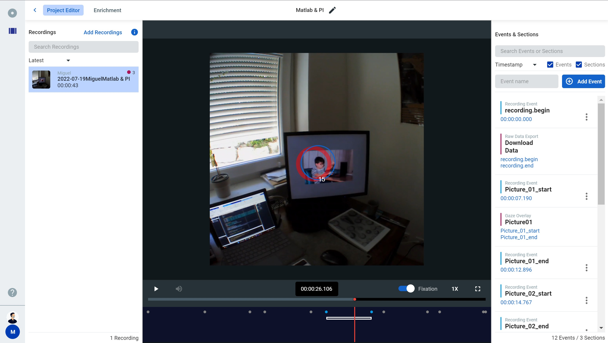
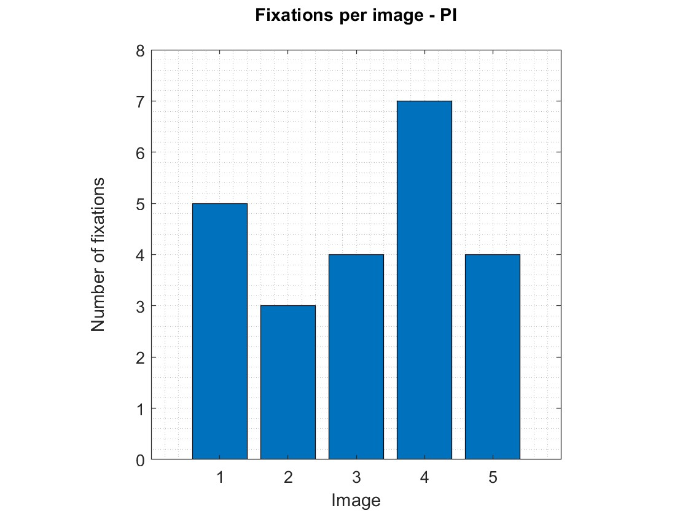

# Track your experiment in MATLAB

MATLAB is often used by researchers to build eye tracking experiments, such as tracking how long participants look at stimuli presented on a computer screen.

When working with head-mounted eye trackers like Pupil Invisible, it can be useful to synchronize stimuli presentation with the eye tracking recording. This enables you to, a) keep track of when a stimulus is shown, and b) segment the eye tracking data accordingly.

In this guide, we will build a simple MATLAB experiment. The experiment will show you how to automatically and conveniently track stimulus presentation as part of your eye tracking recording using [events](/invisible/basic-concepts/events) and [Pupil Invisible's real-time API](/invisible/real-time-api/introduction). Finally, you will see how those events enable the segmentation of eye tracking data per stimulus during the analysis.

While MATLAB is not officially supported by [Pupil Invisible's real-time API](/invisible/real-time-api/introduction), we have created a simple wrapper to enable some of the available functions required for this application.

::: tip
A similar guide for tracking an experiment in Python can be found [here](/invisible/real-time-api/track-your-experiment-progress-using-events).
:::

## Requirements

This wrapper uses the [.net.http package from MATLAB](https://mathworks.com/help/matlab/ref/matlab.net.http-package.html#), which was introduced in the MATLAB 2016b release. Before starting, please ensure you use this or a newer version of MATLAB.

You can use any library that you want to present your stimulus or even [run the wrapper alone](#can-i-run-the-wrapper-alone?). However, if you plan on running the current demo to its full extent, you will need to install [Psychtoolbox](http://www.psychtoolbox.org/download.html) and ensure it runs before continuing.

[Psychtoolbox](http://www.psychtoolbox.org/) is a free set of MATLAB and GNU Octave functions for vision and neuroscience research, which makes it easy to show accurately controlled visual stimuli on-screen. You can learn more about it [here](http://www.psychtoolbox.org/).

All images used in the demo are from [Unsplash](https://unsplash.com/), but we do not include the photos in the demo files. Therefore, you will need internet access so MATLAB can read them from the web.

Finally, you will need to download the wrapper and demo code by cloning the repository or downloading the .zip file from
[here](https://github.com/pupil-labs/realtime-matlab-experiment/archive/refs/heads/main.zip).

```git
git clone https://github.com/pupil-labs/realtime-matlab-experiment.git
```

## How to use Events to keep track of your experiment

Before we dig into how to run the demo and the wrapper, you will need to understand what events are and how to use them to keep track of your experiment.

Events are essentially timestamps within a recording that have been marked with a name. In this demo, we need to track when a specific image is shown during a recording to associate the fixation data with that image. Thus, we will create an event at the start and end of each image presentation to mark this section.

Events can be created post-hoc in the project editor or at recording time using either the [real-time API](/invisible/real-time-api/introduction) or [Pupil Invisible Monitor](/invisible/how-tos/data-collection-with-the-companion-app/monitor-your-data-collection-in-real-time.html). In this example, we are interested in fully automating the event creation within MATLAB. Still, depending on your use case, you could use either of those methods.

## Running the demo

Hands-on!
Confirm that your Pupil Invisible is plugged to the Companion Device.
Check that the Companion Device and the MATLAB computer are connected to the same network.
Then you can execute the demo code as shown below:

```matlab
demo_pupil_labs();
```

### Through the demo

Beyond all the steps needed to display an image in Psychtoolbox (which you can find in the demo code), here we will focus on the calls to the Pupil Invisible real-time API.

First, we start with a call to check if the connection is working.

```matlab
r = pupil_labs_realtime_api();
```

A proper connection will return the code 200 on the `r.StatusCode` property.

Then, the demo script will load the images, and several steps will follow to prepare a Psychtoolbox call to the screen. After that, the recording is initialised.

```matlab
pupil_labs_realtime_api('Command', 'start');
```

It's good practice to start the recording before drawing anything on the screen, as the device might start the recording with a small delay.

In the demo, a logo is shown, and a keystroke is required to start displaying the images when the participant is ready. When an image is shown `(Screen('Flip'))`, a starting event call is made to annotate the beginning of the image presentation.

```matlab
pupil_labs_realtime_api('Command', 'event', 'EventName', ['Picture_',num2str(n, '%02.0f'),'_start']);
```

After 4 seconds, another event call is performed to mark the end of the section.

```matlab
pupil_labs_realtime_api('Command', 'event', 'EventName', ['Picture_',num2str(n, '%02.0f'),'_end']);
```

Finally, the recording is stopped and saved after iterating through all the images.

```matlab
pupil_labs_realtime_api('Command', 'save');
```

Additionally, a cancel command was included in our catch routine, so the recording is discarded if any error occurs.

```matlab
pupil_labs_realtime_api('Command', 'cancel');
```

That is all we have to do during data collection. Once all recordings have been uploaded to Pupil Cloud, we create a
project to export them using the "Downloads" view. Within the project editor, we can already see the events in every recording.



## Analysing the data

Having the .csv files means we can read them within MATLAB and start doing some magic!

Let's plot the number of fixations per image using our demo data.

```matlab
% Import events and fixations from the csv files as tables
events = readtable("events.csv");
fixations = readtable("fixations.csv");

% Take only those events with Picture in the name as this is what we used
% in demo_PI to target our events.
events = events(contains(events.name, "Picture"), :);
start_events = events(contains(events.name, "start"), :);
end_events = events(contains(events.name, "end"), :);

% New array matching events and fixations
for nImage = 1:height(start_events)
    imIndex(1,nImage) = nImage;
    fixperIm(1, nImage) = sum(fixations.startTimestamp_ns_ >= start_events.timestamp_ns_(nImage) &...
        fixations.endTimestamp_ns_ <= end_events.timestamp_ns_(nImage));
end

% Plot the data
bar(imIndex,fixperIm);
axis square; grid minor;
ylim([0 max(fixperIm)+1]);
xlabel('Image'); ylabel(['Number of fixations', newline]);
title(['Fixations per image - PI', newline]);
```



## Can I run the wrapper alone?

Yes, if you are not planning on using Psychtoolbox, you can also use the wrapper alone. Download the `pupil_labs_realtime_api` function and add it to your path. Then, call it as you would typically call a function.

```matlab
r = pupil_labs_realtime_api('Command','status');
```

Several arguments can be used to control the wrapper:

- `Command`: followed by one of the following commands, `status`, `start`, `stop`, `save`, `cancel`, or `event`.
- The default is `status`.
  See the section [Running the demo](#running-the-demo) on how to use them.
- `EventName`: followed by a string with the annotation name for the event, default is `Test event`.
- `URLhost`: followed by a string containing the URL of Pupil Invisible, default is `http://pi.local:8080/`. It's generally good practice to call directly to the URL. Nevertheless, Matlab does resolve the DNS and stores it in the cache, so you will only notice a delay in the first call.

## Notes and disclaimers

:::tip
The current wrapper function does not support RTSP protocol. Therefore it is not possible to stream video or gaze positions. If you need this feature, please directly use the [Realtime Network API](https://pupil-labs-realtime-api.readthedocs.io/en/stable/guides/under-the-hood.html?highlight=RTSP).
:::

::: warning
The average response time for HTTP requests to Pupil Invisible in MATLAB is 0.33 +- 0.14 seconds (on a 1000 requests test).
This time might vary depending on your connection and computer load. If you need better time accuracy, check out our
[Python API](https://pupil-labs-realtime-api.readthedocs.io/en/stable/examples/index.html).
:::
