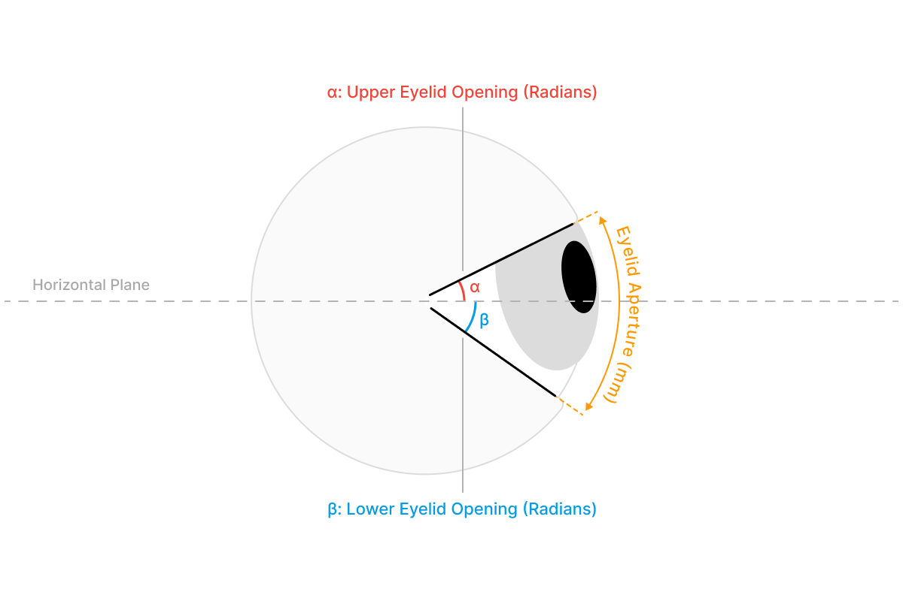

# Data Streams

The Neon module contains a number of sensors providing different types of data
(see also [Technical Overview](/hardware/module-technical-overview/)). Data is available in real-time (e.g. via the [real-time API](/real-time-api/tutorials/)), and post-hoc through either [Pupil Cloud](/pupil-cloud/) or [Neon Player](/neon-player/).

Below you can find a description of all data streams. All data is fully accessible and can be downloaded in convenient formats.

## Eye Videos

The Neon module features two eye cameras, one for each eye. They are located at the tip of the small arms of the module.
The sensors record IR video at 200 Hz with a resolution of 192x192px. The two sensors are synced in hardware, such that they record images at the exact same time. The resulting images are concatenated in a single video stream of 384x192px resolution.

An IR LED is located just above each camera, which guarantees good illumination of the eye in dark environments.

## Scene Video

The front-facing scene camera is located in the center of the Neon Module. It records video at 30 Hz and 1600x1200 px resolution with a field of view of 103°x77°.

The scene camera can be operated with automatic or manual exposure. In situations with challenging lighting conditions, e.g. when recording a screen, optimizing the exposure manually can improve the quality of the scene video.

## Gaze

Gaze data is output in pixel space of the scene camera image. The origin is in the top-left corner of the image.

The achieved _real-time_ framerate can vary based on the Companion device used and environmental conditions. On the OnePlus 10, Motorola Edge 40 Pro, and Samsung Galaxy S25 the full 200 Hz can generally be achieved outside of especially hot environments.
On the OnePlus 8, the framerate typically drops to ~120 Hz within a few minutes of starting a recording. Other apps running simultaneously on the phone may decrease the framerate.

After a recording is uploaded to Pupil Cloud, gaze data is automatically re-computed at the full 200 Hz framerate if required, and can be downloaded from there.

The gaze estimation algorithm is based on end-2-end deep learning and provides gaze data robustly without requiring a calibration. You can find a high-level description as well as a thorough evaluation of the accuracy and robustness of the algorithm in our [white paper](https://zenodo.org/doi/10.5281/zenodo.10420388).

## Fixations & Saccades

The two primary types of [eye movements](https://pupil-labs.com/blog/what-is-eye-tracking#how-are-eye-movements-classified) exhibited by the visual system are fixations and saccades. During fixations, the eyes are directed at a specific point in the environment. A saccade is a very quick movement where the eyes jump from one fixation to the next. Properties like the fixation duration are of significant importance for studying gaze behavior.

Fixations and saccades are calculated automatically and are included in the recording downloads. The deployed fixation detection algorithm was specifically designed for head-mounted eye trackers and offers increased robustness in the presence of head movements. Especially movements due to vestibulo-ocular reflex are compensated for, which is not the case for most other fixation detection algorithms. You can learn more about it in the [Pupil Labs fixation detector whitepaper](https://docs.google.com/document/d/1CZnjyg4P83QSkfHi_bjwSceWCTWvlVtbGWtuyajv5Jc/export?format=pdf) and in our [publication](https://link.springer.com/article/10.3758/s13428-024-02360-0) in _Behavior Research Methods_ discussing fixation detection strategies.

We detect saccades based on the fixation results, considering the gaps between fixations to be saccades. Note, that this assumption is only true in the absence of smooth pursuit eye movements. Additionally, the fixation detector does not compensate for blinks, which can cause a break in a fixation and thus introduce a false saccade.

The downloads for gaze mapping enrichments ([Reference Image Mapper](/pupil-cloud/enrichments/reference-image-mapper/#export-format), [Marker Mapper](/pupil-cloud/enrichments/marker-mapper/#export-format)) also include mapped fixations, i.e. fixations in reference image or surface coordinates respectively.

::: info Real-Time Fixation Detection
The fixation detector runs on the device in real-time (if enabled). Fixations and saccades are also computed during post-processing in Pupil Cloud.
:::

## 3D Eye Poses

3D eye poses are a time series of each eye's position and orientation in 3D space, given by the location of the eyeball center and the optical axis of each eye. The units are millimeters.

The coordinate system is depicted below. The origin corresponds to the scene camera of the Neon Module.

You can specify the inter-eye distance (IED) of a wearer in the wearer profile before making a recording to further improve the accuracy of the measurements. If no IED value is specified, the population average of 63 mm is used.

## Pupil Diameters

Pupil diameter is provided separately for the left and right eye. The computed pupil diameters correspond to the physical pupil size in mm, rather than the apparent pupil size in pixels as observed in the eye videos. You can find a high-level description as well as a thorough evaluation of the accuracy and robustness of Neon’s pupil size measurements in our [white paper](https://zenodo.org/records/10057185).

Similar to the 3D eye poses, the accuracy of the pupil diameter measurements improves when supplying the wearer's IED in the wearer profile before making a recording.

## Eye Openness

Eye openness enables research into factors such as emotional, cognitive, and physiological states. Neon's eye openness measurements
comprise of eyelid opening angles for the upper and lower eyelids relative to the scene camera’s horizontal plane with values provided in radians. It also measures eyelid aperture in millimeters, quantifying the maximum arc length between the upper and lower eyelids. These measurements are provided separately for the left and right eyes.

::: warning A Note on Real-Time Processing
Enabling real-time estimation of 3D eye poses, pupil diameter and eye openness on older Companion Devices (OnePlus 8, 8T, 10 Pro) can affect the sampling rates of other sensors due to the greater computational resources required for these tasks. We recommend keeping it off or lowering the sample rate and obtaining the data from Pupil Cloud unless real-time processing is necessary.

If 200 Hz real-time data is essential, consider upgrading to a newer [Companion Device model](/hardware/compatible-devices/).
:::

## Blinks

During blinks the eye is briefly covered by the eyelids, which serves the purpose of spreading tears across the cornea.
The blink rate and blink duration are also correlated with cognitive processes, which makes them interesting physiological signals.

The blink detection is derived from the eye openness signal, if eye state is disabled on the device this stream will only be available in Cloud.

## Audio

Stereo microphones are integrated into the Neon module. Recorded audio is part of the resulting scene video.

Audio recording is disabled in the Neon Companion app by default and can be enabled in Companion App main page.

## Movement (IMU Data)

The Neon module is equipped with a 9-DoF [inertial measurement unit](https://invensense.tdk.com/products/motion-tracking/9-axis/icm-20948/) (IMU) featuring an accelerometer, gyroscope, and magnetometer. The accelerometer and gyroscope measure linear acceleration and angular velocity, respectively, and are provided as raw values.

A fusion engine also combines these values with magnetometer readings to estimate the module's absolute orientation relative to magnetic north (positive world y-axis), gravity (negative world z-axis), and a rightward pointing vector (positive world x-axis) as a quaternion. We refer to this as the world coordinate system. It is important to note that this is not the same as the local IMU coordinate system.

The IMU is located in the top bar of the module and is sampled at 110 Hz. Its local coordinate system is oriented with the x-axis pointing to the right, the y-axis pointing in front, and the z-axis pointing upwards.

When relating data from the IMU to things visible in the scene camera, it may be necessary to align their respective 3D coordinate systems. The IMU's coordinate system is rotated by 102° around the x-axis in relation to the scene camera's coordinate system. See our [IMU Transformations article](https://docs.pupil-labs.com/alpha-lab/imu-transformations/) for a guide.

### Euler Angles

When exporting recordings from Pupil Cloud or Neon Player the IMU's orientation in Euler angles (i.e. pitch, yaw, and roll) are also available:

- Pitch is defined as a rotation around the world x-axis with a value range of -90° to +90°. Wearing Neon upright and looking parallel to the horizon roughly corresponds to 0° pitch. Backward tilt is positive, forward is negative.
- Yaw is a rotation around the world z-axis with a value range of -180° to +180°. With a calibrated IMU, a yaw of 0° indicates alignment with magnetic north. Leftward turn is positive, rightward is negative.
- Roll is a rotations around the world y-axis with a value range of -180° to +180°. Wearing Neon upright with a neutral head pose roughly corresponds to a roll of 0°. Rightward tilt is positive, leftward is negative.

