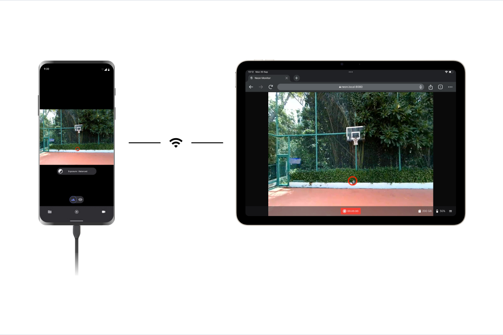
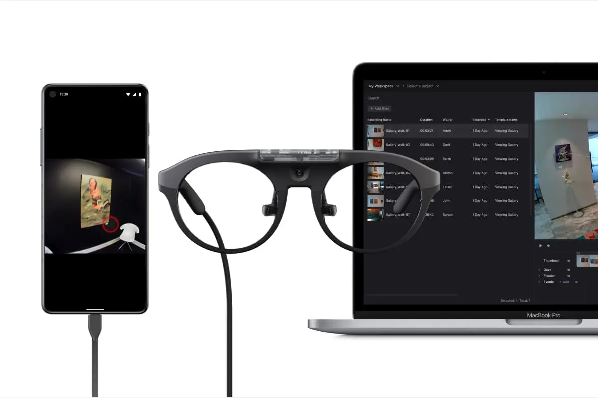

# Ecosystem Overview

The Neon ecosystem contains a range of tools that support you during data collection and data analysis. This overview introduces all the key components so you can become familiar with the tools at your disposal.

## Neon Companion App

You should have already used the Neon Companion app to [make your first recording](/data-collection/first-recording/). This app is the core of every Neon data collection.

When your Neon is connected to the Companion device, it supplies it with power and enables it to generate a real-time gaze signal as well as several other [data streams](/data-collection/data-streams/). When making a [recording](/data-collection/recordings/), all generated data is saved on the Companion device.

The app automatically saves [UTC timestamps](https://en.wikipedia.org/wiki/Coordinated_Universal_Time) for every generated data sample. This allows you to easily sync your data with other external data streams, or to sync recordings from multiple subjects that have been made in parallel.

## Other Data Collection Tools

Several other tools complement the Neon Companion app and can make data collection much easier in some scenarios.

### Neon Monitor

All data generated by Neon can be monitored in real time from other devices in the local network using the Neon Monitor app. To access the app simply visit [neon.local:8080](http://neon.local:8080) in the browser of any device connected to the same WiFi network as the Companion device.

The real-time streaming app enables you to monitor and control a recording session remotely without having to directly interact with the Companion device carried by the subject. You can view the scene video and gaze data remotely in your browser. You can also start and stop recordings and annotate important moments in time with [events](/data-collection/events/). All data will be saved with the recording on the Companion device.

### PsychoPy for Screen-Based Studies

[PsychoPy](https://www.psychopy.org/) is a commonly used tool to facilitate screen-based studies. It's a Python framework including tools for stimulus presentation on a screen and time-synchronized data collection.

Neon is officially supported by PsychoPy using [this](https://www.psychopy.org/api//iohub/device/eyetracker_interface/PupilLabs_Neon_Implementation_Notes.html) plugin. It allows you to capture gaze data in screen coordinates in real time and to synchronize this data with stimulus presentation and other data streams.

You can learn more about PsychoPy and the Neon plugin [here](/data-collection/psychopy/).

### Lab Streaming Layer for Sensor Fusion

[Lab Streaming Layer (LSL)](https://labstreaminglayer.org/) is a widely supported tool for sensor fusion. It is compatible with a huge range of physiological sensors including EEG, GSR, and EKG sensors and many more. It allows you to temporally synchronize and save the data coming from all of them.

Neon is compatible with LSL and you can learn more about how to use Neon with LSL [here](/data-collection/lab-streaming-layer/).

## Pupil Cloud

[Pupil Cloud](/pupil-cloud/) is our web-based storage and analysis platform located at [cloud.pupil-labs.com](https://cloud.pupil-labs.com/). It makes it easy to store all your data securely in one place and offers a variety of options for data analysis and visualization.

Pupil Cloud is the recommended tool for processing your Neon recordings and if you enable uploads in the Neon Companion app all recordings can be uploaded automatically.

Once a recording is uploaded to Pupil Cloud the processing pipeline begins adding several additional low-level data streams to it - including fixation, pupil diameter, blink, and 3D eye state data. Some of this data is only available through Pupil Cloud. For a full overview see the [data-streams](/data-collection/data-streams/) page

From here, you can either download the raw recording data in a convenient format or use the available analysis tools to extract additional information from the data. These tools include various algorithms for gaze mapping e.g. the [Reference Image Mapper](/pupil-cloud/enrichments/reference-image-mapper/), which allows you to track when subjects are looking at objects of interest shown on a reference image, as well as the ability to define [Areas of Interest (AOIs)](/pupil-cloud/areas-of-interest/) and to aggregate various metrics like e.g. average fixation duration on them.

We have a strict [privacy policy](https://pupil-labs.com/legal/) that ensures your recording data is accessible only by you and those you explicitly grant access to. Pupil Labs will **never** access your recording data unless you explicitly instruct us to. This implies that your recording data is not used for any product development. Of course, Pupil Cloud is fully GDPR-compliant.

You can find a tutorial on how to get started with Pupil Cloud [here](/pupil-cloud/).

## Neon Player

[Neon Player](/neon-player/) is a desktop application that allows you to easily play back Neon recordings locally. It also allows you to export recordings in convenient formats without having to go through Pupil Cloud. You can find a full overview of which data streams are available [here](/data-collection/data-streams/).

## Real-Time API

All data generated by Neon is accessible to developers in real time via our **Real-Time API**. Similar to the Neon Monitor app, it allows you to stream data, remotely start/stop recordings and save events. The only requirement is that the Companion device and the computer using the API are connected to the same WiFi network.

This enables you to e.g. implement applications with gaze-interaction or to streamline your experiments by remotely controlling your devices and saving events automatically.

Check out the [Real-Time API](/real-time-api/) section to learn more!

For a concrete usage example, see [Track your Experiment Progress using Events](https://pupil-labs.github.io/pl-realtime-api/dev/cookbook/track-your-experiment-progress-using-events/)!
