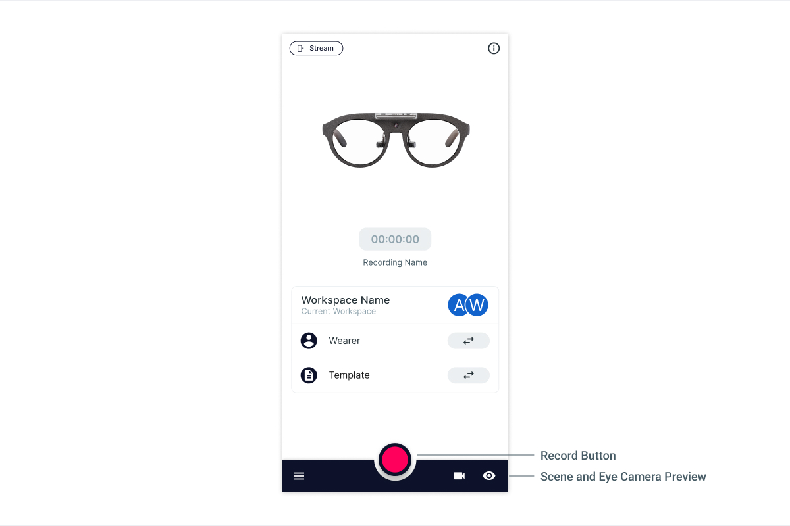

# Make Your First Recording

Using your Neon eye tracking system for the first time?

Follow the steps below to make your first recording!

## 1. Set Up Your New Companion Device.

The Companion Device included in your Neon case is a brand-new device. It has never been turned on, so it will require setup.

Create a new Google account or use an existing Google account during setup.

## 2. Install and Start the Neon Companion App.

Next, install the Neon Companion app on your device:

- Launch the **Google Play Store** app. It is already installed by default on your Companion Device.
- Search for [**Neon Companion**](https://play.google.com/store/apps/details?id=com.pupillabs.neoncomp) in the Google Play Store and click install.
- Start the Neon Companion app when the installation has finished.
- A couple of permission prompts will appear, which you need to accept.
- First-time users need to sign up for a [Pupil Cloud](https://cloud.pupil-labs.com/) account. Sign up using your Google account, or create an account with an email address and password.

  
  

  

## 3. Follow the Setup Instructions on the Screen

- As part of the setup process, you can enable uploading recordings to [Pupil Cloud](https://cloud.pupil-labs.com/).
- Pupil Cloud is an online storage and analysis platform for eye tracking recordings. It makes it easy to get recordings off of the phone and includes various algorithms for processing them. Uploading data to Pupil Cloud is optional, but some features are not available without it (e.g. obtaining the 200 Hz gaze or fixations signal).
- You can change this setting at any time in the app settings.
- You will also be asked to create your first [**wearer profile**](/data-collection/wearers/). Neon uses wearer profiles to distinguish who is wearing the glasses.

## 4. Open the Live Preview

Now, let's see some eye tracking in action!

- The **scene and eye camera icons** in the app's home screen should be colored, indicating that the glasses are connected (otherwise the icons would be gray).
- You can see a live stream of the scene video with a gaze overlay by clicking the **Preview** button.

Put on the glasses and give it a try!

## 5. Make Your First Recording

Press the round record button on the home view to start recording. Once you are done press the button again and tap save.

## 6. Playback and Download

Navigate to the **Recordings view** and click the recording you just made to play it! If you enabled the upload of recordings to Pupil Cloud, you should see that the recording has already started uploading!

Now that you have made a recording, let's explore what you can do with it! In the next article, you will get an overview of the software ecosystem at your disposal.
