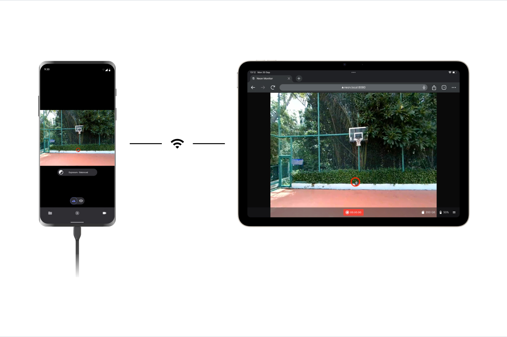
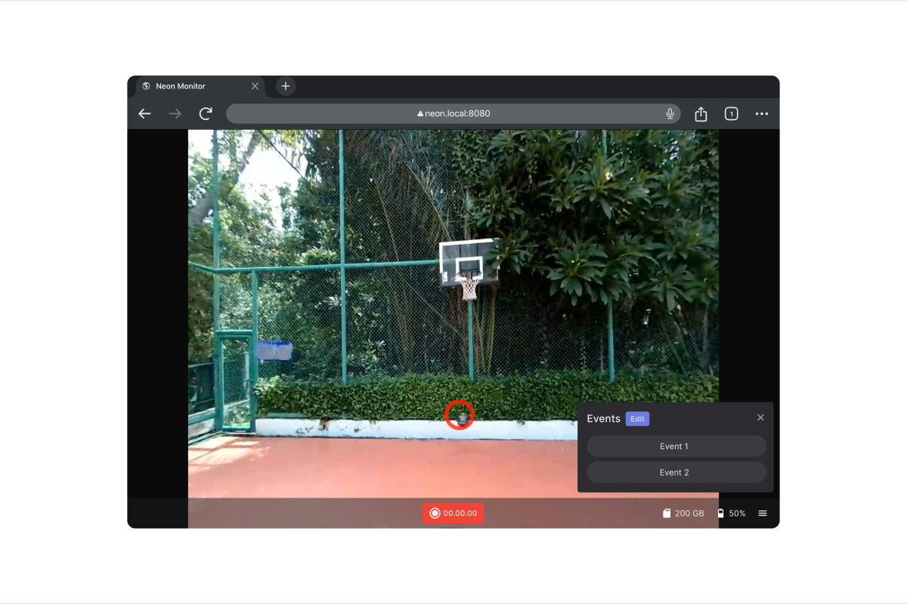

# Monitor Your Data Collection in Real-Time

Using the **Neon Monitor** app you can easily monitor your data collection in real-time and remote control all your Neons from another device. It's a web-app that can be opened in any browser on a computer, tablet or phone! The only requirement is that the Neon Companion device and the device you use to access the Monitor app are connected to the same network.

To access the Monitor app make sure the Neon Companion App is running and visit the page [neon.local:8080](http://neon.local:8080) on your monitoring device.

::: tip
The Neon Companion App can display a QR code that gets you straight to the monitor website. Just select `Streaming` on the home screen!
:::

## The App's User Interface

The majority of the app interface is dedicated to a live stream of Neon's scene camera with a gaze overlay. A record button is at the bottom and can be used to remotely start and stop a recording on the device.

If you have multiple Neon eye trackers connected to the network, you can switch between them from the main app menu.

You can also remotely annotate or mark points of interest in your recordings by using [events](/data-collection/events/). Events can be sent using the event buttons located at the bottom right of the interface. You can add, remove, and customize events from this menu.

## Connection Problems?

In case you have trouble connecting to your Neon please consider the following:

- First, make sure the Companion phone and the device you are using for monitoring are both connected to the same network.
- The local network must allow MDNS and UDP traffic for the app to work. In large public networks, this may be prohibited for security reasons. You can circumvent this by running a separate WiFi using the phone's hot spot functionality or an extra router.

If you still have trouble, please reach out to us in [chat](https://pupil-labs.com/chat/)!

## Conclusion

The Neon Monitor app allows you to easily monitor your data collection and remotely control all your Neons.

If you want to go further and get real-time access to the generated data for custom processing, please check out our [real-time API](/real-time-api/tutorials/).

If you want to save events programmatically in real-time during your data collection, check out our how-to guide on [Tracking your Experiment Progress using Events](/real-time-api/track-your-experiment-progress-using-events/) using the real-time API.
