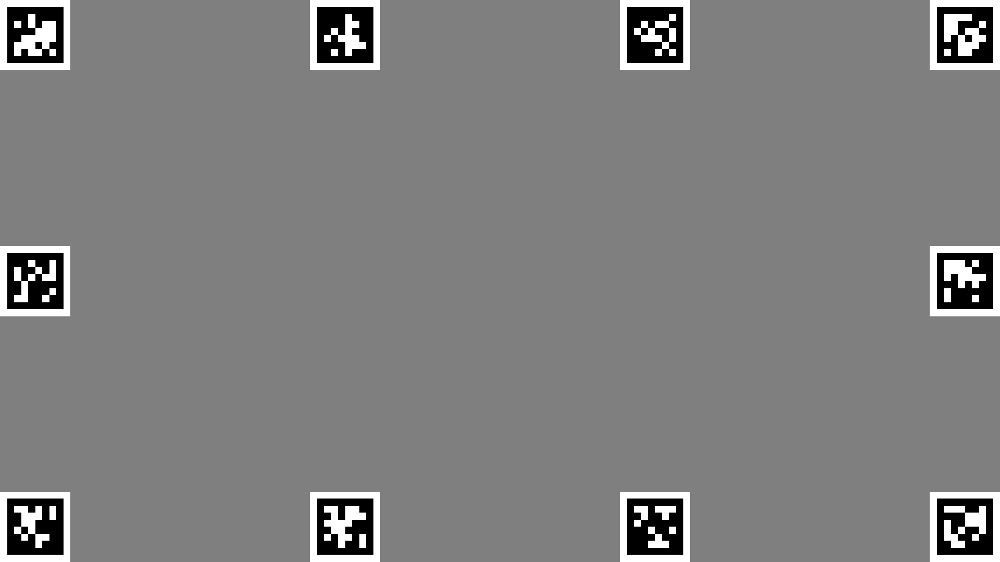

# PsychoPy

[PsychoPy](https://psychopy.org/) is widely used open-source software for creating and running psychophysics experiments. It enables users to present stimuli, collect data, and interface with a variety of hardware and software applications.

PsychoPy users have two options for designing their experiments.

- [Builder](https://www.psychopy.org/builder/) – Gives users a graphical interface with little or no need to write code - although it does support custom code when necessary. A Pupil Labs plugin for PsychoPy is provided to simplify interactions between PsychoPy and Neon.
- [Coder](https://psychopy.org/coder/index.html) – Gives users the option to generate experiments or do other things programmatically, [using Psychopy like any other Python package](https://psychopy.org/api/).

## Using PsychoPy with Neon

When using PsychoPy with Neon, we recommend making a recording in the Neon Companion app for the duration of the experiment. PsychoPy’s standard "Eyetracker Record" component can be used to start and stop recordings accordingly. For experiments that do not require screen-based gaze coordinates (e.g., pupillometry/eye state), this is all that is required.

To use Neon for screen-based work in PsychoPy, the screen needs to be robustly located within the scene camera’s field of view, and Neon’s gaze data subsequently transformed from scene camera-based coordinates to screen-based coordinates. The Pupil Labs eyetracker plugin for PsychoPy achieves this with the use of AprilTag Markers and the [real-time-screen-gaze](https://github.com/pupil-labs/real-time-screen-gaze) Python package (installed automatically with the plugin).

## Builder

### Installing the Plugin

- Open PsychoPy Builder
- Click on the "Tools" menu and select "Plugins/package Manager"
- Find "Pupil Labs" in the plugin list and click "Install"
- Close all PsychoPy windows and re-open Builder

### Experiment Settings

- Open your experiment and open the experiment settings (gear ⚙️ icon in the toolbar)
- Go to the "Eyetracking" tab and select "Pupil Labs (Neon)" as your eyetracking device
- Modify the IP address and port if necessary

### Components

The standard "Eyetracker Record" and "Region of Interest" components work with Neon. Because Neon is calibration-free, the Calibration and Validation components are unused.

Two new Builder components will be available in the components list under the Eyetracking section: "April Tag Frame" and "April Tag". These are necessary for screen-based work.

- April Tag Frame: this component is recommended for most users. Using it in your Builder experiment will display an array of AprilTag markers around the edge of the screen. You can configure the number of markers to display along the horizontal and vertical edges of the screen, the size and contrast of the markers, and (optionally) the marker IDs. A minimum of four markers (2 horizontally by 2 vertically) is recommended, but more markers will provide more robust detection and accurate mapping.


- April Tag: this component will add a single AprilTag marker to your display. It is intended for use when the April Tag Frame component cannot be used (e.g., you need to display stimuli on the edges of the display where the April Tag Frame component would place markers in the way).

### Data

[PsychoPy saves eyetracking data in its own format](https://psychopy.org/hardware/eyeTracking.html#what-about-the-data), but we also recommend that you record your sessions with the Companion app. You can use the "Eyetracker Record" component in Builder to automate starting and stopping/saving your recordings.

### Example

Check out our simple but complete [gaze contingent demo designed in PsychoPy Builder](https://github.com/pupil-labs/psychopy-gaze-contingent-demo) to see how it all works!

## Coder

To use Neon with PsychoPy coder, we recommend interfacing directly with the [real-time API](https://docs.pupil-labs.com/neon/real-time-api/tutorials/) and, for screen-based tasks, using the [real-time-screen-gaze](https://github.com/pupil-labs/real-time-screen-gaze) package. `AprilTagFrameStim` and `AprilTagStim` classes are provided to more easily display screen markers and configure a screen-based gaze mapper.

```python
import numpy as np

from psychopy import visual, event
from psychopy.tools.monitorunittools import convertToPix
from psychopy_eyetracker_pupil_labs.pupil_labs.stimuli import AprilTagFrameStim

from pupil_labs.realtime_api.simple import discover_one_device
from pupil_labs.real_time_screen_gaze.gaze_mapper import GazeMapper

win = visual.Window(fullscr=True, units='height', checkTiming=False)

gaze_circle = visual.Circle(win, radius=.02, color="red")
text = visual.TextStim(win, text='Press "ESCAPE" to exit', height=0.05)

tag_frame = AprilTagFrameStim(
    win=win,
    name='tag_frame', units='norm',
    pos=(0, 0), size=[2, 2], anchor='center',
    h_count=4, v_count=3,
    marker_size=0.125, marker_units='height',
    contrast=1.0,
)
win_size_pix = convertToPix(np.array([2, 2]), [0, 0], 'norm', win)

neon_device = discover_one_device()
gaze_mapper = GazeMapper(neon_device.get_calibration())
screen_surface = gaze_mapper.add_surface(tag_frame.marker_verts, win_size_pix)

while True:
    frame, gaze = neon_device.receive_matched_scene_video_frame_and_gaze()
    result = gaze_mapper.process_frame(frame, gaze)

    for surface_gaze in result.mapped_gaze[screen_surface.uid]:
        gaze_circle.pos = surface_gaze.x, surface_gaze.y
        gaze_circle.draw()

    text.draw()
    tag_frame.draw()
    win.flip()

    if 'escape' in event.getKeys():
        break

neon_device.close()
```