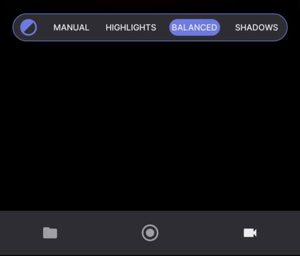
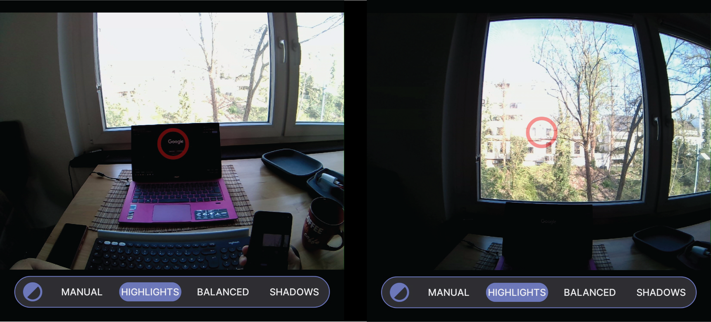
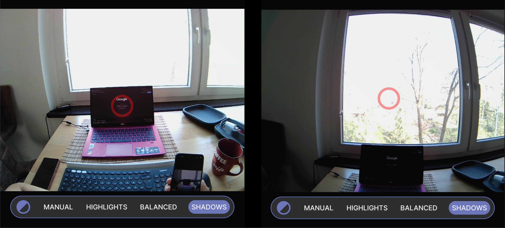
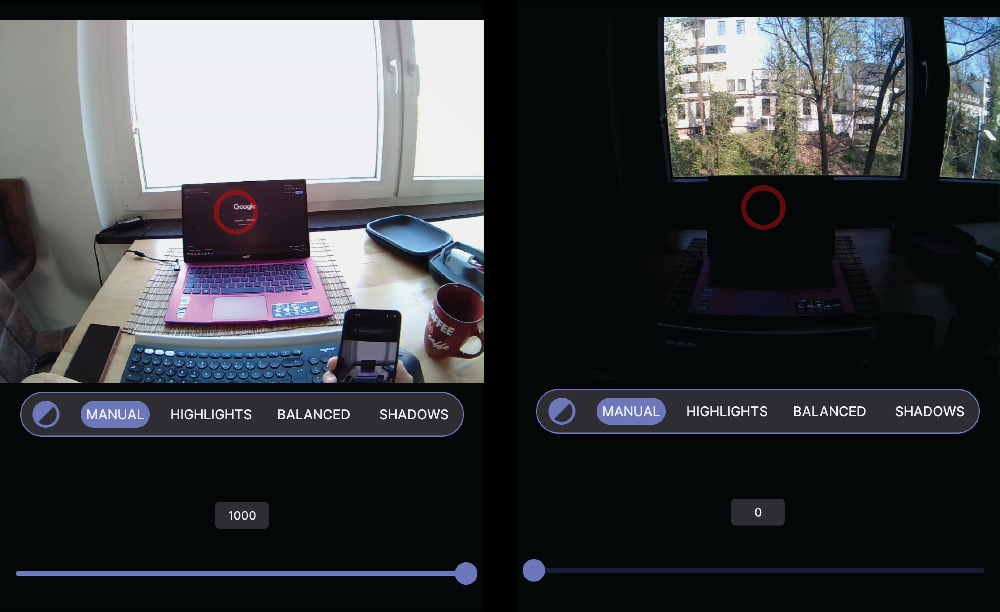

# Scene Camera Exposure
The [scene camera’s](https://docs.pupil-labs.com/neon/data-collection/data-streams/#scene-video) exposure modes can be adjusted to improve image quality in different lighting conditions. There are four modes:

- **Manual:** This mode lets you set the exposure value manually.
- **Automatic**: `Highlights`, `Balanced`, and `Shadows` automatically adjust exposure according to the surrounding lighting.
    - `Highlights`- optimizes the exposure to capture bright areas in the environment, while potentially underexposing dark areas.
    - `Balanced` - optimizes the exposure to capture brighter and darker areas in the environment equally.
    - `Shadows` - optimizes the exposure to capture darker areas in the environment, while potentially overexposing bright areas.

::: tip 
The mode you choose should depend on the environment. The images below provide an example and some caveats.
:::

## Changing Exposure Modes

From the home screen of the Neon Companion app, tap the [Scene and Eye Camera preview](https://docs.pupil-labs.com/neon/data-collection/first-recording/#_4-open-the-live-preview). 

- Tap on `Balanced` to reveal all four modes 
- Tap on the desired mode

## Automatic Exposure Modes

**Mode: `Highlights`**

This mode optimizes the exposure to capture bright areas in the environment, while potentially underexposing dark areas.

**Mode: `Balanced`**

This mode optimizes the exposure to capture brighter and darker areas in the environment equally.

**Mode: `Shadows`**

This mode optimizes the exposure to capture darker areas in the environment, while potentially overexposing bright areas.

## Manual Exposure Mode

`Manual` mode is recommended when you want to adjust the exposure values manually. This mode provides exposure time between 1 ms and 1000 ms.

::: tip 
**Note:** The mode you choose should depend on the environment. The images below provide an example and some caveats.
:::

Manual mode allows you to set the exposure time between 1 ms and 1000 ms.