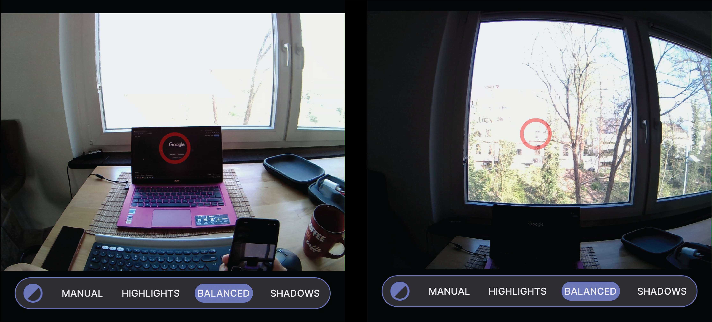

# Scene Camera Exposure

The [scene camera’s](/data-collection/data-streams/#scene-video) exposure can be adjusted to improve image quality in different lighting conditions. There are four modes:

- **Manual:** This mode lets you set the exposure time manually.
- **Automatic**: `Highlights`, `Balanced`, and `Shadows` automatically adjust exposure according to the surrounding lighting.

::: tip
The mode you choose should depend on the lighting conditions in your environment. The images below provide some
examples and important considerations.
:::

## Changing Exposure Modes

From the home screen of the Neon Companion app, tap
the [Scene and Eye Camera preview](/data-collection/first-recording/#_4-open-the-live-preview),
and then select `Balanced` to reveal all four modes.

## Manual Exposure Mode

Allows you to set the exposure time between 1 ms and 1000 ms.

::: tip
Exposure duration is inversely related to camera frame rate. Exposure values above 330 ms will reduce the scene camera rate below 30fps.
:::

## Automatic Exposure Modes

`Highlights`- optimizes the exposure to capture bright areas in the environment, while potentially underexposing dark areas.

`Balanced` - optimizes the exposure to capture brighter and darker areas equally.

`Shadows` - optimizes the exposure to capture darker areas in the environment, while potentially overexposing brighter areas.

::: tip
If your set-up requires a specialized camera to handle challenging light conditions, this [alpha-lab article](https://docs.pupil-labs.com/alpha-lab/egocentric-video-mapper/) shows you how you can add a third-party egocentric camera.
:::
