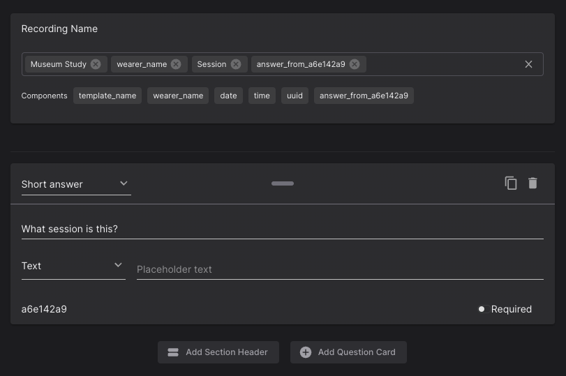

# Templates
Templates are used to add meta-data to a recording (e.g. age, gender, or location). They are forms that can be filled out at recording time to document important information for your study. The responses will be saved alongside the recording. Further, templates define a naming scheme for recordings. If, for example, you add a field for the `Experiment Name` to the form, you can set this value to be added to your recording names automatically. This is useful if you have a pre-defined structure for your study.

## Form for Meta-Data
You can create new templates in Pupil Cloud and customize them to your use case. You can add as many form fields as you want, including text fields and multiple-choice fields.

You can set individual fields of the template to be "required", such that a recording can not be stopped before filling out those fields.

Before your templates become available for selection in the Companion app, you need to **publish** them. After they are published, they can no longer be edited to ensure consistency between responses.

Some example use-cases for template forms include:

- **Questionnaire**: During the recording of a scientific study participating subjects are often asked to fill out a questionnaire to capture e.g. demographic data. You can simply create a template for your questionnaire so your subjects can fill out the questionnaire on the Companion Device. All questionnaire answers will be saved alongside the recording data associated with the according wearer.
- **Recording Structure**: If your recording schedule has a known structure, e.g. different recording phases or one recording per week, you can set up a template to note down the respective phase or week for each recording.
- **Documenting the unplanned**: Data collection does not always go as planned. Sometimes a subject did not quite understand the instructions and sometimes something went wrong in the experiment workflow. Using templates you can immediately note down what happened and flag recordings that will require further inspection. This will be saved as part of the recording, so you do not have to keep a separate list of notes.

## Naming Scheme for Recordings 
The only required field when creating a new template is the `Recording Name`, which determines the naming scheme of your recordings. Any text you type in this field will be included in the recording names. You can add form fields to the `Recording Name` as well, to include the corresponding values entered at recording time to the recording name. Additionally, you can add the following pre-defined elements to the name:

- **template_name**: The name of this template.
- **wearer_name**: The name of the current wearer.
- **date**: The date of recording. Format `YYYY-MM-DD`.
- **time**: The recording start time. Format `HH:mm:ss`.
- **uuid**: The unique ID of the recording. Format `uuidv4`.

### Example
The below template definition is an example for a data collection called `Museum Study`. This collection is happening with several subjects in multiple sessions. We can track which subject a recording was made with using the associated wearer profile. To track what session a recording belongs to, we have a multiple-choice form field in the template.

In the `Recording Name` field of the template, we defined a naming scheme that conveniently summarizes the recording in the context of this study. It uses a mix of custom text (the gray "chips"), the wearer name, and the multiple-choice form field about the session (which has the form field ID `2255e141`). This scheme will create names like `Museum Study - Jane - Session 2`.

