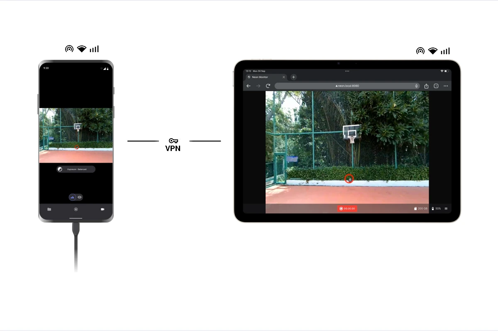

# Using a VPN for Remote Data Collection

In some research scenarios, participants may be located off-site, in restricted environments, or geographically distant from the researcher. Thus, one can not rely on devices being connected to the same local network.

A Virtual Private Network (VPN) can help overcome this limitation by securely extending the reach of the Realtime API or Monitor App over the internet, allowing devices in different locations to communicate as if they were on the same network.

## How it works?

Instead of routing all traffic through a central server like traditional VPNs, some modern VPN solutions allow devices to connect directly to each other through a secure mesh network. By joining both the host computer and the Companion Device to the same mesh network, the devices establish an encrypted peer-to-peer connection.

This effectively creates a virtual local network. As a result, the devices can communicate securely and seamlessly, just as they would if they were connected to the same physical Wi-Fi router, even when they are located in different places.

## Steps
Setting this up is generally straightforward across most modern mesh VPNs. The core idea is simply to ensure both devices are authenticated and active on the same private virtual network.

1. **Install the VPN client:** Download and install the client software for your chosen VPN on the computer running the Realtime API or Monitor App and the Companion Device.

2. **Log in**: Login and initialize your virtual network with the same account or invite both devices to the same network instance, depending on the VPN's setup process. This will allow them to discover each other and establish a secure connection.

3. **Verify Connectivity:** Once both devices are connected to the VPN, check that they can see each other on the virtual network. This can usually be done through the VPN's interface, which should show a list of connected devices and their assigned virtual IP addresses.

4. **Retrieve the Virtual IP Address**:** The VPN will have assigned a unique virtual IP address to all machines (for example, if using Tailscale, this usually starts with 100.x.x.x). Copy or note down the specific address assigned to the Companion Device. Now with your computer connected to the VPN, you can use this virtual IP address to connect to the Companion Device from the Realtime API or Monitor App, just as you would with a local IP address.

::: tip Tested VPN Solutions
Any VPN service that supports device-to-device connections or mesh networking can be used. While no specific provider is officially endorsed, this setup has been successfully tested using [Tailscale](https://tailscale.com/).
:::
