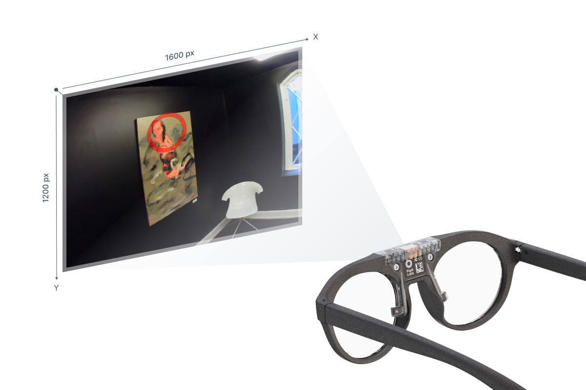

# Data Streams
The Neon module contains a number of sensors providing different types of data. Some data is available in real-time (e.g. via the [real-time API](/real-time-api/tutorials/)), while other data is generated post hoc through either [Pupil Cloud](/pupil-cloud/) or [Neon Player](/neon-player/). 
 
Below you can find a description of all data streams and where they are available. All data is fully accessible and can be downloaded in convenient formats.

## Eye Videos <Badge>Real-time</Badge>
The Neon module features two eye cameras, one for each eye. They are located at the tip of the small arms of the module. The sensors record IR video at 200 Hz with a resolution of 192x192px. The two sensors are synced in hardware, such that they record images at the exact same time. The resulting images a concatenated in a single video stream of 384x192px resolution. 

An IR LED is located just above each camera, which guarantees good illumination of the eye in dark environments.

## Gaze <Badge>Real-time</Badge>
The Neon Companion app can provide gaze data in real-time at up to 200 Hz. Gaze data is output in pixel space of the scene camera image, which has a resolution of 1600x1200 px. The origin is in the top-left corner of the image.

The achieved framerate can vary based on what Companion device is used and environmental conditions. One the OnePlus 10 the full 200 Hz can generally be achieved outside of especially hot environments. On the OnePlus 8 the framerate typically drops to ~120 Hz within a few minutes of starting a recording. Other apps running simultaneously on the phone may decrease the framerate.

After a recording is uploaded to Pupil Cloud, gaze data is automatically re-computed at the full 200 Hz framerat and can be downloaded from there.

The gaze estimation algorithm is based on end-2-end deep learning and provides gaze data robustly without requiring a calibration. We are currently working on a white paper that thoroughly evaluated the algorithm and will link it here once it is published.

## Fixations <Badge>Pupil Cloud</Badge><Badge>Neon Player</Badge>
The two primary types of eye movements exhibited by the visual system are fixations and saccades. During fixations, the eyes are directed at a specific point in the environment. A saccade is a very quick movement where the eyes jump from one fixation to the next. Properties like the fixation duration are of significant importance for studying gaze behaviour.

Fixations are calculated automatically in Pupil Cloud after uploading a recording and are included in relevant downloads. The downloads for gaze mapping enrichments ([Reference Image Mapper](/pupil-cloud/enrichments/reference-image-mapper/#export-format), [Marker Mapper](/pupil-cloud/enrichments/marker-mapper/#export-format)) also include "mapped fixations".

The deployed fixation detection algorithm was specifically designed for head-mounted eye trackers and offers increased robustness in the presence of head-movements. Especially movements due to vestibulo-ocular reflex are compensated for, which is not the case for most other fixation detection algorithms. Read more about that in the [Pupil Labs fixation detector whitepaper](https://docs.google.com/document/d/1dTL1VS83F-W1AZfbG-EogYwq2PFk463HqwGgshK3yJE/export?format=pdf)

## 3D Eye States <Badge>Pupil Cloud</Badge>
After uploading a recording to Pupil Cloud, 3D eye states are computed automatically at 200 Hz. The 3D eye states are a time series of each eye's position and orientation in 3D space, given by the location of the eyeball center and the optical axis of each eye. 

The coordinate system is depicted below. The origin corresponds to the scene camera of the Neon Module.

You can specify the inter eye distance (IED) of a wearer in the wearer profile before making a recording to further improve the accuracy of the measurements. If no IED value is specified, the population average of 63 mm is used.

## Pupil Diameters <Badge>Pupil Cloud</Badge>
After uploading a recording to Pupil Cloud, pupil diameters are computed automatically at 200 Hz. The computed pupil diameters correspond to the actual physical diameter of the 3D pupil, rather than the apparent pupil diameter in the eye video. Measurements are given in mm.

Similar to the 3D eye states, the accuracy of the pupil diameter measurements improves when supplying the wearer's IED in the wearer profile before making a recording.

## Blinks <Badge>Pupil Cloud</Badge><Badge>Neon Player</Badge>
During blinks the eye is briefly covered by the eye lids, which serves the purpose of spreading tears across the cornea. The blink rate and blink duration are also correlated with cognitive processes, which makes them interesting physiological signals.

Blinks are detected automatically in Pupil Cloud after uploading a recording and are part of the downloadable data.

The blink detection algorithm is operating directly on the eye video to detect the movement patterns of blinks. Read more about the algorithm in the [Pupil Labs blink detector whitepaper](https://docs.google.com/document/d/1JLBhC7fmBr6BR59IT3cWgYyqiaM8HLpFxv5KImrN-qE/export?format=pdf). The algorithm will soon be released as open-source

## Scene Video <Badge>Real-time</Badge>
The front-facing scene camera is located in the center of the Neon Module. It records video at 30 Hz and 1600x1200 px resolution with a field of view of 132°x81°.

The scene camera can be operated with automatic or manual exposure. In situations with challenging lighting condition, e.g. when recordings a screen, optimizing the exposure manually can improve the quality of the scene video.

## Audio
A microphone is integrated into the Neon module. Recorded audio will be part of the resulting scene video.

Audio recording is disabled in the Neon Companion app by default and can be enabled in the settings.

## Movement (IMU Data) 
The Neon module is equipped with a 9-DoF [inertial measurement unit](https://invensense.tdk.com/products/motion-tracking/9-axis/icm-20948/) (IMU) featuring an accelerometer, gyroscope, and magnetometer. The accelerometer and gyroscope measure linear acceleration and angular velocity, respectively, and are provided as raw values. 

A fusion engine also combines these values with magnetometer readings to estimate the module's absolute orientation relative to magnetic north and gravity as a quaternion. Note that in order to obtain precise absolute yaw readings, the magnetometer needs to be [calibrated](/data-collection/calibrating-the-imu/).

The IMU is located in the top bar of the module and is sampled at 220 Hz. It's coordinate system is oriented with the x-axis pointing to the right, the y-axis pointing in front, and the z-axis pointing upwards.

When relating data from the IMU to things visible in the scene camera, it may be necessary to align their respective 3D coordinate systems. The IMU's coordinate system is rotated by 102° around the x-axis in relation to the scene camera's coordinate system.

### Euler Angles  <Badge>Pupil Cloud</Badge><Badge>Neon Player</Badge>
When exporting recordings from Pupil Cloud or Neon Player the IMU's orientation in Euler angles (i.e. roll, pitch, and yaw) is also available.

Pitch is defined as a rotation around the x-axis with a value range of -90° to +90°. Yaw and roll are rotations around the y- and z-axis, respectively, with value ranges of -180° to +180°.

