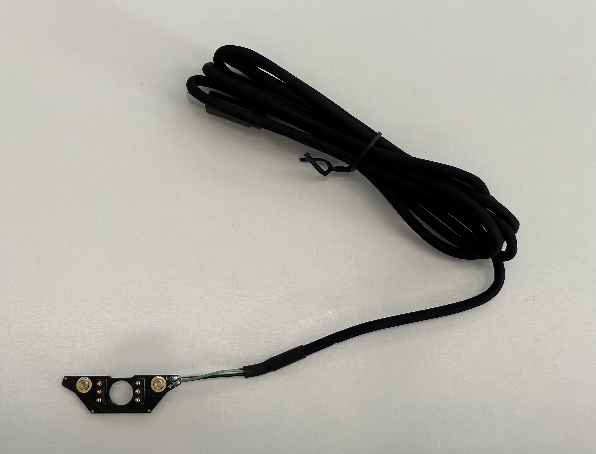

# Design your own Frame
You can design your own custom frame and integrate Neon into whichever form factor you want. To support this, we offer the "Bare Metal" frame, which only includes the "nest" PCB and USB cable. These are the only components you need to operate the Neon module and you can design your custom frame around them.

CAD models of the Neon module and nest are available [here](https://github.com/pupil-labs/neon-geometry). A model of the "Just act natural" frame is also included as a template to kickstart your design process!

