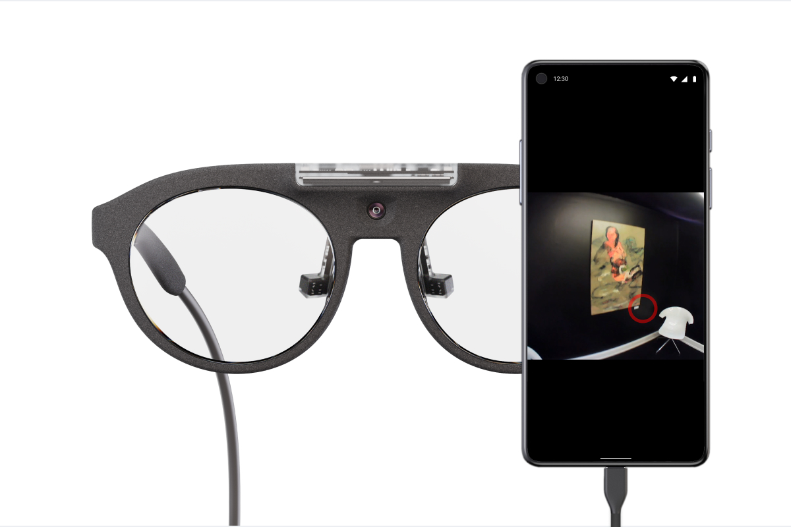
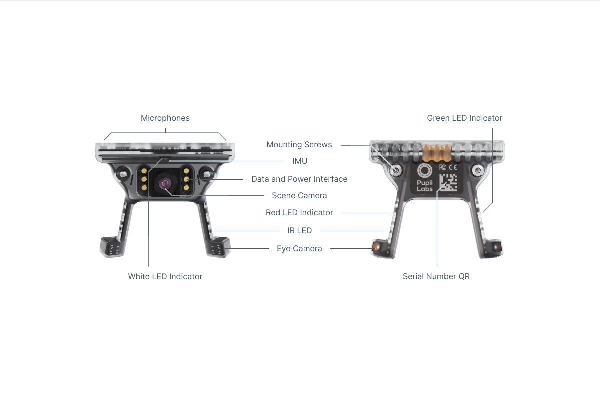

# Technical Overview

Neon connects to the Companion device (Android phone) with a USB-C cable. The Companion device supplies Neon with power and receives the raw sensor data for storage and further processing. Use the Neon Companion app to make recordings, preview real-time gaze and world video, stream data over the network, set up wearers, select templates, and preview and upload recordings to Pupil Cloud.

The Neon module is filled with sensors and electronics:

- **Eye Cameras**: A binocular pair of infrared cameras with matching 850nm infrared illuminator **LEDs** are used to capture [eye videos](/neon/basic-concepts/data-streams/#eye-videos). The raw data is saved with each recording and is used for real-time [gaze](/neon/basic-concepts/data-streams/#gaze) estimation.

- **IR LEDs**: One infrared LED is located on each arm of the module. The LEDs illuminate the eyes of the wearer to improve image quality in dark environments.

- **Scene Camera**: A front-facing scene camera is located at the center of the module capturing [scene video](/neon/basic-concepts/data-streams/#scene-video). A **microphone** is integrated in the module to capture [audio](/neon/basic-concepts/data-streams/#audio). Capturing audio is optional and settable in the Neon Companion app settings.
 
- **IMU**: A 9-degrees-of-freedom IMU is integrated into the module. It captures the [inertia](/neon/basic-concepts/data-streams/#inertial-measurements) of the glasses, including translational acceleration, rotational speed, magnetic orientation, pitch, yaw, and roll.

- **Data and Power Interface**: A USB connector is located at the front of the module. Through this connector, the module connects to a "nest" which is typically located in a glasses-like frame. Attached to the nest is a USB-C cable which connects to the Companion device.

- **Serial Number QR**: A QR-Code is located at the back of the module, which contains the serial number of the device.

- **Mounting Screws**: The module is attached to the nest of a frame with two screws.

- **Indicator LEDs**: The module has several indicator LEDs. The red LED will e.g. start blinking to indicate issues like a low battery.