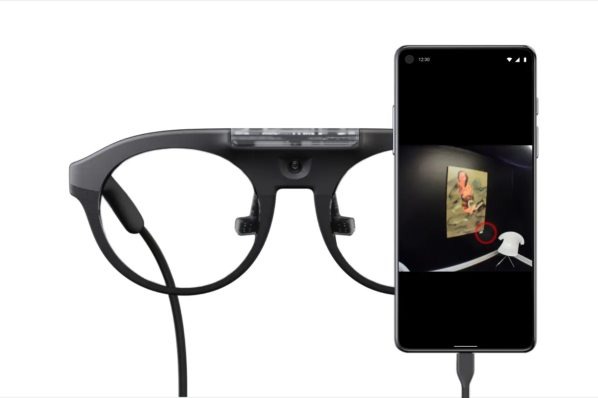
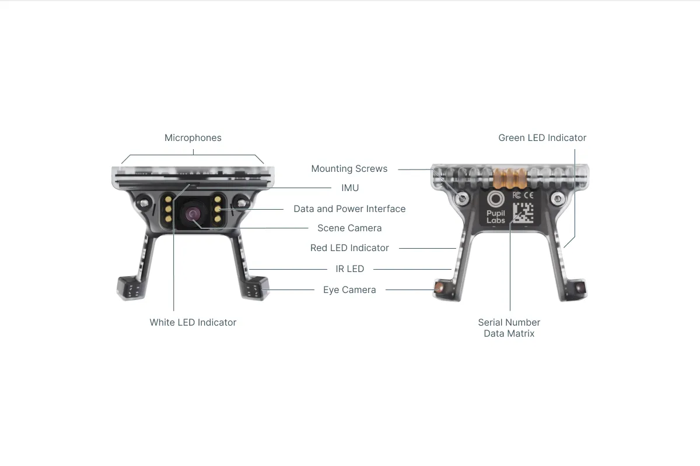

# Technical Overview

The Neon module is a small powerhouse of sensors! It connects to the Companion device (Android phone) with a USB-C cable, which supplies it with electric power and compute power for processing. Find an overview of all components of Neon below!

- **Eye Cameras**: A binocular pair of infrared cameras with matching 850nm infrared illuminator **LEDs** are used to capture [eye videos](/data-collection/data-streams/#eye-videos). The raw data is saved with each recording and is used for real-time [gaze](/data-collection/data-streams/#gaze) estimation.

- **IR LEDs**: One infrared LED is located on each arm of the module. The LEDs illuminate the eyes of the wearer to improve image quality in dark environments.

- **Scene Camera**: A front-facing scene camera is located at the center of the module capturing [scene video](/data-collection/data-streams/#scene-video). A **microphone** is integrated into the module to capture [audio](/data-collection/data-streams/#audio). Capturing audio is optional and settable in the Neon Companion App settings.

- **IMU**: A 9-degrees-of-freedom IMU is integrated into the module. It captures the [inertia](/data-collection/data-streams/#movement-imu-data) of the glasses, including translational acceleration, rotational speed, magnetic orientation, pitch, yaw, and roll.

- **Data and Power Interface**: A USB connector is located at the front of the module. Through this connector, the module connects to a "nest" which is typically located in a glasses-like frame. Attached to the nest is a USB-C cable that connects to the Companion device.

- **Serial Number Data Matrix**: A Data Matrix is located at the back of the module, which contains the serial number of the device.

- **Mounting Screws**: The module is attached to the nest of a frame with two screws.

- **Indicator LEDs**: The module has several indicator LEDs. The red LED will e.g. start blinking to indicate issues like a low battery.
