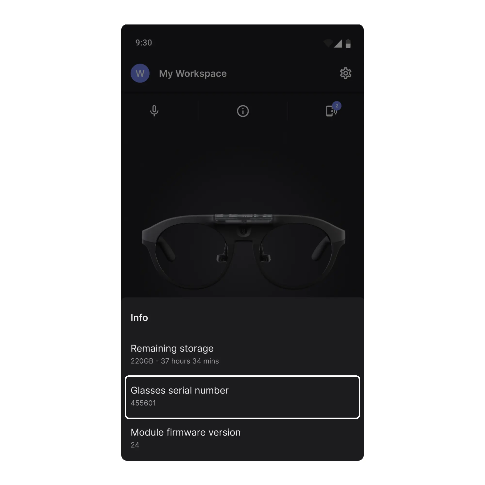
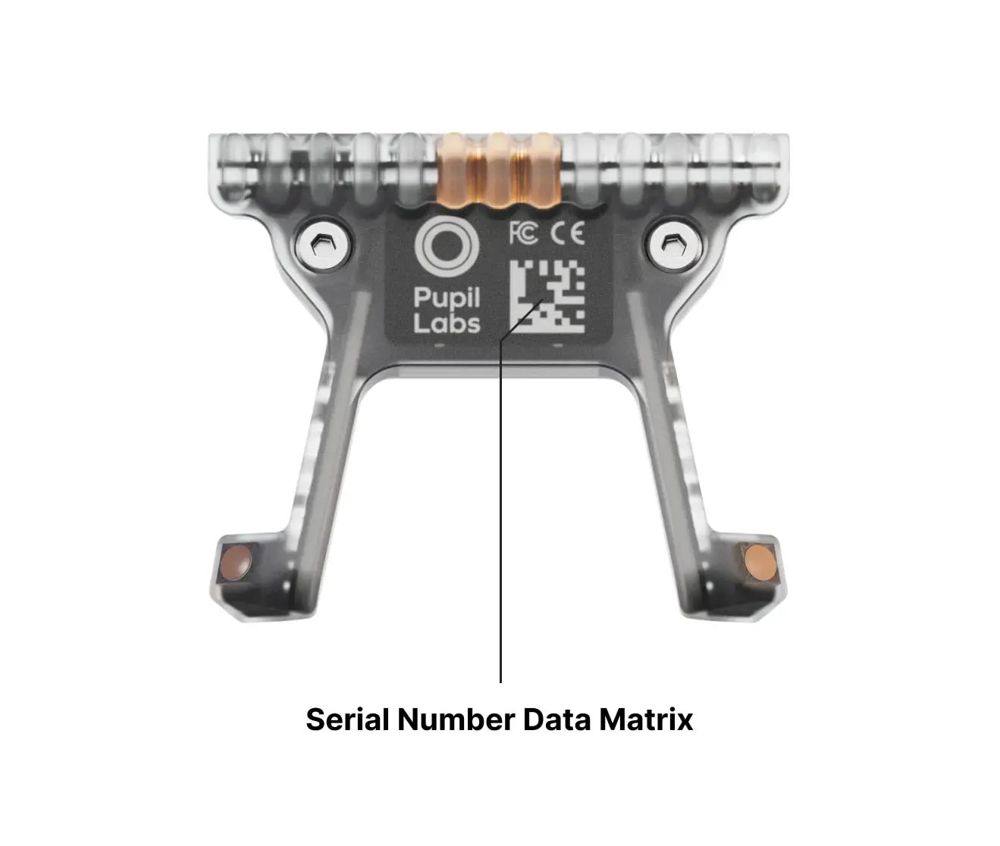

# How to obtain the Serial Number of your Neon.

### On the Companion App

You can find the serial number of your Neon module directly in the Companion app. While Neon is connected, tap the Info icon in the center of the screen. The serial number will be displayed there. Please refer to the screenshot below for guidance.

### From the Data Matrix on the Module

The serial number of the Neon module is also printed on a Data Matrix code located on the back of the module.

