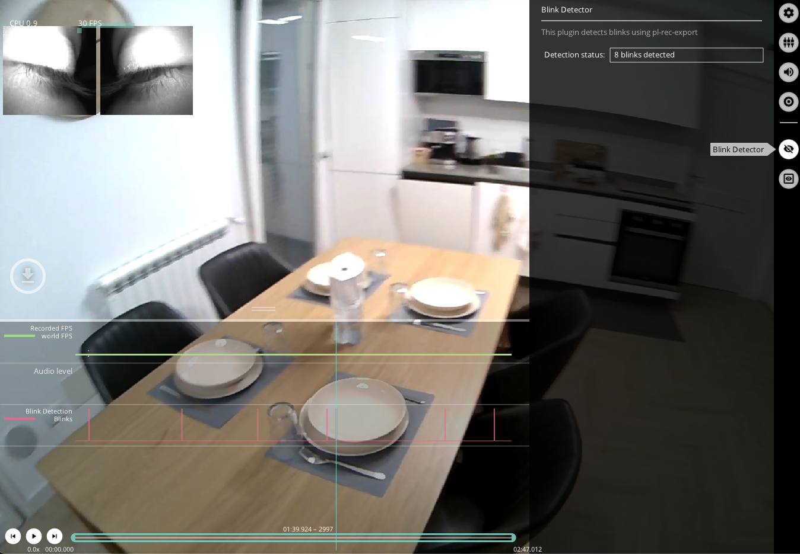

# Blink Detector

Neon Player runs the same [Blink Detector](./../../data-collection/data-streams/#blinks) employed in Pupil Cloud. There
are no tunable parameters; simply enable the blink detector plugin to start the blink detection process. The menu gives 
feedback about the progress of the detection and how many blinks were found.

To learn more about the blink detector, read the dedicated [Blink Detector Documentation](./../../data-collection/data-streams/#blinks).

Blink detection results are visualized as a red step-function plot in the timeline at the bottom of the window.

## Export Format
Results exported to `blinks.csv` with the following fields:
| Field | Description | 
| -------- | -------- | 
| **blink id** | Identifier of the blink. The counter starts at the beginning of the recording.     |
| **start&nbsp;timestamp&nbsp;[ns]** | UTC timestamp in nanoseconds of the start of the blink.     |
| **end timestamp [ns]** | UTC timestamp in nanoseconds of the end of the blink.     |
| **duration [ms]** | Duration of the blink in milliseconds.     |

:::tip
Want to compute blink rate or use the blink detector in realtime? Have a look at <a href="../../../../alpha-lab/blink-detection/#detecting-eye-blinks-using-pupil-labs-blink-detection-pipeline" target="_self">Detect Eye Blinks With Neon</a>
:::