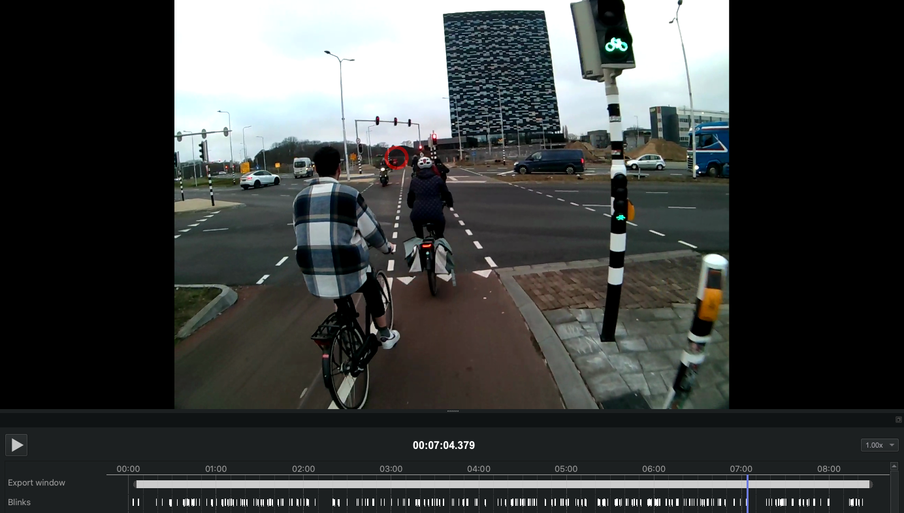

# Blinks

[Blinks](./../../data-collection/data-streams/#blinks) are provided for the whole recording and are visualized as a step-function plot in the timeline.

## Export Format
Results are exported to `blinks.csv` and include the following fields:

| Field                              | Description                                                                    |
| ---------------------------------- | ------------------------------------------------------------------------------ |
| **recording id**                   | Unique identifier of the recording this sample belongs to.                     |
| **blink id**                       | Identifier of the blink. The counter starts at the beginning of the recording. |
| **start&nbsp;timestamp&nbsp;[ns]** | UTC timestamp in nanoseconds of the start of the blink.                        |
| **end timestamp [ns]**             | UTC timestamp in nanoseconds of the end of the blink.                          |
| **duration [ms]**                  | Duration of the blink in milliseconds.                                         |

:::tip
Want to compute blink rate or use the blink detector in realtime? Have a look at <a href="../../../../alpha-lab/blink-detection/#detecting-eye-blinks-using-pupil-labs-blink-detection-pipeline" target="_self">Detect Eye Blinks With Neon</a>
:::