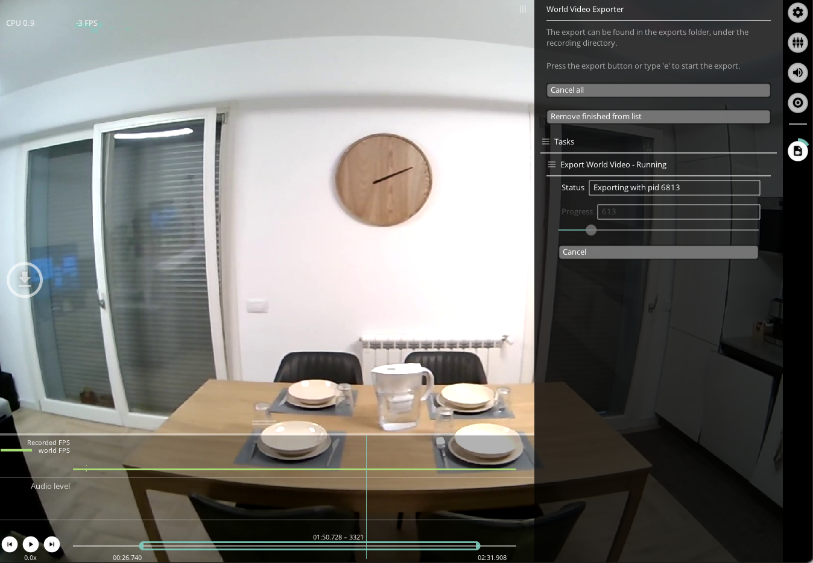
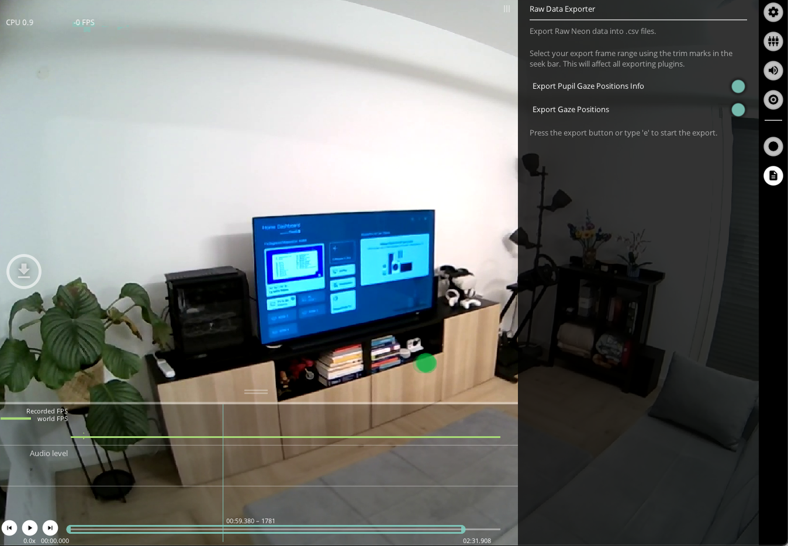
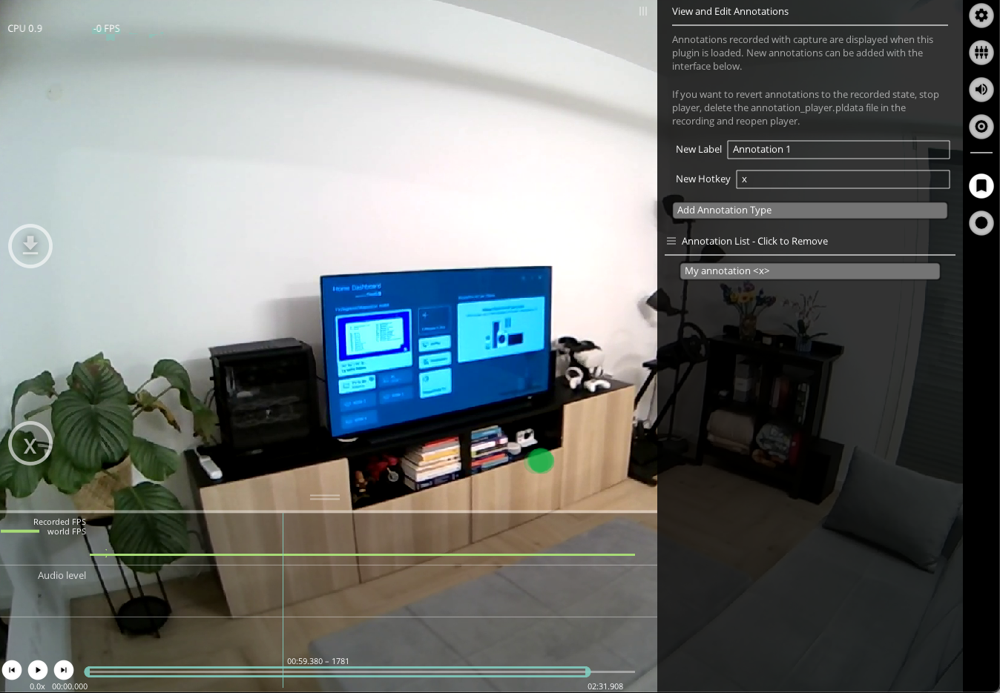

# Export

<!-- TODO: Is the export format actually correct? -->

You can export data and videos by pressing `e` on your keyboard or the `e` hot key button in the **Neon Player** window.

Upon activation, all loaded plugins with export capabilities will initiate the export process. Some exports operate in the background, you can monitor their progress via a GUI progress bar. This allows you to continue working with Neon Player.

Exports are separated from your raw data and contained in the `exports` sub-directory, that is generated in your recording directory.

## Export Directory

Multiple exports will create a new folder within the `exports` sub-directory for each export. All data from the export is saved to this folder.

## Export Handling

You can select the frame range to export by setting trim marks in the seek bar or directly in the `General Settings` menu.

Longer running exports, e.g. video exports, go through three phases: Queued, Running, and Completed.
Export tasks can be cancelled while being queued or running.
Completed tasks are kept in the list for reference.

## World Video Exporter

The `World Video Exporter` is loaded by default.



The export saves the world video as shown in Player, including all currently active visualizations (see [Visualization Plugins](/neon-player/visualization-plugins/)).

General overview for exported video files:

The World and Eye video exporter saves the scene video file, together with [numpy](https://numpy.org/devdocs/reference/generated/numpy.lib.format.html) and csv files containing timestamps corresponding to each frame.
The csv timestamp files include an additional `pts` column. `pts` is an abbreviation for _presentation timestamps_ and refers to the media file's internal time representation. It can be used to seek or identify specific frames within the media file. See this [tutorial on how to extract individual frame images from the world video](https://github.com/pupil-labs/pupil-tutorials/blob/master/09_frame_identification.ipynb).

## Eye Video Exporter

The `Eye Video Exporter` needs to be loaded explicitly through the Plugin Manager.

## Raw Data Exporter

The `Raw Data Exporter` exports gaze data to `.csv` files and is active by default.



Have a look at the [Data Format](../../data-collection/data-format/), to understand the structure of these files.

## Annotation Player

This plugin loads any annotations generated during the recording, as well as allowing you to add annotations post-hoc. With the Pupil Player interface, you can assign hotkeys to your annotations to ensure efficient labelling of important events in your recordings.



On export, the annotation plugin writes the annotation data to `annotations.csv`. It includes at least the following keys:

- `index`: World frame index during which the annotation started or happened
- `timestamp`: Start time or timestamp of the annotation.
- `label`: Annotation label
- `duration`: Duration of the annotation

::: tip
Any custom field encountered in the annotations will be exported as an additional column.
Their values will be converted to strings using Python's string representation. Therefore, it is recommended to use primitive types (strings, integers, floats) as value types for custom fields.
:::

Annotation hotkey definitions are stored in the recording directory:
`<recording dir>/offline_data/annotation_definitions.json` with the format:

```json
{
  "version": 1,
  "definitions": {
    "<label>": "<hotkey>"
  }
}
```

When a new recording is loaded, Neon Player will attempt to load the annotation definitions from the recording-specific file. If it is not found or invalid, the last known set of annotation definitions will be loaded from Neon Player's session settings.

## Fixations Export and Blink Exports

If you have the fixation and blink detector plugins enabled, you will obatain a [fixations.csv](../../data-collection/data-format/#fixations-csv) and [blink.csv](../../data-collection/data-format/#blinks-csv) files.
