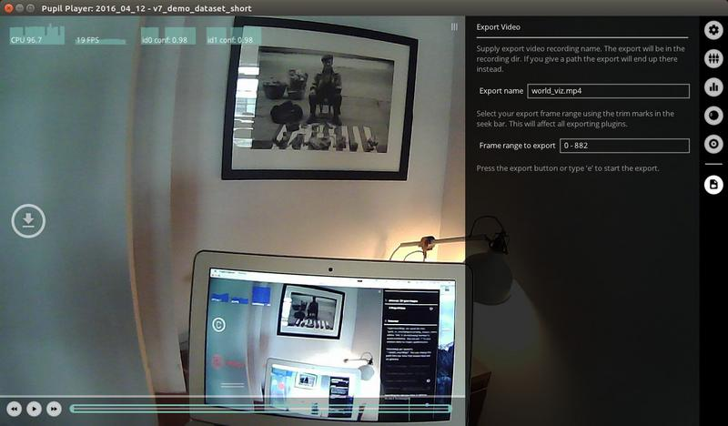
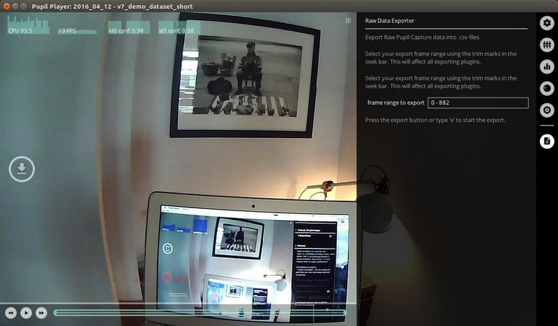
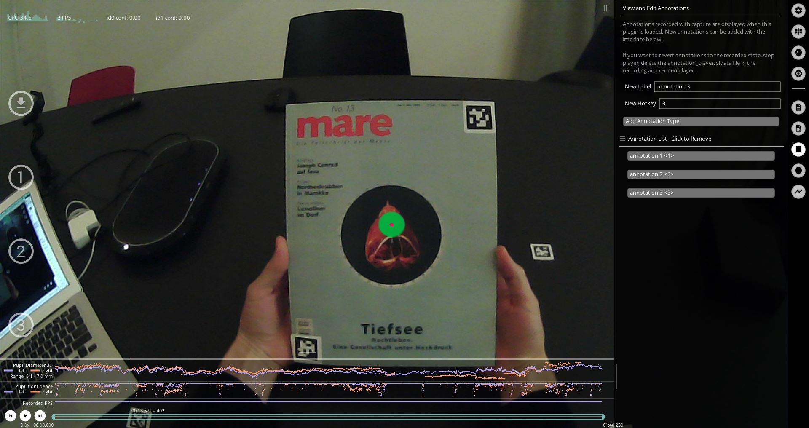

# Export

<!-- TODO: Is the export format actually correct? -->

You can export data and videos by pressing `e` on your keyboard or the `e` hot key button in the Neon Player window.

All open plugins that have export capability will export when you press `e`.
Exports are separated from your raw data and contained in the `exports` sub-directory.
The exports directory lives within your recording directory.

Active video exporters will run in the background and you can see the progress bar of the export in the GUI. While exporting, you can continue working with Neon Player and even launch new exports. Each video export creates at least one `mp4` and its respective file timestamp file.

## Export Directory
Every export creates a new folder within the `exports` sub-directory of your recording. All data from the export is saved to this folder.


## Export Handling
You can select the frame range to export by setting trim marks in the seek bar or directly in the `General Settings` menu.

Longer running exports, e.g. video exports, go through three phases: Queued, Running, and Completed.
Export tasks can be cancelled while being queued or running.
Completed tasks are kept in the list for reference.

## World Video Exporter
The `World Video Exporter` is loaded by default.



The export saves the world video as shown in Player, including all currently active visualizations (see  [Visualization Plugins](/neon-player/visualization-plugins/)). 

General overview for exported video files:

The World and Eye video exporter saves the scene video file, together with [numpy](https://numpy.org/devdocs/reference/generated/numpy.lib.format.html) and csv files containing timestamps corresponding to each frame. 
The csv timestamp files include an additional `pts` column. `pts` is an abbreviation for _presentation timestamps_ and refers to the media file's internal time representation. It can be used to seek or identify specific frames within the media file. See this [tutorial on how to extract individual frame images from the world video](https://github.com/pupil-labs/pupil-tutorials/blob/master/09_frame_identification.ipynb). 


## Eye Video Exporter
The `Eye Video Exporter` needs to be loaded explicitly through the Plugin Manager.
It includes the option to render the 2d pupil detection result into the exported video.

## iMotions Exporter 
THIS IS NO LONGER TRUE; THE FORMAT IS RAW NATIVE FOR IMOTIONS, we needto remove it.
The iMotions Exporter creates data that can be used with [https://imotions.com/](https://imotions.com/ "iMotions website").

Specifically, it undistorts the world video images using the camera intrinsics. Gaze data is also undistorted and exported to the `gaze.tlv` file.

## Raw Data Exporter
The `Raw Data Exporter` exports pupil and gaze data to `.csv` files and is active by default.




NOT RELEVANT, NEEDS TO BE REMOVED
### pupil_positions.csv
* `pupil_timestamp` - timestamp of the source image frame
* `world_index` - associated_frame: closest world video frame
* `eye_id` - 0 or 1 for left/right eye
* `confidence` - is an assessment by the pupil detector on how sure we can be on this measurement. A value of `0` indicates no confidence. `1` indicates perfect confidence. In our experience useful data carries a confidence value greater than ~0.6. A `confidence` of exactly `0` means that we don't know anything. So you should ignore the position data.
* `norm_pos_x` - x position in the eye image frame in normalized coordinates
* `norm_pos_y` - y position in the eye image frame in normalized coordinates
* `diameter` - diameter of the pupil in image pixels as observed in the eye image frame (is not corrected for perspective)
* `method` - string that indicates what detector was used to detect the pupil

Data made available by 2d pupil detection:

* `ellipse_center_x` - x center of the pupil in image pixels
* `ellipse_center_y` - y center of the pupil in image pixels
* `ellipse_axis_a` - first axis of the pupil ellipse in pixels
* `ellipse_axis_b` - second axis of the pupil ellipse in pixels
* `ellipse_angle` - angle of the ellipse in degrees

Data made available by 3d pupil detection:

* `diameter_3d` - diameter of the pupil scaled to mm based on anthropomorphic avg eye ball diameter and corrected for perspective.
* `model_confidence` - confidence of the current eye model (0-1)
* `model_id` - id of the current eye model. When a slippage is detected the model is replaced and the id changes.
* `sphere_center_x` - x pos of the eyeball sphere is eye pinhole camera 3d space units are scaled to mm.
* `sphere_center_y` - y pos of the eye ball sphere
* `sphere_center_z` - z pos of the eye ball sphere
* `sphere_radius` - radius of the eyeball. This is always 12mm (the anthropomorphic avg.) We need to make this assumption because of the `single camera scale ambiguity`.
* `circle_3d_center_x` - x center of the pupil as 3d circle in eye pinhole camera 3d space units are mm.
* `circle_3d_center_y` - y center of the pupil as 3d circle
* `circle_3d_center_z` - z center of the pupil as 3d circle
* `circle_3d_normal_x` - x normal of the pupil as 3d circle. Indicates the direction that the pupil points at in 3d space.
* `circle_3d_normal_y` - y normal of the pupil as 3d circle
* `circle_3d_normal_z` - z normal of the pupil as 3d circle
* `circle_3d_radius` - radius of the pupil as 3d circle. Same as `diameter_3d`
* `theta` - circle_3d_normal described in spherical coordinates
* `phi` - circle_3d_normal described in spherical coordinates
* `projected_sphere_center_x` - x center of the 3d sphere projected back onto the eye image frame. Units are in image pixels.
* `projected_sphere_center_y` - y center of the 3d sphere projected back onto the eye image frame
* `projected_sphere_axis_a` - first axis of the 3d sphere projection.
* `projected_sphere_axis_b` - second axis of the 3d sphere projection.
* `projected_sphere_angle` - angle of the 3d sphere projection. Units are degrees.

### gaze_positions.csv
* `gaze_timestamp` - timestamp of the source image frame
* `world_index` - associated_frame: closest world video frame
* `confidence` - computed confidence between 0 (not confident) -1 (confident)
* `norm_pos_x` - x position in the world image frame in normalized coordinates
* `norm_pos_y` - y position in the world image frame in normalized coordinates

The fields below are _not_ available for Pupil Invisible recordings:

* `base_data` - "timestamp-id timestamp-id ..." of pupil data that this gaze position is computed from data made available by the 3d vector gaze mappers
* `gaze_point_3d_x` - x position of the 3d gaze point (the point the subject looks at) in the world camera coordinate system
* `gaze_point_3d_y` - y position of the 3d gaze point
* `gaze_point_3d_z` - z position of the 3d gaze point
* `eye_center0_3d_x` - x center of eye-ball 0 in the world camera coordinate system (of camera 0 for binocular systems or any eye camera for monocular system)
* `eye_center0_3d_y` - y center of eye-ball 0
* `eye_center0_3d_z` - z center of eye-ball 0
* `gaze_normal0_x` - x normal of the visual axis for eye 0 in the world camera coordinate system (of eye 0 for binocular systems or any eye for monocular system). The visual axis goes through the eye ball center and the object thats looked at.
* `gaze_normal0_y` - y normal of the visual axis for eye 0
* `gaze_normal0_z` - z normal of the visual axis for eye 0
* `eye_center1_3d_x` - x center of eye-ball 1 in the world camera coordinate system (not available for monocular setups.)
* `eye_center1_3d_y` - y center of eye-ball 1
* `eye_center1_3d_z` - z center of eye-ball 1
* `gaze_normal1_x` - x normal of the visual axis for eye 1 in the world camera coordinate system (not available for monocular setups.). The visual axis goes through the eye ball center and the object thats looked at.
* `gaze_normal1_y` - y normal of the visual axis for eye 1
* `gaze_normal1_z` - z normal of the visual axis for eye 1

## Annotation Player

This plugin loads any annotations generated during the recording, as well as allowing you to add annotations after the 
effect. With the Pupil Player interface, you can assign hotkeys to your annotations to ensure efficient labelling 
of important events in your recordings.



On export, the annotation plugin writes the annotation data to `annotations.csv`. It includes at least the
following keys:
- `index`: World frame index during which the annotation started or happened
- `timestamp`: Start time or timestamp of the annotation in Pupil time
- `label`: Annotation label
- `duration`: Duration of the annotation

::: tip
Any custom field encountered in the annotations will be exported as an additional column.
Their values will be converted to strings using Python's string representation. Therefore,
it is recommended to use primitive types (strings, integers, floats) as value types for
custom fields.
:::

Annotation hotkey definitions are stored in the recording directory: 
`<recording dir>/offline_data/annotation_definitions.json` with the format:
```json
{
    "version": 1,
    "definitions": {
        "<label>": "<hotkey>"
    }
}
```
When a new recording is loaded, Pupil Player will attempt to load the annotation definitions from the recording-specific 
file. If it is not found or invalid, the last known set of annotation definitions will be loaded from Pupil Player's 
session settings.

## Fixation Export
# POINT TO NORMAL FIXATION EXPORTS
Fixations are exported to `fixations.csv`, containing the following fields:

* `start_timestamp` - Timestamp of the first related gaze datum
* `duration` - Exact fixation duration, in milliseconds
* `start_frame_index` - Index of the first related world frame
* `end_frame_index` - Index of the last related world frame
* `norm_pos_x` - Normalized x position of the fixation’s centroid
* `norm_pos_y` - Normalized y position of the fixation’s centroid
* `dispersion` - Dispersion, in degrees
* `confidence` - Average pupil confidence
* `method` - `2d gaze` or `3d gaze`
* `gaze_point_3d_x` - x position of mean 3d gaze point, only available if `gaze 3d` method was used
* `gaze_point_3d_y` - y position of mean 3d gaze point, only available if `gaze 3d` method was used
* `gaze_point_3d_z` - z position of mean 3d gaze point, only available if `gaze 3d` method was used
* `base_data` - Gaze data that the fixation is based on
