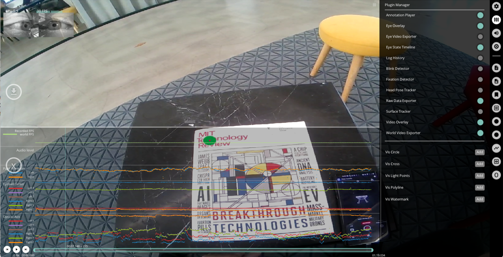

# Eye State Timeline

This plugin visualizes [3D eye state](/data-collection/data-streams/#_3d-eye-states) and [pupil diameter](/data-collection/data-streams/#pupil-diameters) data.

::: info
The data will only be visualized if Eye State computation was enabled in the Neon Companion app during recording.
:::

## Export Format

Results exported to `3d_eye_states.csv` with the following fields:
| Field | Description |
| ------------------------- | -------- |
| **section id** | Unique identifier of the corresponding section. |
| **recording id** | Unique identifier of the recording this sample belongs to. |
| **timestamp [ns]** | UTC timestamp in nanoseconds of the sample. Equal to the timestamp of the eye video frame this sample was generated with. |
| **pupil&nbsp;diameter&nbsp;left&nbsp;[mm]** | Physical diameter of the pupil of the left eye. |
| **pupil&nbsp;diameter&nbsp;right&nbsp;[mm]** | Physical diameter of the pupil of the right eye. |
| **eye&nbsp;ball&nbsp;center&nbsp;left&nbsp;x&nbsp;[mm]**  **eye ball center left y [mm]**  **eye ball center left z [mm]**  **eye&nbsp;ball&nbsp;center&nbsp;right&nbsp;x&nbsp;[mm]**  **eye&nbsp;ball&nbsp;center&nbsp;right&nbsp;y&nbsp;[mm]**  **eye ball center right z [mm]** | Location of left and right eye ball centers in millimeters in relation to the scene camera of the Neon module. For details on the coordinate systems see [here](/data-collection/data-streams/#_3d-eye-states). |
| **optical axis left x**  **optical axis left y**  **optical axis left z**  **optical axis right x**  **optical axis right y**  **optical axis right z** | Directional vector describing the optical axis of the left and right eye, i.e. the vector pointing from eye ball center to pupil center of the respective eye. For details on the coordinate systems see [here](/data-collection/data-streams/#_3d-eye-states). |
| **eyelid angle top left** **eyelid angle bottom left** **eyelid angle top right** **eyelid angle bottom right**                                                                                                                                                                             | Angles quantifying the vertical opening of the left and right eyes' upper and lower eyelids relative to the eyeball's horizontal plane (in scene camera coordinates) in radians.                                                                                 |
| **eyelid aperture left [mm]** **eyelid aperture right [mm]**                                                                                                                                                                                                                                          | Maximum vertical arc length between the left and right eyes' upper and lower eyelids, measured in millimeters.                                                                                                                                                   |
